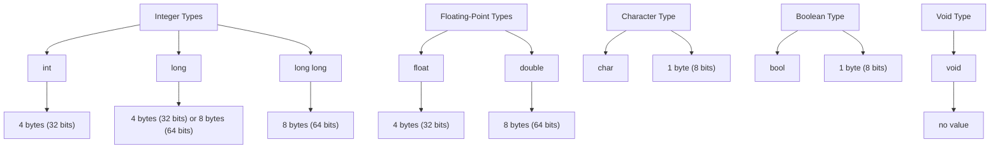

## Introduction
Data types are the foundation of any programming language, and C++ is no exception. **Data types** determine the type of value a variable can hold, the amount of memory it occupies, and the operations that can be performed on it. In C++, data types are categorized into several types, including **int**, **long**, **long long**, **float**, **double**, **char**, **bool**, and **void**. Understanding these data types is crucial for writing efficient, bug-free code. In this section, we will delve into the world of C++ data types, exploring their definitions, internal workings, and practical applications.

## Core Concepts
At the heart of C++ data types are the following core concepts:
- **Integer types**: **int**, **long**, **long long** - whole numbers, either positive, negative, or zero.
- **Floating-point types**: **float**, **double** - decimal numbers, used for mathematical calculations.
- **Character type**: **char** - a single character, such as a letter, digit, or symbol.
- **Boolean type**: **bool** - a logical value, either true or false.
- **Void type**: **void** - a type that represents the absence of a value.

> **Tip:** When choosing a data type, consider the range of values it can hold and the operations you need to perform on it.

## How It Works Internally
Internally, C++ data types are represented as binary values in memory. The size of each data type varies depending on the system architecture:
- **int**: typically 4 bytes (32 bits) on most systems.
- **long**: typically 4 bytes (32 bits) on 32-bit systems, 8 bytes (64 bits) on 64-bit systems.
- **long long**: typically 8 bytes (64 bits) on most systems.
- **float**: typically 4 bytes (32 bits) on most systems.
- **double**: typically 8 bytes (64 bits) on most systems.
- **char**: typically 1 byte (8 bits) on most systems.
- **bool**: typically 1 byte (8 bits) on most systems, but can be optimized to a single bit.

Here's a step-by-step breakdown of how data types work internally:
1. **Memory allocation**: When a variable is declared, the compiler allocates memory for it based on its data type.
2. **Binary representation**: The value assigned to the variable is converted to its binary representation and stored in memory.
3. **Operations**: When an operation is performed on a variable, the compiler generates machine code that operates on the binary representation of the value.

## Code Examples
### Example 1: Basic Data Type Usage
```cpp
#include <iostream>

int main() {
    int myInt = 5; // integer type
    double myDouble = 3.14; // floating-point type
    char myChar = 'A'; // character type
    bool myBool = true; // boolean type

    std::cout << "myInt: " << myInt << std::endl;
    std::cout << "myDouble: " << myDouble << std::endl;
    std::cout << "myChar: " << myChar << std::endl;
    std::cout << "myBool: " << myBool << std::endl;

    return 0;
}
```
### Example 2: Data Type Conversions
```cpp
#include <iostream>

int main() {
    int myInt = 5; // integer type
    double myDouble = 3.14; // floating-point type

    // implicit conversion: int to double
    double result1 = myInt + myDouble;
    std::cout << "result1: " << result1 << std::endl;

    // explicit conversion: double to int
    int result2 = static_cast<int>(myDouble);
    std::cout << "result2: " << result2 << std::endl;

    return 0;
}
```
### Example 3: Data Type Optimization
```cpp
#include <iostream>

struct Person {
    char name[20]; // character array
    int age; // integer type
    bool isAdmin; // boolean type
};

int main() {
    Person person;
    person.age = 30;
    person.isAdmin = true;

    std::cout << "age: " << person.age << std::endl;
    std::cout << "isAdmin: " << person.isAdmin << std::endl;

    return 0;
}
```
> **Warning:** Be cautious when performing implicit or explicit conversions between data types, as this can lead to loss of precision or unexpected behavior.

## Visual Diagram

The diagram illustrates the relationships between the different data types in C++.

## Comparison
| Data Type | Size (bytes) | Range | Precision |
| --- | --- | --- | --- |
| int | 4 | -2147483648 to 2147483647 | 32 bits |
| long | 4 or 8 | -2147483648 to 2147483647 (32-bit) or -9223372036854775808 to 9223372036854775807 (64-bit) | 32 or 64 bits |
| long long | 8 | -9223372036854775808 to 9223372036854775807 | 64 bits |
| float | 4 | 3.4E-38 to 3.4E+38 | 32 bits |
| double | 8 | 1.8E-308 to 1.8E+308 | 64 bits |
| char | 1 | -128 to 127 | 8 bits |
| bool | 1 | true or false | 8 bits |
| void | - | no value | - |

## Real-world Use Cases
1. **Google's Search Engine**: Google's search engine uses a combination of **int** and **long long** data types to store and retrieve search results.
2. **Facebook's Database**: Facebook's database uses **int** and **long** data types to store user IDs and other metadata.
3. **NASA's Space Exploration**: NASA's space exploration programs use **double** and **float** data types to perform complex mathematical calculations and simulations.

## Common Pitfalls
1. **Integer Overflow**: When an **int** value exceeds its maximum range, it can cause an integer overflow, leading to unexpected behavior.
```cpp
int x = INT_MAX;
x += 1; // integer overflow
```
2. **Floating-Point Precision**: **Float** and **double** data types can suffer from precision issues, leading to incorrect results.
```cpp
double x = 0.1 + 0.2; // precision issue
```
3. **Type Mismatch**: Using the wrong data type can lead to type mismatch errors, causing the program to crash or produce incorrect results.
```cpp
int x = 'A'; // type mismatch
```
4. **Null Pointer Dereference**: Dereferencing a null pointer can cause a segmentation fault, leading to program termination.
```cpp
int* x = nullptr;
*x = 5; // null pointer dereference
```
> **Note:** Always use the correct data type for the task at hand, and be aware of potential pitfalls such as integer overflow, floating-point precision issues, type mismatch, and null pointer dereferences.

## Interview Tips
1. **What is the difference between int and long?**
	* Weak answer: "int is smaller than long."
	* Strong answer: "int is typically 4 bytes (32 bits) on most systems, while long is typically 4 bytes (32 bits) on 32-bit systems and 8 bytes (64 bits) on 64-bit systems."
2. **How do you handle integer overflow?**
	* Weak answer: "I use a larger data type."
	* Strong answer: "I use a combination of techniques, including using a larger data type, such as long long, and implementing overflow detection and handling mechanisms."
3. **What is the purpose of the void data type?**
	* Weak answer: "It's used for functions that don't return a value."
	* Strong answer: "The void data type represents the absence of a value, and is used for functions that don't return a value, as well as for pointers that don't point to a valid memory location."

## Key Takeaways
* **Data types** determine the type of value a variable can hold and the operations that can be performed on it.
* **Integer types** include **int**, **long**, and **long long**, each with its own range and precision.
* **Floating-point types** include **float** and **double**, used for decimal numbers and mathematical calculations.
* **Character type** is represented by **char**, a single character.
* **Boolean type** is represented by **bool**, a logical value.
* **Void type** represents the absence of a value.
* Always use the correct data type for the task at hand, and be aware of potential pitfalls such as integer overflow, floating-point precision issues, type mismatch, and null pointer dereferences.
* Understand the internal representation of data types, including memory allocation and binary representation.
* Use data type conversions and optimizations judiciously, and be aware of their potential impact on performance and precision.