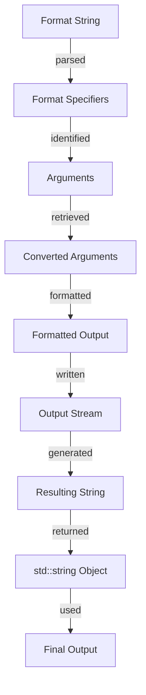

## Introduction
Formatted output is a fundamental aspect of programming, allowing developers to present data in a readable and structured format. In C++, there are two primary ways to achieve this: `printf` and `std::format` (introduced in C++20). **printf** is a legacy function inherited from C, while **std::format** is a modern, type-safe, and more expressive alternative. Understanding both is crucial for any C++ developer, as they are widely used in various applications, from command-line tools to complex software systems.
> **Note:** Formatted output is not limited to C++; other languages, such as Python and Java, also provide similar functionality.

In real-world scenarios, formatted output is essential for tasks like logging, reporting, and user interface rendering. For instance, a web server might use formatted output to generate HTML pages, while a scientific application might use it to display complex data visualizations.
> **Tip:** When working with formatted output, it's essential to consider the performance implications, as excessive use of formatting functions can lead to slower execution times.

## Core Concepts
To work effectively with formatted output in C++, you need to understand the following core concepts:
* **Format specifiers**: These are special characters used to specify the type of data being formatted, such as `%d` for integers or `%s` for strings.
* **Format strings**: These are the strings that contain format specifiers and are used as templates for generating formatted output.
* **Type safety**: This refers to the ability of a formatting function to ensure that the correct type of data is being formatted, preventing type mismatches and potential errors.
> **Warning:** Using the wrong format specifier with `printf` can lead to undefined behavior, emphasizing the importance of type safety.

Key terminology includes:
* **Placeholder**: A placeholder is a special character or sequence of characters in a format string that is replaced with actual data during formatting.
* **Argument**: An argument is the actual data being formatted and inserted into the format string.

## How It Works Internally
When using `printf`, the following steps occur internally:
1. The format string is parsed, and format specifiers are identified.
2. The corresponding arguments are retrieved and converted to the specified type.
3. The formatted output is generated by replacing placeholders with the converted arguments.
4. The resulting string is written to the output stream.

In contrast, `std::format` uses a more modern approach:
1. The format string is parsed, and placeholders are identified.
2. The corresponding arguments are retrieved and stored in a tuple.
3. The formatted output is generated by iterating over the tuple and replacing placeholders with the actual data.
4. The resulting string is returned as a `std::string` object.

> **Interview:** Can you explain the difference between `printf` and `std::format` in terms of type safety and performance?

## Code Examples
### Example 1: Basic Usage of `printf`
```c
#include <cstdio>

int main() {
    int x = 5;
    printf("The value of x is: %d\n", x);
    return 0;
}
```
This example demonstrates the basic usage of `printf` to format an integer value.

### Example 2: Real-World Pattern with `std::format`
```cpp
#include <format>
#include <string>

std::string generateReport(const std::string& name, int score) {
    return std::format("Student: {}, Score: {}\n", name, score);
}

int main() {
    std::string report = generateReport("John Doe", 85);
    std::cout << report;
    return 0;
}
```
This example showcases the use of `std::format` to generate a formatted report string.

### Example 3: Advanced Usage with `std::format` and Custom Types
```cpp
#include <format>
#include <string>

struct Person {
    std::string name;
    int age;
};

std::string generatePersonInfo(const Person& person) {
    return std::format("Name: {}, Age: {}\n", person.name, person.age);
}

int main() {
    Person person = {"Jane Doe", 30};
    std::string info = generatePersonInfo(person);
    std::cout << info;
    return 0;
}
```
This example demonstrates the use of `std::format` with custom types, such as structs.

## Visual Diagram

This diagram illustrates the internal workflow of `std::format`, from parsing the format string to generating the final output.

## Comparison
| Approach | Time Complexity | Space Complexity | Pros | Cons | Best For |
| --- | --- | --- | --- | --- | --- |
| `printf` | O(n) | O(1) | Simple, widely supported | Type-unsafe, error-prone | Legacy code, simple use cases |
| `std::format` | O(n) | O(n) | Type-safe, expressive, modern | Steeper learning curve, requires C++20 | New code, complex use cases |
| `std::stringstream` | O(n) | O(n) | Flexible, type-safe | Verbose, slower than `std::format` | Legacy code, compatibility |
| `std::to_string` | O(n) | O(n) | Simple, type-safe | Limited functionality, slower than `std::format` | Simple use cases, compatibility |

## Real-world Use Cases
1. **Logging**: A web server might use formatted output to generate log messages, including timestamps, request information, and error messages.
2. **Reporting**: A financial application might use formatted output to generate reports, including tables, charts, and summaries.
3. **User Interface**: A desktop application might use formatted output to render user interface elements, such as labels, buttons, and menus.

## Common Pitfalls
1. **Type Mismatch**: Using the wrong format specifier with `printf` can lead to undefined behavior.
```c
// Wrong
printf("%d", "hello");

// Right
printf("%s", "hello");
```
2. **Buffer Overflow**: Using `printf` with a buffer that is too small can lead to buffer overflows.
```c
// Wrong
char buffer[10];
printf(buffer, "hello world");

// Right
char buffer[20];
printf(buffer, "hello world");
```
3. **Inconsistent Formatting**: Using inconsistent formatting can make code harder to read and maintain.
```cpp
// Wrong
std::string name = "John";
std::string age = "30";
std::cout << "Name: " << name << ", Age: " << age << std::endl;

// Right
std::cout << std::format("Name: {}, Age: {}\n", name, age);
```
4. **Performance Issues**: Excessive use of formatting functions can lead to slower execution times.
```cpp
// Wrong
for (int i = 0; i < 100000; i++) {
    std::cout << std::format("Hello, world!\n");
}

// Right
std::string message = std::format("Hello, world!\n");
for (int i = 0; i < 100000; i++) {
    std::cout << message;
}
```
> **Tip:** Use `std::format` instead of `printf` for new code to ensure type safety and better performance.

## Interview Tips
1. **What is the difference between `printf` and `std::format`?**
	* Weak answer: "They are both used for formatted output."
	* Strong answer: " `printf` is a legacy function that is type-unsafe, while `std::format` is a modern, type-safe alternative that provides better performance and expressiveness."
2. **How do you handle type mismatches with `printf`?**
	* Weak answer: "I use the correct format specifier."
	* Strong answer: "I use `std::format` instead of `printf` to ensure type safety, and I also use tools like compilers and static analyzers to detect type mismatches."
3. **What is the time complexity of `std::format`?**
	* Weak answer: "It is O(1)."
	* Strong answer: "The time complexity of `std::format` is O(n), where n is the length of the format string."

## Key Takeaways
* `std::format` is a modern, type-safe alternative to `printf`.
* `std::format` provides better performance and expressiveness than `printf`.
* Type safety is essential when working with formatted output.
* Consistent formatting is crucial for code readability and maintainability.
* Excessive use of formatting functions can lead to slower execution times.
* `std::format` has a time complexity of O(n), where n is the length of the format string.
* `std::format` is available in C++20 and later versions.
* `printf` is a legacy function that should be avoided in new code.