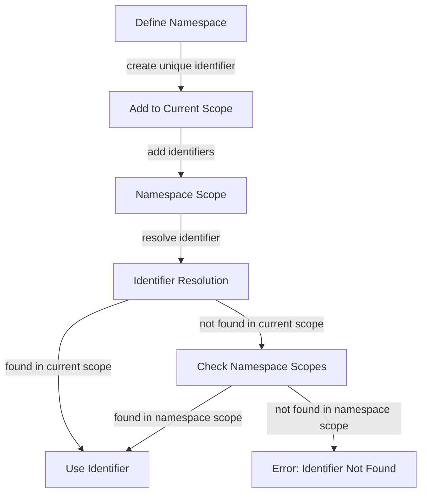

## Introduction
**Namespaces** are a fundamental concept in C++ that allow developers to organize their code into logical scopes, preventing naming conflicts and improving code readability. In this section, we will explore the importance of namespaces, their real-world relevance, and why every engineer needs to understand this concept. 
> **Note:** Namespaces are essential for large-scale projects, as they help to avoid naming conflicts and make the code more maintainable.

In real-world scenarios, namespaces are crucial when working with third-party libraries or collaborating with other developers. For instance, when using a library like **Boost**, you need to ensure that your code does not conflict with the library's namespace. 
> **Warning:** Failing to use namespaces correctly can lead to naming conflicts, which can be challenging to resolve, especially in large projects.

Every engineer needs to understand namespaces because they are a fundamental aspect of C++ programming. By using namespaces effectively, developers can write more organized, maintainable, and efficient code.

## Core Concepts
A **namespace** is a declarative region that provides a scope to the identifiers (names of functions, variables, classes, etc.) inside it. Namespaces help to avoid naming conflicts by allowing multiple libraries or modules to use the same identifier without conflicts.
> **Tip:** Think of a namespace as a container that holds a set of identifiers, and you can use the `using` directive to import the entire namespace or specific identifiers.

The **`using namespace`** directive allows you to import an entire namespace, making all its identifiers available for use in the current scope. However, it is generally recommended to avoid using this directive in header files to prevent naming conflicts.
> **Interview:** In an interview, you may be asked to explain the difference between `using namespace` and `using namespace::identifier`. Be prepared to provide examples and explain the benefits and drawbacks of each approach.

Key terminology includes:
* **Namespace**: a declarative region that provides a scope to identifiers.
* **`using namespace`**: a directive that imports an entire namespace.
* **`using namespace::identifier`**: a directive that imports a specific identifier from a namespace.

## How It Works Internally
When you define a namespace, the compiler creates a unique identifier for it, which is used to resolve naming conflicts. The namespace is essentially a scope that contains a set of identifiers, and you can use the `::` operator to access these identifiers.
> **Note:** The `::` operator is called the **scope resolution operator**, and it is used to specify the namespace or class scope of an identifier.

Here's a step-by-step breakdown of how namespaces work internally:
1. The compiler encounters a namespace definition.
2. The compiler creates a unique identifier for the namespace.
3. The namespace is added to the current scope.
4. Identifiers defined inside the namespace are added to the namespace's scope.
5. When an identifier is used, the compiler checks the current scope and then the namespace scopes to resolve the identifier.

## Code Examples
### Example 1: Basic Namespace Usage
```cpp
// Define a namespace
namespace MyNamespace {
    // Define a function inside the namespace
    void myFunction() {
        std::cout << "Hello from MyNamespace!" << std::endl;
    }
}

int main() {
    // Use the namespace
    MyNamespace::myFunction();
    return 0;
}
```
This example demonstrates the basic usage of a namespace. We define a namespace `MyNamespace` and a function `myFunction` inside it. We then use the `::` operator to access the function in the `main` function.

### Example 2: Using Directive
```cpp
// Define a namespace
namespace MyNamespace {
    // Define a function inside the namespace
    void myFunction() {
        std::cout << "Hello from MyNamespace!" << std::endl;
    }
}

int main() {
    // Use the using directive
    using namespace MyNamespace;
    myFunction();
    return 0;
}
```
This example demonstrates the use of the `using` directive to import the entire namespace. We define a namespace `MyNamespace` and a function `myFunction` inside it. We then use the `using` directive to import the namespace, and we can access the function without using the `::` operator.

### Example 3: Nested Namespaces
```cpp
// Define a namespace
namespace MyNamespace {
    // Define a nested namespace
    namespace MyNestedNamespace {
        // Define a function inside the nested namespace
        void myFunction() {
            std::cout << "Hello from MyNestedNamespace!" << std::endl;
        }
    }
}

int main() {
    // Use the nested namespace
    MyNamespace::MyNestedNamespace::myFunction();
    return 0;
}
```
This example demonstrates the use of nested namespaces. We define a namespace `MyNamespace` and a nested namespace `MyNestedNamespace` inside it. We then define a function `myFunction` inside the nested namespace and access it using the `::` operator.

## Visual Diagram

This diagram illustrates the process of defining a namespace, adding it to the current scope, and resolving identifiers. The diagram shows the flow of identifier resolution, including checking the current scope and namespace scopes.

## Comparison
| Approach | Time Complexity | Space Complexity | Pros | Cons | Best For |
| --- | --- | --- | --- | --- | --- |
| Using Directive | O(1) | O(1) | Convenient, reduces verbosity | Can lead to naming conflicts | Small projects, personal code |
| Scope Resolution Operator | O(1) | O(1) | Explicit, avoids naming conflicts | More verbose | Large projects, collaborative code |
| Nested Namespaces | O(1) | O(1) | Organizes code, reduces naming conflicts | More complex, harder to read | Large projects, complex codebases |
| Anonymous Namespaces | O(1) | O(1) | Reduces naming conflicts, improves code readability | Limited scope, not suitable for all use cases | Small projects, personal code |

## Real-world Use Cases
1. **Boost Library**: The Boost library uses namespaces to organize its code and avoid naming conflicts. For example, the `boost::algorithm` namespace provides a set of algorithms for working with strings and containers.
2. **Google's Abseil Library**: The Abseil library uses namespaces to provide a set of C++ libraries for common programming tasks. For example, the `absl::strings` namespace provides a set of functions for working with strings.
3. **Microsoft's STL**: The Microsoft STL uses namespaces to provide a set of C++ standard library containers and algorithms. For example, the `std::vector` namespace provides a dynamic array class.

## Common Pitfalls
1. **Naming Conflicts**: Failing to use namespaces correctly can lead to naming conflicts, which can be challenging to resolve.
```cpp
// Wrong
namespace MyNamespace {
    void myFunction() {}
}

namespace MyOtherNamespace {
    void myFunction() {} // naming conflict
}

// Right
namespace MyNamespace {
    void myFunction() {}
}

namespace MyOtherNamespace {
    void myOtherFunction() {} // no naming conflict
}
```
2. **Using Directive in Header Files**: Using the `using` directive in header files can lead to naming conflicts and make the code harder to read.
```cpp
// Wrong
// myheader.h
using namespace MyNamespace;

// mysource.cpp
#include "myheader.h"
void myFunction() {} // naming conflict

// Right
// myheader.h
namespace MyNamespace {
    void myFunction();
}

// mysource.cpp
#include "myheader.h"
using namespace MyNamespace;
void myFunction() {} // no naming conflict
```
3. **Nested Namespace Complexity**: Nested namespaces can make the code harder to read and understand.
```cpp
// Wrong
namespace MyNamespace {
    namespace MyNestedNamespace {
        namespace MyOtherNestedNamespace {
            void myFunction() {} // hard to read
        }
    }
}

// Right
namespace MyNamespace {
    namespace MyNestedNamespace {
        void myFunction() {} // easier to read
    }
}
```
4. **Anonymous Namespace Limitations**: Anonymous namespaces have limited scope and may not be suitable for all use cases.
```cpp
// Wrong
namespace {
    void myFunction() {} // limited scope
}

// Right
namespace MyNamespace {
    void myFunction() {} // wider scope
}
```

## Interview Tips
1. **What is a namespace?**: Be prepared to explain the concept of a namespace, including its purpose and benefits.
> **Interview:** "What is a namespace, and how does it help to avoid naming conflicts?"
2. **How do you use a namespace?**: Be prepared to explain how to use a namespace, including the `using` directive and the scope resolution operator.
> **Interview:** "How do you use a namespace, and what are the benefits and drawbacks of each approach?"
3. **What is the difference between `using namespace` and `using namespace::identifier`?**: Be prepared to explain the difference between importing an entire namespace and importing a specific identifier.
> **Interview:** "What is the difference between `using namespace` and `using namespace::identifier`, and when would you use each?"

## Key Takeaways
* Namespaces are essential for large-scale projects to avoid naming conflicts and improve code readability.
* The `using` directive can import an entire namespace or a specific identifier.
* Nested namespaces can help to organize code and reduce naming conflicts.
* Anonymous namespaces have limited scope and may not be suitable for all use cases.
* The scope resolution operator (`::`) is used to specify the namespace or class scope of an identifier.
* The `using` directive should be avoided in header files to prevent naming conflicts.
* Nested namespaces can make the code harder to read and understand if not used carefully.
* Anonymous namespaces have limited scope and may not be suitable for all use cases.
* The `using` directive can lead to naming conflicts if not used carefully.
* The scope resolution operator (`::`) can help to avoid naming conflicts by specifying the namespace or class scope of an identifier.