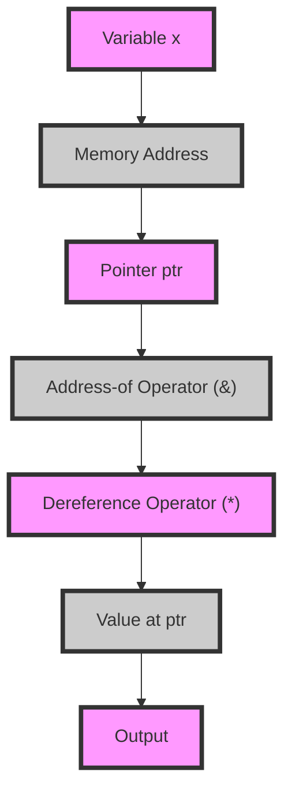

## Introduction
Pointers are a fundamental concept in C++ programming, allowing developers to directly manipulate memory addresses. In essence, a pointer is a variable that holds the memory address of another variable. Pointers are crucial in C++ because they enable efficient memory management, which is essential for building high-performance applications. Every engineer needs to understand pointers because they are a building block of C++ programming, and their misuse can lead to memory leaks, crashes, and security vulnerabilities.

## Core Concepts
To grasp pointers, it's essential to understand the following key concepts:
- **Pointer declaration**: A pointer is declared using the asterisk symbol (\*) before the pointer name. For example, `int* ptr;` declares a pointer to an integer.
- **Address-of operator**: The address-of operator (&) is used to get the memory address of a variable. For example, `&x` returns the memory address of the variable `x`.
- **Dereference operator**: The dereference operator (\*) is used to access the value stored at a memory address. For example, `*ptr` returns the value stored at the memory address held by `ptr`.
- **Null pointer**: A null pointer is a pointer that does not point to a valid memory address. In C++, `nullptr` is used to represent a null pointer.

> **Note:** Pointers can be confusing, especially for beginners. However, understanding pointers is crucial for building efficient and scalable C++ applications.

## How It Works Internally
When a pointer is declared, the compiler allocates memory to store the pointer's value, which is the memory address of another variable. Here's a step-by-step breakdown of how pointers work internally:
1. **Memory allocation**: The compiler allocates memory for the pointer variable.
2. **Address assignment**: The address-of operator (&) is used to assign the memory address of a variable to the pointer.
3. **Dereferencing**: The dereference operator (\*) is used to access the value stored at the memory address held by the pointer.

> **Tip:** To avoid memory leaks, always initialize pointers to `nullptr` when they are not in use.

## Code Examples
### Example 1: Basic Pointer Usage
```cpp
#include <iostream>

int main() {
    int x = 10;
    int* ptr = &x; // Declare a pointer and assign the address of x
    std::cout << "Value of x: " << x << std::endl;
    std::cout << "Address of x: " << &x << std::endl;
    std::cout << "Value of ptr: " << ptr << std::endl;
    std::cout << "Value at ptr: " << *ptr << std::endl;
    return 0;
}
```
This example demonstrates the basic usage of pointers, including declaration, address assignment, and dereferencing.

### Example 2: Pointer Arithmetic
```cpp
#include <iostream>

int main() {
    int arr[5] = {1, 2, 3, 4, 5};
    int* ptr = arr; // Declare a pointer and assign the address of the first element
    for (int i = 0; i < 5; i++) {
        std::cout << "Value at index " << i << ": " << *(ptr + i) << std::endl;
    }
    return 0;
}
```
This example demonstrates pointer arithmetic, where the pointer is incremented to access subsequent elements in an array.

### Example 3: Dynamic Memory Allocation
```cpp
#include <iostream>

int main() {
    int* ptr = new int; // Dynamically allocate memory for an integer
    *ptr = 10; // Assign a value to the allocated memory
    std::cout << "Value at ptr: " << *ptr << std::endl;
    delete ptr; // Deallocate the memory to avoid memory leaks
    return 0;
}
```
This example demonstrates dynamic memory allocation using the `new` operator and deallocation using the `delete` operator.

## Visual Diagram

This diagram illustrates the relationship between a variable, its memory address, a pointer, and the address-of and dereference operators.

## Comparison
| Approach | Time Complexity | Space Complexity | Pros | Cons | Best For |
| --- | --- | --- | --- | --- | --- |
| Pointers | O(1) | O(1) | Efficient memory management, flexible | Error-prone, requires manual memory management | Systems programming, high-performance applications |
| References | O(1) | O(1) | Safer than pointers, easier to use | Limited flexibility, cannot be reassigned | General-purpose programming, when pointers are not necessary |
| Smart Pointers | O(1) | O(1) | Automatic memory management, exception-safe | Overhead due to additional logic | Modern C++ programming, when smart pointers are available |
| Arrays | O(1) | O(n) | Simple to use, efficient for sequential access | Limited flexibility, fixed size | General-purpose programming, when a fixed-size array is sufficient |

> **Warning:** Pointers can be error-prone and require manual memory management, which can lead to memory leaks and crashes if not done correctly.

## Real-world Use Cases
1. **Operating Systems**: Pointers are used extensively in operating system development to manage memory, devices, and system resources.
2. **Game Development**: Pointers are used in game development to optimize performance, manage memory, and implement complex data structures.
3. **Database Systems**: Pointers are used in database systems to manage memory, optimize query performance, and implement indexing mechanisms.

## Common Pitfalls
1. **Dangling Pointers**: A dangling pointer is a pointer that points to memory that has already been deallocated. This can lead to crashes or unexpected behavior.
```cpp
int* ptr = new int;
delete ptr;
*ptr = 10; // Dangling pointer
```
2. **Null Pointer Dereference**: Dereferencing a null pointer can lead to crashes or unexpected behavior.
```cpp
int* ptr = nullptr;
*ptr = 10; // Null pointer dereference
```
3. **Pointer Arithmetic Errors**: Incorrect pointer arithmetic can lead to accessing invalid memory locations.
```cpp
int arr[5] = {1, 2, 3, 4, 5};
int* ptr = arr;
std::cout << *(ptr + 10) << std::endl; // Pointer arithmetic error
```
4. **Memory Leaks**: Failing to deallocate memory can lead to memory leaks.
```cpp
int* ptr = new int;
// Forget to delete ptr
```
> **Tip:** Always initialize pointers to `nullptr` when they are not in use, and use smart pointers when possible to avoid memory leaks.

## Interview Tips
1. **What is a pointer?**: A pointer is a variable that holds the memory address of another variable.
2. **How do you declare a pointer?**: A pointer is declared using the asterisk symbol (\*) before the pointer name.
3. **What is the difference between a pointer and a reference?**: A pointer is a variable that holds a memory address, while a reference is an alias for a variable.

> **Interview:** Be prepared to explain the differences between pointers, references, and smart pointers, and provide examples of their usage.

## Key Takeaways
* Pointers are variables that hold memory addresses.
* Pointers are used for efficient memory management and flexible data structures.
* Pointers can be error-prone and require manual memory management.
* Smart pointers provide automatic memory management and exception safety.
* Pointers have a time complexity of O(1) and a space complexity of O(1).
* Pointers are widely used in systems programming, game development, and database systems.
* Common pitfalls include dangling pointers, null pointer dereferences, pointer arithmetic errors, and memory leaks.
* Always initialize pointers to `nullptr` when they are not in use, and use smart pointers when possible to avoid memory leaks.