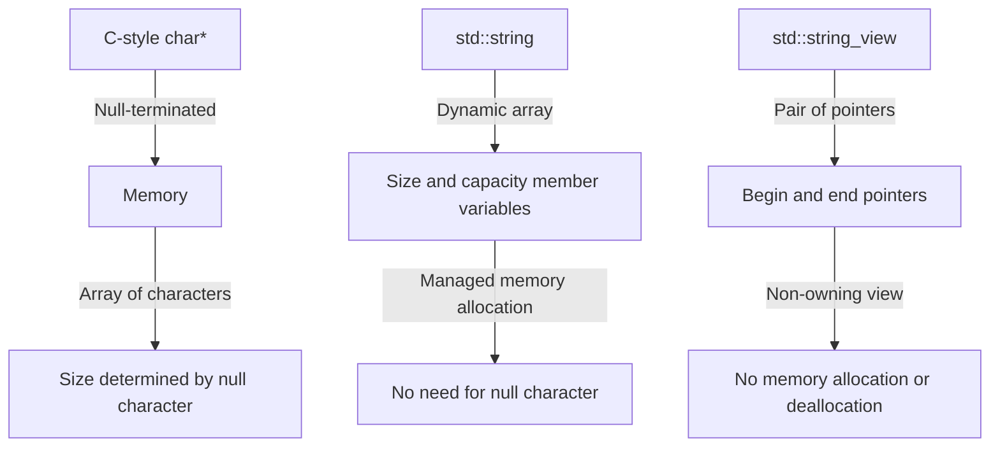

## Introduction
In C++, strings are a fundamental data type used to represent sequences of characters. There are three main types of strings in C++: C-style **char\***, **std::string**, and **std::string_view**. Each type has its own strengths and weaknesses, and understanding the differences between them is crucial for writing efficient and effective C++ code. In this section, we will explore the basics of each type and why they matter in real-world applications.

> **Note:** C-style **char\*** strings are the most basic type of string in C++ and are essentially arrays of characters terminated by a null character (**\0**).

Real-world relevance: Strings are used in almost every aspect of programming, from user input to data storage and manipulation. For example, Google's search engine relies heavily on string processing to index and retrieve web pages.

Why every engineer needs to know this: Understanding the different types of strings in C++ and their trade-offs is essential for writing efficient, scalable, and maintainable code. Whether you're working on a web application, a game, or a scientific simulation, strings are a fundamental building block of any program.

## Core Concepts
In this section, we will delve into the precise definitions, mental models, and key terminology surrounding C-style **char\***, **std::string**, and **std::string_view**.

*   C-style **char\***: A C-style string is an array of characters terminated by a null character (**\0**). This type of string is the most basic and is inherited from the C programming language.
*   **std::string**: **std::string** is a class that represents a sequence of characters. It is a part of the C++ Standard Library and provides a more convenient and safer way of working with strings compared to C-style **char\***.
*   **std::string_view**: **std::string_view** is a class that represents a non-owning view of a string. It was introduced in C++17 and provides a way to work with strings without taking ownership of the underlying data.

> **Warning:** C-style **char\*** strings can be error-prone and lead to buffer overflows if not used carefully.

Mental model: Think of C-style **char\*** as a raw array of characters, **std::string** as a managed string that handles memory allocation and deallocation for you, and **std::string_view** as a lightweight view of a string that doesn't own the underlying data.

Key terminology:

*   **Null-terminated**: A string that is terminated by a null character (**\0**).
*   **Owned**: A string that manages its own memory allocation and deallocation.
*   **Non-owning**: A string that does not manage its own memory allocation and deallocation.

## How It Works Internally
In this section, we will explore the under-the-hood mechanics of C-style **char\***, **std::string**, and **std::string_view**.

C-style **char\***:

*   A C-style string is stored in memory as an array of characters.
*   The string is terminated by a null character (**\0**).
*   The length of the string is determined by the position of the null character.

**std::string**:

*   **std::string** is implemented as a dynamic array of characters.
*   The string has a **size** member variable that stores the number of characters in the string.
*   The string has a **capacity** member variable that stores the maximum number of characters that the string can hold without reallocation.

**std::string_view**:

*   **std::string_view** is implemented as a pair of pointers: one to the beginning of the string and one to the end of the string.
*   The **std::string_view** does not own the underlying data and does not manage its own memory allocation and deallocation.

> **Tip:** Use **std::string** when you need to work with owned strings, and use **std::string_view** when you need to work with non-owning strings.

## Code Examples
In this section, we will explore three complete and runnable code examples that demonstrate the usage of C-style **char\***, **std::string**, and **std::string_view**.

### Example 1: Basic Usage of C-style char\*

```cpp
#include <iostream>

int main() {
    // Define a C-style string
    const char* str = "Hello, World!";
    
    // Print the string
    std::cout << str << std::endl;
    
    return 0;
}
```

### Example 2: Real-world Pattern with std::string

```cpp
#include <iostream>
#include <string>

int main() {
    // Define an std::string
    std::string str = "Hello, World!";
    
    // Append a new string to the end of the existing string
    str += " This is a new string.";
    
    // Print the string
    std::cout << str << std::endl;
    
    return 0;
}
```

### Example 3: Advanced Usage of std::string_view

```cpp
#include <iostream>
#include <string_view>

int main() {
    // Define a std::string
    std::string str = "Hello, World!";
    
    // Create a std::string_view from the std::string
    std::string_view view = str;
    
    // Print the string view
    std::cout << view << std::endl;
    
    return 0;
}
```

## Visual Diagram

This diagram illustrates the internal workings of C-style **char\***, **std::string**, and **std::string_view**. It shows how each type stores and manages its data, and highlights the key differences between them.

> **Note:** The diagram is a simplified representation of the internal workings of each type and is intended to provide a high-level overview of the key concepts.

## Comparison
| Approach | Time Complexity | Space Complexity | Pros | Cons | Best For |
| --- | --- | --- | --- | --- | --- |
| C-style char\* | O(n) for string operations | O(1) for storage | Low-level control, no overhead | Error-prone, no memory management | Systems programming, embedded systems |
| std::string | O(n) for string operations | O(n) for storage | Managed memory allocation, convenient API | Overhead for dynamic memory allocation | General-purpose programming, web development |
| std::string_view | O(1) for string operations | O(1) for storage | Lightweight, non-owning view | Limited functionality, no memory management | High-performance applications, real-time systems |

## Real-world Use Cases
In this section, we will explore three real-world use cases that demonstrate the usage of C-style **char\***, **std::string**, and **std::string_view**.

1.  **Google Search Engine**: Google's search engine relies heavily on string processing to index and retrieve web pages. C-style **char\*** strings are used for low-level string manipulation, while **std::string** is used for higher-level string operations.
2.  **Facebook's Database**: Facebook's database uses **std::string** to store and retrieve user data. The database is designed to handle large amounts of data and requires efficient string processing.
3.  **Real-time Systems**: Real-time systems, such as those used in aerospace and defense, require low-latency and high-performance string processing. **std::string_view** is used in these systems to provide a lightweight and non-owning view of strings.

> **Interview:** Can you explain the differences between C-style **char\***, **std::string**, and **std::string_view**? How would you choose between them for a given use case?

## Common Pitfalls
In this section, we will explore four common pitfalls that engineers may encounter when working with C-style **char\***, **std::string**, and **std::string_view**.

1.  **Buffer Overflows**: C-style **char\*** strings can lead to buffer overflows if not used carefully. To avoid this, use **std::string** or **std::string_view** instead.
2.  **Null Character**: C-style **char\*** strings require a null character (**\0**) to terminate the string. Forgetting to include the null character can lead to errors.
3.  **Memory Management**: **std::string** manages its own memory allocation and deallocation. However, **std::string_view** does not manage its own memory allocation and deallocation. To avoid memory leaks, use **std::string** instead of **std::string_view** when working with owned strings.
4.  **Thread Safety**: **std::string** is not thread-safe by default. To make **std::string** thread-safe, use a mutex or other synchronization mechanism.

> **Warning:** C-style **char\*** strings can be error-prone and lead to buffer overflows if not used carefully.

## Interview Tips
In this section, we will explore three common interview questions that are related to C-style **char\***, **std::string**, and **std::string_view**.

1.  **What is the difference between C-style char\* and std::string?**
    *   Weak answer: C-style **char\*** is a raw array of characters, while **std::string** is a managed string.
    *   Strong answer: C-style **char\*** is a null-terminated array of characters, while **std::string** is a dynamic array of characters that manages its own memory allocation and deallocation.
2.  **How do you choose between std::string and std::string_view?**
    *   Weak answer: I use **std::string** for owned strings and **std::string_view** for non-owning strings.
    *   Strong answer: I use **std::string** when I need to work with owned strings and require managed memory allocation and deallocation. I use **std::string_view** when I need to work with non-owning strings and require a lightweight view of the string.
3.  **What is the time complexity of std::string operations?**
    *   Weak answer: The time complexity of **std::string** operations is O(1).
    *   Strong answer: The time complexity of **std::string** operations is O(n), where n is the length of the string.

## Key Takeaways
In this section, we will summarize the key takeaways from this topic.

*   C-style **char\*** strings are null-terminated arrays of characters.
*   **std::string** is a dynamic array of characters that manages its own memory allocation and deallocation.
*   **std::string_view** is a lightweight, non-owning view of a string.
*   Choose between **std::string** and **std::string_view** based on whether you need to work with owned or non-owning strings.
*   The time complexity of **std::string** operations is O(n), where n is the length of the string.
*   The space complexity of **std::string** storage is O(n), where n is the length of the string.
*   Use **std::string** for general-purpose programming and web development.
*   Use **std::string_view** for high-performance applications and real-time systems.
*   Avoid using C-style **char\*** strings for high-level string manipulation.
*   Use a mutex or other synchronization mechanism to make **std::string** thread-safe.