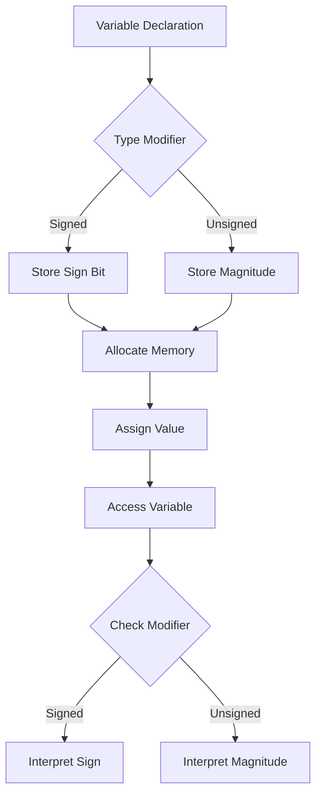

## Introduction
Type modifiers are a crucial aspect of programming in C++, as they allow developers to specify the size and range of variables. The **signed**, **unsigned**, **short**, and **long** modifiers are used to modify the behavior of fundamental data types such as **int**, **char**, and **float**. Understanding these modifiers is essential for writing efficient and effective code, especially when working with low-level programming, embedded systems, or performance-critical applications. In this section, we will explore the importance of type modifiers, their real-world relevance, and why every engineer needs to know this.

Type modifiers are used to specify the size and range of variables, which can significantly impact the performance and behavior of a program. For instance, using an **unsigned** modifier can prevent overflow errors and ensure that a variable always contains a positive value. Similarly, using a **long** modifier can provide a larger range of values, making it suitable for applications that require large integers.

> **Note:** Type modifiers are not only important for C++ programmers but also for developers working with other languages that support these modifiers, such as C and Java.

## Core Concepts
The **signed**, **unsigned**, **short**, and **long** modifiers are used to modify the behavior of fundamental data types. Here are the precise definitions and mental models for each modifier:

* **Signed**: A signed variable can store both positive and negative values. The most significant bit (MSB) is used to represent the sign of the number, with 0 indicating a positive number and 1 indicating a negative number.
* **Unsigned**: An unsigned variable can only store positive values. The MSB is used to represent the magnitude of the number.
* **Short**: A short variable is a smaller version of the **int** data type, typically 16 bits in size.
* **Long**: A long variable is a larger version of the **int** data type, typically 32 bits in size.

> **Tip:** When working with type modifiers, it's essential to understand the trade-offs between size, range, and performance.

## How It Works Internally
When a type modifier is applied to a variable, it changes the way the variable is stored and accessed in memory. Here's a step-by-step breakdown of what happens when you use a type modifier:

1. The compiler determines the size and range of the variable based on the modifier.
2. The variable is allocated memory based on its size.
3. When the variable is assigned a value, the value is stored in the allocated memory.
4. When the variable is accessed, the compiler checks the modifier to determine the correct interpretation of the value.

> **Warning:** Using the wrong type modifier can lead to unexpected behavior, such as overflow errors or incorrect results.

## Code Examples
Here are three complete and runnable examples that demonstrate the use of type modifiers:

### Example 1: Basic Usage
```cpp
#include <iostream>

int main() {
    signed int signedVar = -10;
    unsigned int unsignedVar = 10;

    std::cout << "Signed variable: " << signedVar << std::endl;
    std::cout << "Unsigned variable: " << unsignedVar << std::endl;

    return 0;
}
```
This example demonstrates the basic usage of **signed** and **unsigned** modifiers.

### Example 2: Real-World Pattern
```cpp
#include <iostream>

struct Person {
    short age;
    long id;
};

int main() {
    Person person;
    person.age = 25;
    person.id = 1234567890;

    std::cout << "Age: " << person.age << std::endl;
    std::cout << "ID: " << person.id << std::endl;

    return 0;
}
```
This example demonstrates the use of **short** and **long** modifiers in a real-world scenario.

### Example 3: Advanced Usage
```cpp
#include <iostream>

int main() {
    unsigned short unsignedShortVar = 65535;
    signed short signedShortVar = -32768;

    std::cout << "Unsigned short variable: " << unsignedShortVar << std::endl;
    std::cout << "Signed short variable: " << signedShortVar << std::endl;

    return 0;
}
```
This example demonstrates the use of **unsigned** and **signed** modifiers with **short** variables.

## Visual Diagram

This diagram illustrates the flow of variable declaration, type modification, and access.

> **Interview:** Can you explain the difference between **signed** and **unsigned** variables? How do they affect the behavior of a program?

## Comparison
Here's a comparison table that summarizes the characteristics of each type modifier:

| Modifier | Size | Range | Pros | Cons |
| --- | --- | --- | --- | --- |
| **Signed** | 16/32/64 bits | -32768 to 32767 | Can store negative values | May cause overflow errors |
| **Unsigned** | 16/32/64 bits | 0 to 65535 | Prevents overflow errors | Cannot store negative values |
| **Short** | 16 bits | -32768 to 32767 | Reduces memory usage | May cause overflow errors |
| **Long** | 32/64 bits | -2147483648 to 2147483647 | Provides larger range | Increases memory usage |

## Real-world Use Cases
Here are three real-world examples of type modifiers in use:

* **Embedded Systems**: In embedded systems, type modifiers are used to optimize memory usage and prevent overflow errors.
* **Game Development**: In game development, type modifiers are used to optimize performance and ensure correct behavior of game logic.
* **Database Systems**: In database systems, type modifiers are used to ensure correct storage and retrieval of data.

> **Tip:** When working with type modifiers, it's essential to consider the trade-offs between size, range, and performance.

## Common Pitfalls
Here are four common pitfalls to watch out for when working with type modifiers:

* **Overflow Errors**: Using the wrong type modifier can cause overflow errors, leading to unexpected behavior.
* **Incorrect Results**: Using the wrong type modifier can lead to incorrect results, especially when working with arithmetic operations.
* **Memory Issues**: Using the wrong type modifier can lead to memory issues, such as memory leaks or allocation errors.
* **Portability Issues**: Using type modifiers that are not portable across different platforms can lead to compatibility issues.

> **Warning:** Always test your code thoroughly to ensure correct behavior and prevent common pitfalls.

## Interview Tips
Here are three common interview questions related to type modifiers, along with weak and strong answers:

* **Question 1:** What is the difference between **signed** and **unsigned** variables?
	+ Weak answer: "Uh, I think **signed** variables can store negative values, but I'm not sure."
	+ Strong answer: "Yes, **signed** variables can store both positive and negative values, while **unsigned** variables can only store positive values. This affects the behavior of arithmetic operations and overflow errors."
* **Question 2:** How do you optimize memory usage in a program?
	+ Weak answer: "I'm not sure, but I think it has something to do with using **short** variables."
	+ Strong answer: "To optimize memory usage, I would use **short** or **char** variables instead of **int** variables, depending on the specific requirements of the program. I would also consider using **unsigned** variables to prevent overflow errors and reduce memory usage."
* **Question 3:** What is the purpose of type modifiers in C++?
	+ Weak answer: "Uh, I think they're used to make the code look nicer or something."
	+ Strong answer: "Type modifiers are used to specify the size and range of variables, which can significantly impact the performance and behavior of a program. They can prevent overflow errors, optimize memory usage, and ensure correct behavior of arithmetic operations."

## Key Takeaways
Here are the key takeaways from this section:

* Type modifiers are used to specify the size and range of variables.
* **Signed** variables can store both positive and negative values, while **unsigned** variables can only store positive values.
* **Short** variables are smaller versions of the **int** data type, while **long** variables are larger versions.
* Type modifiers can prevent overflow errors, optimize memory usage, and ensure correct behavior of arithmetic operations.
* Always test your code thoroughly to ensure correct behavior and prevent common pitfalls.
* Consider the trade-offs between size, range, and performance when working with type modifiers.
* Use **unsigned** variables to prevent overflow errors and reduce memory usage.
* Use **short** or **char** variables to optimize memory usage, depending on the specific requirements of the program.