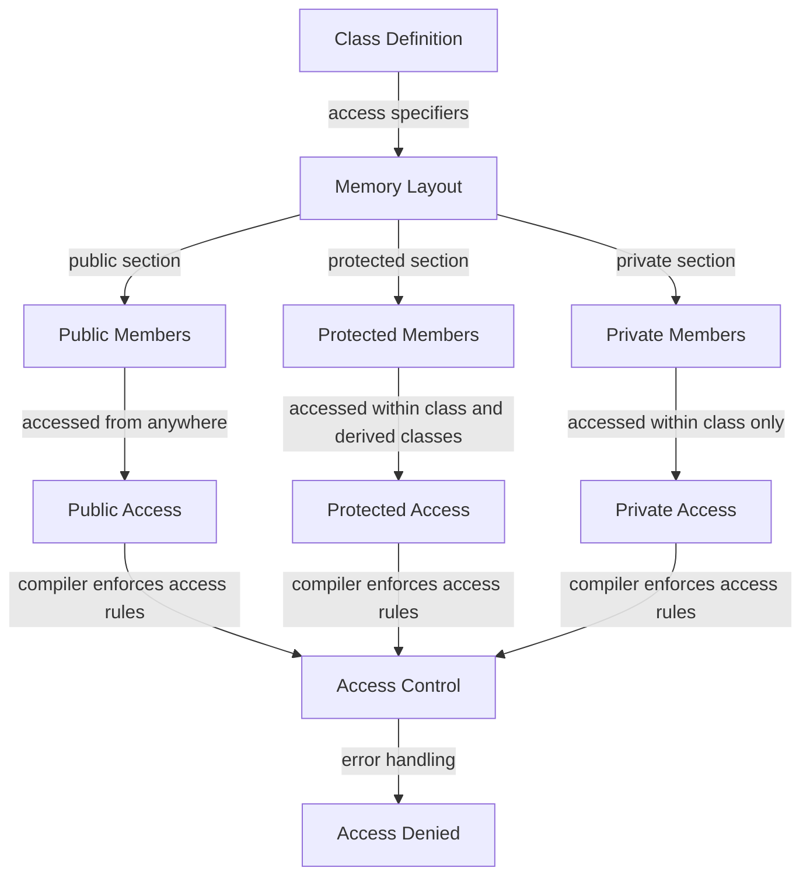

## Introduction
Access specifiers are a fundamental concept in object-oriented programming (OOP) that control the visibility and accessibility of class members, such as variables and methods. In C++, access specifiers are used to define the access level of class members, determining whether they can be accessed from outside the class or not. This concept is crucial in software development, as it helps to encapsulate data and ensure data hiding, which is essential for maintaining code integrity, security, and reusability. In real-world scenarios, access specifiers are used in various systems, such as operating systems, databases, and web applications, to protect sensitive data and prevent unauthorized access.

> **Note:** Access specifiers are not only used in C++ but also in other programming languages, such as Java and C#.

## Core Concepts
Access specifiers in C++ are classified into three main categories: **public**, **private**, and **protected**. Each category has its own set of rules and restrictions that define how class members can be accessed.

*   **Public** members can be accessed from anywhere, both within and outside the class.
*   **Private** members can only be accessed within the class itself and are not visible outside the class.
*   **Protected** members can be accessed within the class itself and by any derived classes.

> **Tip:** When designing a class, it's essential to consider the access level of each member to ensure that sensitive data is protected and only accessible when necessary.

## How It Works Internally
When a class is defined with access specifiers, the compiler generates a memory layout that reflects the access level of each member. The memory layout is organized into sections, each corresponding to a specific access level. The **public** section is usually placed at the beginning of the memory layout, followed by the **protected** section, and finally the **private** section.

Here's a step-by-step breakdown of how access specifiers work internally:

1.  The compiler parses the class definition and identifies the access specifiers used.
2.  The compiler generates a memory layout for the class, allocating space for each member based on its access level.
3.  The compiler enforces the access level rules by generating code that checks the access level of each member before allowing access.

> **Warning:** Access specifiers are not a security feature and should not be relied upon to protect sensitive data. They are primarily used to encapsulate data and ensure data hiding.

## Code Examples
### Example 1: Basic Usage
```cpp
class MyClass {
public:
    int publicVar; // public member
private:
    int privateVar; // private member
protected:
    int protectedVar; // protected member

public:
    void setPrivateVar(int value) {
        privateVar = value; // accessing private member within the class
    }

    int getPrivateVar() {
        return privateVar; // accessing private member within the class
    }
};

int main() {
    MyClass obj;
    obj.publicVar = 10; // accessing public member
    // obj.privateVar = 20; // error: cannot access private member
    // obj.protectedVar = 30; // error: cannot access protected member

    obj.setPrivateVar(20); // accessing private member through a public method
    std::cout << "Private Var: " << obj.getPrivateVar() << std::endl;

    return 0;
}
```

### Example 2: Derived Class
```cpp
class BaseClass {
protected:
    int protectedVar; // protected member
public:
    void setProtectedVar(int value) {
        protectedVar = value; // accessing protected member within the base class
    }

    int getProtectedVar() {
        return protectedVar; // accessing protected member within the base class
    }
};

class DerivedClass : public BaseClass {
public:
    void accessProtectedVar() {
        protectedVar = 10; // accessing protected member within the derived class
    }
};

int main() {
    DerivedClass obj;
    obj.setProtectedVar(20); // accessing protected member through a public method
    obj.accessProtectedVar(); // accessing protected member within the derived class
    std::cout << "Protected Var: " << obj.getProtectedVar() << std::endl;

    return 0;
}
```

### Example 3: Friend Function
```cpp
class MyClass {
private:
    int privateVar; // private member
public:
    friend void friendFunction(MyClass& obj); // declaring a friend function

    void setPrivateVar(int value) {
        privateVar = value; // accessing private member within the class
    }

    int getPrivateVar() {
        return privateVar; // accessing private member within the class
    }
};

void friendFunction(MyClass& obj) {
    obj.privateVar = 20; // accessing private member through a friend function
}

int main() {
    MyClass obj;
    friendFunction(obj); // accessing private member through a friend function
    std::cout << "Private Var: " << obj.getPrivateVar() << std::endl;

    return 0;
}
```

## Visual Diagram


The diagram illustrates the relationship between access specifiers, memory layout, and access control. It shows how the compiler enforces access rules and handles access attempts to class members based on their access level.

> **Interview:** Can you explain the difference between public, private, and protected access specifiers in C++? How do they affect the memory layout of a class?

## Comparison
| Access Specifier | Description | Use Case | Pros | Cons |
| --- | --- | --- | --- | --- |
| public | accessible from anywhere | external interfaces, APIs | easy to use, flexible | lacks encapsulation, security risks |
| private | accessible within class only | internal implementation details, sensitive data | encapsulation, data hiding | restricted access, cumbersome |
| protected | accessible within class and derived classes | inheritance, polymorphism | balances encapsulation and flexibility | complex access rules, harder to maintain |

## Real-world Use Cases
1.  **Operating Systems:** Access specifiers are used in operating systems to protect sensitive data, such as user credentials and encryption keys, from unauthorized access.
2.  **Databases:** Databases use access specifiers to control access to sensitive data, such as credit card numbers and personal identifiable information.
3.  **Web Applications:** Web applications use access specifiers to protect user data, such as passwords and session cookies, from unauthorized access.

> **Tip:** When designing a class, consider using access specifiers to encapsulate sensitive data and ensure data hiding.

## Common Pitfalls
1.  **Overuse of public access:** Using public access specifiers excessively can lead to tight coupling between classes and compromise data encapsulation.
2.  **Underuse of private access:** Failing to use private access specifiers can expose sensitive data to unauthorized access and compromise data security.
3.  **Incorrect use of protected access:** Misusing protected access specifiers can lead to unintended access to sensitive data and compromise data encapsulation.
4.  **Friend functions:** Overusing friend functions can compromise data encapsulation and lead to tight coupling between classes.

> **Warning:** Access specifiers are not a substitute for proper error handling and security measures. Always use access specifiers in conjunction with other security mechanisms to ensure data integrity and security.

## Interview Tips
1.  **What is the purpose of access specifiers in C++?**
    *   Weak answer: Access specifiers are used to restrict access to class members.
    *   Strong answer: Access specifiers are used to encapsulate data, ensure data hiding, and control access to class members based on their access level.
2.  **Can you explain the difference between public, private, and protected access specifiers?**
    *   Weak answer: Public members can be accessed from anywhere, private members can only be accessed within the class, and protected members can be accessed within the class and derived classes.
    *   Strong answer: Public members can be accessed from anywhere, but lack encapsulation and security. Private members can only be accessed within the class, providing encapsulation and data hiding. Protected members can be accessed within the class and derived classes, balancing encapsulation and flexibility.
3.  **How do access specifiers affect the memory layout of a class?**
    *   Weak answer: Access specifiers do not affect the memory layout of a class.
    *   Strong answer: Access specifiers affect the memory layout of a class by organizing members into sections based on their access level. The public section is usually placed at the beginning of the memory layout, followed by the protected section, and finally the private section.

## Key Takeaways
*   Access specifiers are used to control access to class members based on their access level.
*   Public members can be accessed from anywhere, but lack encapsulation and security.
*   Private members can only be accessed within the class, providing encapsulation and data hiding.
*   Protected members can be accessed within the class and derived classes, balancing encapsulation and flexibility.
*   Access specifiers affect the memory layout of a class by organizing members into sections based on their access level.
*   Access specifiers are not a substitute for proper error handling and security measures.
*   Always use access specifiers in conjunction with other security mechanisms to ensure data integrity and security.
*   Consider using access specifiers to encapsulate sensitive data and ensure data hiding.
*   Avoid overusing public access specifiers, as it can lead to tight coupling between classes and compromise data encapsulation.