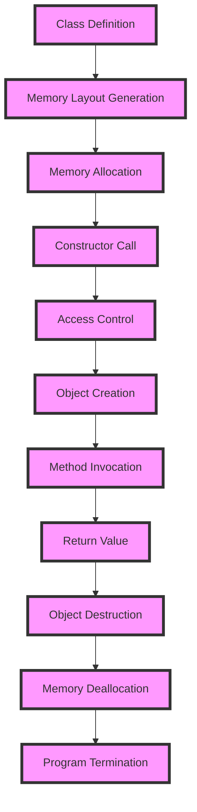

## Introduction
**Classes and objects** are fundamental concepts in object-oriented programming (OOP) that enable developers to create reusable, modular code. In C++, `class` and `struct` are two keywords used to define custom data types. While they share many similarities, there are key differences between them. Understanding these differences is crucial for writing efficient, maintainable code. In this section, we will explore the basics of classes and objects, their importance in software development, and real-world applications.

> **Note:** Classes and objects are essential building blocks of OOP, allowing developers to encapsulate data and behavior, promoting code reusability and modularity.

## Core Concepts
A **class** is a blueprint or a template that defines the characteristics and behaviors of an object. It is a user-defined data type that encapsulates data members (variables) and member functions (methods). A **struct**, on the other hand, is a type of class that is used to define a composite data type. The main difference between a class and a struct is the default access specifier: `private` for classes and `public` for structs.

> **Warning:** Failing to understand the differences between classes and structs can lead to incorrect usage, resulting in unexpected behavior or compiler errors.

Key terminology includes:

* **Encapsulation**: The concept of hiding implementation details and exposing only necessary information through public interfaces.
* **Abstraction**: The process of representing complex systems in a simplified way, focusing on essential features and behaviors.
* **Inheritance**: The mechanism of creating a new class based on an existing class, inheriting its properties and behaviors.

## How It Works Internally
When a class or struct is defined, the compiler generates a memory layout for the object. The memory layout includes the data members and any additional information required by the compiler, such as padding bytes for alignment. The default access specifier determines the visibility of the data members and member functions.

Here is a step-by-step breakdown of the process:

1. **Class definition**: The compiler encounters a class definition and generates a memory layout for the object.
2. **Memory allocation**: When an object is created, memory is allocated for the object based on the memory layout.
3. **Constructor call**: The constructor is called to initialize the object's data members.
4. **Access control**: The access specifier determines the visibility of the data members and member functions.

## Code Examples
### Example 1: Basic Class Usage
```cpp
class Person {
public:
    // Constructor
    Person(std::string name, int age) : name_(name), age_(age) {}

    // Getter methods
    std::string getName() const { return name_; }
    int getAge() const { return age_; }

private:
    std::string name_;
    int age_;
};

int main() {
    Person person("John Doe", 30);
    std::cout << "Name: " << person.getName() << std::endl;
    std::cout << "Age: " << person.getAge() << std::endl;
    return 0;
}
```
### Example 2: Struct Usage
```cpp
struct Point {
    int x;
    int y;
};

int main() {
    Point point;
    point.x = 10;
    point.y = 20;
    std::cout << "Point: (" << point.x << ", " << point.y << ")" << std::endl;
    return 0;
}
```
### Example 3: Inheritance and Polymorphism
```cpp
class Shape {
public:
    virtual void draw() const = 0;
};

class Circle : public Shape {
public:
    void draw() const override {
        std::cout << "Drawing a circle." << std::endl;
    }
};

class Rectangle : public Shape {
public:
    void draw() const override {
        std::cout << "Drawing a rectangle." << std::endl;
    }
};

int main() {
    Shape* circle = new Circle();
    Shape* rectangle = new Rectangle();
    circle->draw();
    rectangle->draw();
    delete circle;
    delete rectangle;
    return 0;
}
```
> **Tip:** Use `const` correctness to ensure that methods do not modify the object's state unnecessarily.

## Visual Diagram

The diagram illustrates the process of object creation, method invocation, and object destruction.

## Comparison
| Approach | Time Complexity | Space Complexity | Pros | Cons | Best For |
| --- | --- | --- | --- | --- | --- |
| Class | O(1) | O(n) | Encapsulation, inheritance, polymorphism | Steeper learning curve | Complex systems, large-scale applications |
| Struct | O(1) | O(n) | Simple, lightweight, default public access | Limited functionality, no inheritance | Small, simple data structures |
| Inheritance | O(1) | O(n) | Code reuse, polymorphism | Increased complexity, potential for tight coupling | Hierarchical relationships between classes |
| Composition | O(1) | O(n) | Flexibility, loose coupling | Increased complexity, potential for over-engineering | Complex systems, multiple relationships between classes |

> **Interview:** What is the main difference between a class and a struct in C++? (Answer: The default access specifier: private for classes and public for structs.)

## Real-world Use Cases
1. **Game development**: Classes and objects are used to represent game entities, such as characters, enemies, and obstacles.
2. **Financial systems**: Classes and objects are used to represent financial instruments, such as stocks, bonds, and derivatives.
3. **Database systems**: Classes and objects are used to represent database entities, such as tables, rows, and columns.

## Common Pitfalls
1. **Incorrect access specifier**: Failing to specify the correct access specifier can lead to unexpected behavior or compiler errors.
2. **Tight coupling**: Overusing inheritance or composition can lead to tight coupling between classes, making it difficult to modify or maintain the code.
3. **Over-engineering**: Using complex class hierarchies or overly complex data structures can lead to decreased performance and increased maintenance costs.

> **Warning:** Avoid using `friend` classes or functions, as they can break encapsulation and make the code harder to understand and maintain.

## Interview Tips
1. **Define a class**: Ask the candidate to define a simple class with a constructor, getter methods, and a destructor.
2. **Explain inheritance**: Ask the candidate to explain the concept of inheritance and provide an example of how it can be used.
3. **Discuss polymorphism**: Ask the candidate to discuss the concept of polymorphism and provide an example of how it can be used.

## Key Takeaways
* Classes and objects are fundamental concepts in OOP.
* The default access specifier for classes is `private`, while for structs it is `public`.
* Inheritance and composition are used to create complex relationships between classes.
* Encapsulation, abstraction, and polymorphism are essential principles of OOP.
* Incorrect access specifier, tight coupling, and over-engineering are common pitfalls to avoid.
* Classes and objects are used in a wide range of applications, including game development, financial systems, and database systems.