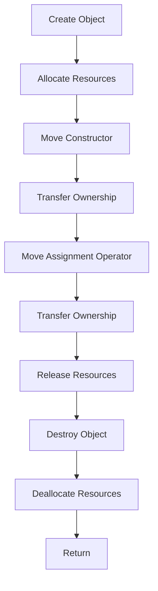

## Introduction
**Move semantics** is a key feature introduced in **C++11** that allows developers to efficiently transfer ownership of objects, reducing unnecessary copying and improving performance. In this section, we will explore what move semantics is, why it matters, and its real-world relevance. Move semantics is essential for every engineer to know, as it can significantly impact the performance and efficiency of C++ applications.

Move semantics addresses the issue of unnecessary copying of objects, which can lead to performance degradation and increased memory usage. By using move semantics, developers can ensure that objects are transferred efficiently, without the need for unnecessary copying.

> **Note:** Move semantics is particularly important when working with large objects, such as vectors or matrices, where copying can be expensive.

## Core Concepts
In this section, we will delve into the core concepts of move semantics, including **move constructors**, **move assignment operators**, and **rvalue references**.

*   **Move constructor**: A special constructor that transfers ownership of an object's resources, rather than copying them. This is achieved by using an **rvalue reference** as the parameter.
*   **Move assignment operator**: A special assignment operator that transfers ownership of an object's resources, rather than copying them. This is also achieved by using an **rvalue reference** as the parameter.
*   **Rvalue reference**: A reference that binds to an rvalue (a temporary object). Rvalue references are used to identify objects that can be moved from, rather than copied.

> **Warning:** Failing to implement move constructors and move assignment operators can lead to performance issues and unnecessary copying of objects.

## How It Works Internally
In this section, we will explore the internal mechanics of move semantics.

1.  When an object is created, its resources (such as memory or file handles) are allocated and managed by the object.
2.  When an object is copied, a new object is created, and the resources of the original object are duplicated.
3.  When an object is moved, the resources of the original object are transferred to the new object, without duplicating them.
4.  The move constructor and move assignment operator are used to transfer ownership of an object's resources.

> **Tip:** To implement move semantics, you should use the `std::move` function to cast an lvalue (a named object) to an rvalue reference.

## Code Examples
In this section, we will explore three complete and runnable code examples that demonstrate the use of move semantics.

### Example 1: Basic Move Constructor
```cpp
class MyClass {
public:
    MyClass() { std::cout << "Default constructor" << std::endl; }
    MyClass(const MyClass& other) { std::cout << "Copy constructor" << std::endl; }
    MyClass(MyClass&& other) noexcept { std::cout << "Move constructor" << std::endl; }
};

int main() {
    MyClass obj1;
    MyClass obj2 = std::move(obj1); // Move constructor is called
    return 0;
}
```

### Example 2: Move Assignment Operator
```cpp
class MyClass {
public:
    MyClass() { std::cout << "Default constructor" << std::endl; }
    MyClass(const MyClass& other) { std::cout << "Copy constructor" << std::endl; }
    MyClass& operator=(const MyClass& other) { std::cout << "Copy assignment operator" << std::endl; return *this; }
    MyClass& operator=(MyClass&& other) noexcept { std::cout << "Move assignment operator" << std::endl; return *this; }
};

int main() {
    MyClass obj1;
    MyClass obj2;
    obj2 = std::move(obj1); // Move assignment operator is called
    return 0;
}
```

### Example 3: Real-World Usage
```cpp
class Vector {
public:
    Vector(int size) : data_(new int[size]), size_(size) { std::cout << "Default constructor" << std::endl; }
    Vector(const Vector& other) : data_(new int[other.size_]), size_(other.size_) {
        std::copy(other.data_, other.data_ + size_, data_);
        std::cout << "Copy constructor" << std::endl;
    }
    Vector(Vector&& other) noexcept : data_(other.data_), size_(other.size_) {
        other.data_ = nullptr;
        other.size_ = 0;
        std::cout << "Move constructor" << std::endl;
    }
    Vector& operator=(const Vector& other) {
        if (this != &other) {
            delete[] data_;
            data_ = new int[other.size_];
            size_ = other.size_;
            std::copy(other.data_, other.data_ + size_, data_);
        }
        std::cout << "Copy assignment operator" << std::endl;
        return *this;
    }
    Vector& operator=(Vector&& other) noexcept {
        if (this != &other) {
            delete[] data_;
            data_ = other.data_;
            size_ = other.size_;
            other.data_ = nullptr;
            other.size_ = 0;
        }
        std::cout << "Move assignment operator" << std::endl;
        return *this;
    }
    ~Vector() { delete[] data_; }

private:
    int* data_;
    int size_;
};

int main() {
    Vector vec1(10);
    Vector vec2 = std::move(vec1); // Move constructor is called
    return 0;
}
```

## Visual Diagram

This diagram illustrates the process of creating an object, allocating resources, transferring ownership using the move constructor and move assignment operator, and finally releasing resources and destroying the object.

## Comparison
| Approach | Time Complexity | Space Complexity | Pros | Cons | Best For |
| --- | --- | --- | --- | --- | --- |
| Copy Constructor | O(n) | O(n) | Easy to implement | Inefficient for large objects | Small objects |
| Move Constructor | O(1) | O(1) | Efficient for large objects | Requires careful implementation | Large objects |
| Copy Assignment Operator | O(n) | O(n) | Easy to implement | Inefficient for large objects | Small objects |
| Move Assignment Operator | O(1) | O(1) | Efficient for large objects | Requires careful implementation | Large objects |

## Real-world Use Cases
1.  **Google's Protocol Buffers**: Google's Protocol Buffers use move semantics to efficiently transfer ownership of message objects.
2.  **Microsoft's std::vector**: Microsoft's implementation of `std::vector` uses move semantics to efficiently transfer ownership of vector objects.
3.  **Qt's QString**: Qt's `QString` class uses move semantics to efficiently transfer ownership of string objects.

> **Interview:** Can you explain the difference between a copy constructor and a move constructor? How do you implement move semantics in C++?

## Common Pitfalls
1.  **Failing to implement move constructors and move assignment operators**: This can lead to performance issues and unnecessary copying of objects.
2.  **Using `std::move` unnecessarily**: This can lead to unnecessary overhead and performance degradation.
3.  **Not using `std::move` when necessary**: This can lead to unnecessary copying of objects and performance degradation.
4.  **Not handling self-assignment correctly**: This can lead to undefined behavior and crashes.

```cpp
// Wrong way: not handling self-assignment correctly
Vector& Vector::operator=(Vector&& other) noexcept {
    data_ = other.data_;
    size_ = other.size_;
    other.data_ = nullptr;
    other.size_ = 0;
    return *this;
}

// Right way: handling self-assignment correctly
Vector& Vector::operator=(Vector&& other) noexcept {
    if (this != &other) {
        data_ = other.data_;
        size_ = other.size_;
        other.data_ = nullptr;
        other.size_ = 0;
    }
    return *this;
}
```

## Interview Tips
1.  **Be prepared to explain the difference between a copy constructor and a move constructor**: Make sure you can clearly explain the purpose and implementation of each.
2.  **Be prepared to explain how to implement move semantics in C++**: Make sure you can provide a clear and concise example of how to implement move semantics using `std::move` and rvalue references.
3.  **Be prepared to explain common pitfalls and how to avoid them**: Make sure you can identify common mistakes and provide solutions to avoid them.

> **Tip:** Practice implementing move semantics and handling common pitfalls to become more confident and proficient.

## Key Takeaways
*   **Move semantics** is a key feature in C++11 that allows for efficient transfer of ownership of objects.
*   **Move constructors** and **move assignment operators** are used to transfer ownership of objects.
*   **Rvalue references** are used to identify objects that can be moved from.
*   **`std::move`** is used to cast an lvalue to an rvalue reference.
*   **Implementing move semantics** requires careful consideration of self-assignment and resource management.
*   **Common pitfalls** include failing to implement move constructors and move assignment operators, using `std::move` unnecessarily, and not handling self-assignment correctly.
*   **Real-world use cases** include Google's Protocol Buffers, Microsoft's `std::vector`, and Qt's `QString`.
*   **Time complexity** of move constructors and move assignment operators is O(1), while copy constructors and copy assignment operators have a time complexity of O(n).
*   **Space complexity** of move constructors and move assignment operators is O(1), while copy constructors and copy assignment operators have a space complexity of O(n).