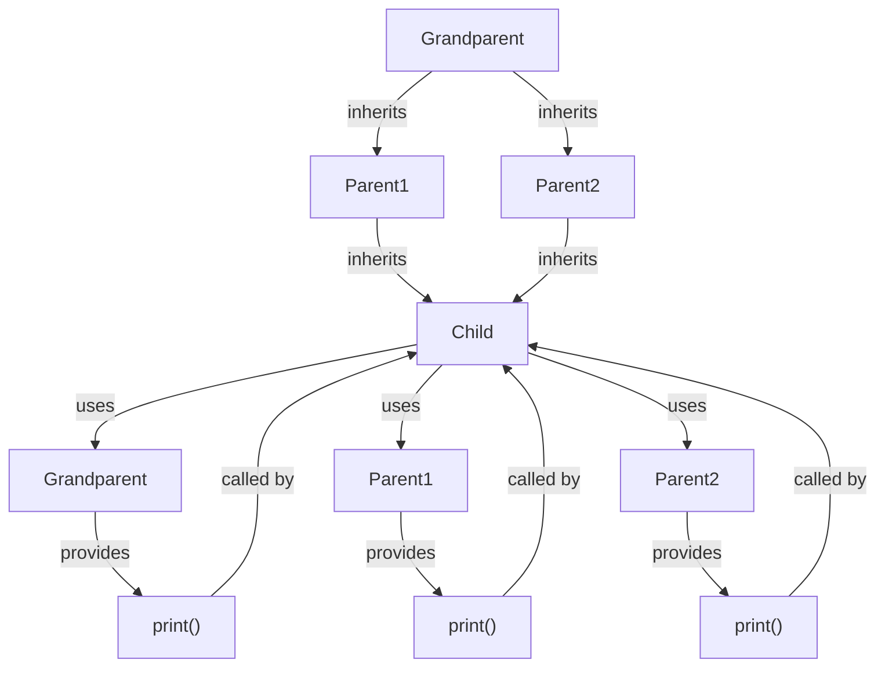

## Introduction
**Multiple Inheritance** is a feature in object-oriented programming (OOP) that allows a class to inherit properties and behavior from more than one superclass. This concept is crucial in designing complex systems, as it enables the creation of a more comprehensive and hierarchical structure. However, multiple inheritance can lead to the **Diamond Problem**, a well-known issue that arises when two classes inherit from a common base class, and another class inherits from both of them. In this scenario, the compiler may become confused about which implementation to use, resulting in ambiguity. Real-world relevance can be seen in systems where multiple inheritance is used to model complex relationships between objects, such as in game development, simulation software, or even operating systems.

> **Note:** The Diamond Problem is a classic example of how multiple inheritance can lead to conflicts and ambiguity in OOP.

## Core Concepts
- **Multiple Inheritance**: A class can inherit properties and behavior from more than one superclass.
- **Diamond Problem**: A situation where two classes inherit from a common base class, and another class inherits from both of them, leading to ambiguity.
- **Ambiguity**: A situation where the compiler is unsure about which implementation to use, resulting in errors.
- **Virtual Inheritance**: A technique used to resolve the Diamond Problem by making the common base class a virtual base class.

## How It Works Internally
When a class inherits from multiple superclasses, the compiler must resolve the ambiguity by choosing which implementation to use. In the case of the Diamond Problem, the compiler may become confused about which implementation to use, resulting in errors. To resolve this issue, the concept of virtual inheritance is used. Virtual inheritance involves making the common base class a virtual base class, which means that only one instance of the base class is created, and all classes that inherit from it share the same instance.

> **Warning:** The Diamond Problem can lead to serious issues in large and complex systems, making it essential to understand how to resolve it.

## Code Examples
### Example 1: Basic Multiple Inheritance
```cpp
class Animal {
public:
    void sound() {
        std::cout << "The animal makes a sound." << std::endl;
    }
};

class Mammal {
public:
    void eat() {
        std::cout << "The mammal eats." << std::endl;
    }
};

class Dog : public Animal, public Mammal {
public:
    void bark() {
        std::cout << "The dog barks." << std::endl;
    }
};

int main() {
    Dog dog;
    dog.sound(); // Output: The animal makes a sound.
    dog.eat(); // Output: The mammal eats.
    dog.bark(); // Output: The dog barks.
    return 0;
}
```

### Example 2: Diamond Problem
```cpp
class Grandparent {
public:
    void print() {
        std::cout << "Grandparent" << std::endl;
    }
};

class Parent1 : public Grandparent {
public:
    void print() {
        std::cout << "Parent1" << std::endl;
    }
};

class Parent2 : public Grandparent {
public:
    void print() {
        std::cout << "Parent2" << std::endl;
    }
};

class Child : public Parent1, public Parent2 {
public:
    void print() {
        std::cout << "Child" << std::endl;
    }
};

int main() {
    Child child;
    child.Parent1::print(); // Output: Parent1
    child.Parent2::print(); // Output: Parent2
    // child.print(); // Error: ambiguous call to overloaded function
    return 0;
}
```

### Example 3: Resolving the Diamond Problem using Virtual Inheritance
```cpp
class Grandparent {
public:
    void print() {
        std::cout << "Grandparent" << std::endl;
    }
};

class Parent1 : public virtual Grandparent {
public:
    void print() {
        std::cout << "Parent1" << std::endl;
    }
};

class Parent2 : public virtual Grandparent {
public:
    void print() {
        std::cout << "Parent2" << std::endl;
    }
};

class Child : public Parent1, public Parent2 {
public:
    void print() {
        std::cout << "Child" << std::endl;
    }
};

int main() {
    Child child;
    child.print(); // Output: Child
    child.Grandparent::print(); // Output: Grandparent
    return 0;
}
```

## Visual Diagram

The diagram illustrates the Diamond Problem and how virtual inheritance can be used to resolve it. The `Grandparent` class is inherited by both `Parent1` and `Parent2`, which are then inherited by the `Child` class. The `Child` class can access the `print()` function from all three classes.

> **Tip:** Using virtual inheritance can help resolve the Diamond Problem, but it can also increase the complexity of the code.

## Comparison
| Approach | Time Complexity | Space Complexity | Pros | Cons | Best For |
|----------|----------------|-----------------|------|------|----------|
| Multiple Inheritance | O(1) | O(n) | Allows for complex hierarchies | Can lead to ambiguity | Large, complex systems |
| Virtual Inheritance | O(1) | O(n) | Resolves the Diamond Problem | Increases complexity | Systems with multiple inheritance |
| Single Inheritance | O(1) | O(1) | Simple and easy to understand | Limited flexibility | Small, simple systems |
| Composition | O(1) | O(1) | Flexible and easy to modify | Can be complex to implement | Systems with dynamic relationships |

## Real-world Use Cases
1. **Game Development**: In game development, multiple inheritance can be used to model complex relationships between characters, such as a character that is both a warrior and a mage.
2. **Simulation Software**: Simulation software can use multiple inheritance to model complex systems, such as a traffic simulation that models both cars and pedestrians.
3. **Operating Systems**: Operating systems can use multiple inheritance to model complex relationships between processes and threads.

> **Interview:** What is the Diamond Problem, and how can it be resolved?

## Common Pitfalls
1. **Ambiguity**: The Diamond Problem can lead to ambiguity, which can be resolved using virtual inheritance.
2. **Complexity**: Multiple inheritance can increase the complexity of the code, making it harder to understand and maintain.
3. **Performance**: Virtual inheritance can affect performance, as it requires the creation of a virtual table.
4. **Overriding**: When using multiple inheritance, it is essential to override functions correctly to avoid ambiguity.

> **Warning:** Multiple inheritance can lead to serious issues if not used correctly.

## Interview Tips
1. **What is multiple inheritance?**: A class can inherit properties and behavior from more than one superclass.
2. **What is the Diamond Problem?**: A situation where two classes inherit from a common base class, and another class inherits from both of them, leading to ambiguity.
3. **How can the Diamond Problem be resolved?**: Using virtual inheritance, which makes the common base class a virtual base class.

> **Note:** Understanding multiple inheritance and the Diamond Problem is essential for any software developer.

## Key Takeaways
* Multiple inheritance allows a class to inherit properties and behavior from more than one superclass.
* The Diamond Problem is a classic example of how multiple inheritance can lead to conflicts and ambiguity.
* Virtual inheritance can be used to resolve the Diamond Problem.
* Multiple inheritance can increase the complexity of the code, making it harder to understand and maintain.
* Performance can be affected by virtual inheritance.
* Overriding functions correctly is essential when using multiple inheritance.
* Understanding multiple inheritance and the Diamond Problem is essential for any software developer.
* The Diamond Problem can be resolved using virtual inheritance, but it can also increase the complexity of the code.
* Multiple inheritance can lead to serious issues if not used correctly.
* The time complexity of multiple inheritance is O(1), and the space complexity is O(n).