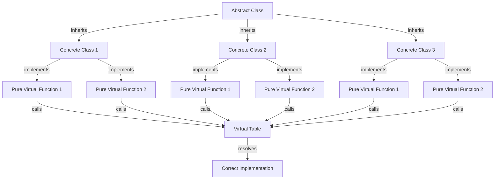

## Introduction
Pure virtual functions and abstract classes are fundamental concepts in object-oriented programming (OOP) in C++. They allow developers to create classes that cannot be instantiated on their own and are meant to be inherited by other classes. This is useful when we want to provide a common interface or base class for a group of related classes, but we don't want to allow direct instantiation of the base class. In this section, we will explore the importance of pure virtual functions and abstract classes, their real-world relevance, and why every engineer needs to know about them.

> **Note:** Pure virtual functions and abstract classes are essential in designing robust and maintainable object-oriented systems. They help to promote code reuse, reduce code duplication, and improve the overall structure of the code.

## Core Concepts
A **pure virtual function** is a member function of a class that is declared with a pure specifier (= 0) at the end of its declaration. A class that contains at least one pure virtual function is called an **abstract class**. Abstract classes cannot be instantiated on their own and are meant to be inherited by other classes. The inheriting classes must provide an implementation for all pure virtual functions.

A **mental model** to understand pure virtual functions and abstract classes is to think of them as a blueprint or a template for other classes. The abstract class provides a common interface or base class for a group of related classes, and the inheriting classes must fill in the gaps by providing an implementation for the pure virtual functions.

> **Warning:** A common mistake is to declare a pure virtual function without providing an implementation for it in the inheriting classes. This will result in a linker error when trying to instantiate the inheriting class.

## How It Works Internally
When a class inherits from an abstract class, the compiler checks if the inheriting class provides an implementation for all pure virtual functions. If it does, the compiler generates a vtable (virtual table) for the inheriting class, which contains pointers to the implementations of the virtual functions. The vtable is used at runtime to resolve the correct implementation of a virtual function.

Here is a step-by-step breakdown of how it works:

1. The compiler checks if the inheriting class provides an implementation for all pure virtual functions.
2. If it does, the compiler generates a vtable for the inheriting class.
3. The vtable contains pointers to the implementations of the virtual functions.
4. At runtime, the program uses the vtable to resolve the correct implementation of a virtual function.

> **Tip:** To optimize the performance of virtual functions, use the `final` keyword to specify that a virtual function cannot be overridden in inheriting classes. This allows the compiler to inline the function call and eliminate the overhead of the vtable lookup.

## Code Examples
### Example 1: Basic Usage
```cpp
class Shape {
public:
    virtual void draw() = 0; // Pure virtual function
};

class Circle : public Shape {
public:
    void draw() override { // Provide an implementation for the pure virtual function
        std::cout << "Drawing a circle." << std::endl;
    }
};

int main() {
    Circle circle;
    circle.draw();
    return 0;
}
```

### Example 2: Real-World Pattern
```cpp
class PaymentGateway {
public:
    virtual void processPayment(const std::string& amount) = 0; // Pure virtual function
};

class PayPal : public PaymentGateway {
public:
    void processPayment(const std::string& amount) override { // Provide an implementation for the pure virtual function
        std::cout << "Processing payment through PayPal: " << amount << std::endl;
    }
};

class Stripe : public PaymentGateway {
public:
    void processPayment(const std::string& amount) override { // Provide an implementation for the pure virtual function
        std::cout << "Processing payment through Stripe: " << amount << std::endl;
    }
};

int main() {
    PayPal paypal;
    Stripe stripe;
    paypal.processPayment("10.99");
    stripe.processPayment("5.99");
    return 0;
}
```

### Example 3: Advanced Usage
```cpp
class Logger {
public:
    virtual void log(const std::string& message) = 0; // Pure virtual function
};

class ConsoleLogger : public Logger {
public:
    void log(const std::string& message) override { // Provide an implementation for the pure virtual function
        std::cout << "Logging to console: " << message << std::endl;
    }
};

class FileLogger : public Logger {
public:
    void log(const std::string& message) override { // Provide an implementation for the pure virtual function
        std::ofstream file("log.txt");
        file << "Logging to file: " << message << std::endl;
        file.close();
    }
};

int main() {
    ConsoleLogger consoleLogger;
    FileLogger fileLogger;
    consoleLogger.log("Hello, world!");
    fileLogger.log("Hello, world!");
    return 0;
}
```

## Visual Diagram

The diagram illustrates the relationship between an abstract class, concrete classes, and pure virtual functions. The abstract class provides a common interface for the concrete classes, which must implement the pure virtual functions. The virtual table is used to resolve the correct implementation of a virtual function at runtime.

> **Interview:** Can you explain the difference between a pure virtual function and a regular virtual function? How do you decide when to use each?

## Comparison
| Approach | Time Complexity | Space Complexity | Pros | Cons | Best For |
| --- | --- | --- | --- | --- | --- |
| Pure Virtual Functions | O(1) | O(1) | Provides a way to define an interface without providing an implementation | Can lead to linker errors if not implemented correctly | Defining interfaces for classes that must be inherited |
| Abstract Classes | O(1) | O(1) | Provides a way to define a base class that cannot be instantiated on its own | Can lead to tight coupling between classes | Defining base classes for groups of related classes |
| Interfaces | O(1) | O(1) | Provides a way to define a contract without providing an implementation | Not supported in C++ | Defining contracts for classes that must be implemented |
| Regular Virtual Functions | O(1) | O(1) | Provides a way to define a function that can be overridden by derived classes | Can lead to performance overhead due to vtable lookup | Defining functions that must be overridden by derived classes |

## Real-world Use Cases
1. **Payment gateways**: Companies like PayPal and Stripe use abstract classes and pure virtual functions to define interfaces for payment processing. This allows them to provide a common interface for different payment methods, such as credit cards and bank transfers.
2. **Logging frameworks**: Companies like Log4j and Logback use abstract classes and pure virtual functions to define interfaces for logging. This allows them to provide a common interface for different logging destinations, such as files and databases.
3. **Game engines**: Companies like Unity and Unreal Engine use abstract classes and pure virtual functions to define interfaces for game objects. This allows them to provide a common interface for different types of game objects, such as characters and vehicles.

## Common Pitfalls
1. **Not providing an implementation for pure virtual functions**: This can lead to linker errors when trying to instantiate a class that inherits from an abstract class.
2. **Not using the `override` keyword**: This can lead to unexpected behavior when overriding virtual functions.
3. **Not using the `final` keyword**: This can lead to performance overhead due to vtable lookup.
4. **Tight coupling between classes**: This can lead to maintainability issues and make it difficult to modify or extend the code.

> **Warning:** Not providing an implementation for pure virtual functions can lead to linker errors. Always make sure to provide an implementation for all pure virtual functions in inheriting classes.

## Interview Tips
1. **Can you explain the difference between a pure virtual function and a regular virtual function?**: A pure virtual function is a virtual function that must be implemented by any class that inherits from the class that declares it. A regular virtual function is a virtual function that can be overridden by derived classes, but does not have to be.
2. **How do you decide when to use a pure virtual function and when to use a regular virtual function?**: Use a pure virtual function when you want to define an interface that must be implemented by any class that inherits from the class that declares it. Use a regular virtual function when you want to define a function that can be overridden by derived classes, but does not have to be.
3. **Can you give an example of a real-world use case for abstract classes and pure virtual functions?**: Yes, payment gateways like PayPal and Stripe use abstract classes and pure virtual functions to define interfaces for payment processing.

## Key Takeaways
* Pure virtual functions and abstract classes are essential in designing robust and maintainable object-oriented systems.
* Abstract classes provide a way to define a base class that cannot be instantiated on its own.
* Pure virtual functions provide a way to define an interface without providing an implementation.
* Use the `override` keyword to specify that a virtual function is being overridden.
* Use the `final` keyword to specify that a virtual function cannot be overridden.
* Always provide an implementation for all pure virtual functions in inheriting classes.
* Use abstract classes and pure virtual functions to define interfaces for groups of related classes.
* Use regular virtual functions to define functions that can be overridden by derived classes, but do not have to be.