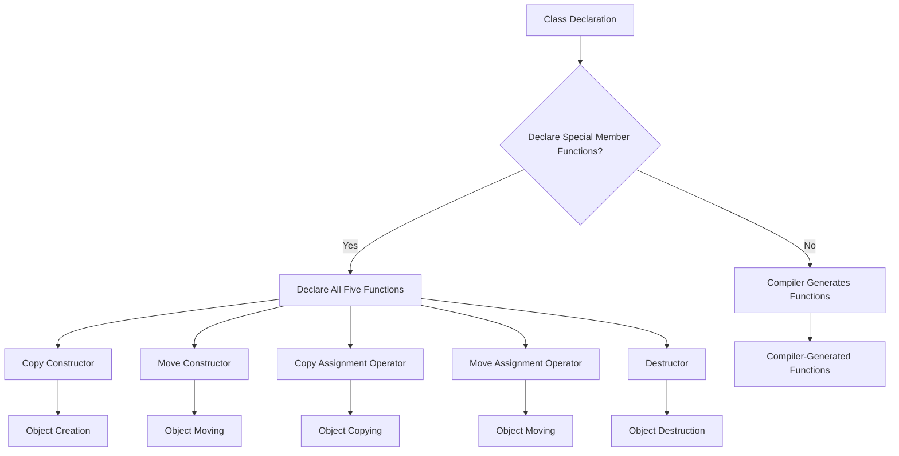

## Introduction
The **Rule of Zero, Three, Five** is a set of guidelines in C++ that helps developers write more efficient, safer, and less error-prone code. It is also known as the **Rule of Five** or **Rule of Zero**, depending on the specific context. In essence, this rule states that if you declare any of the special member functions (copy constructor, move constructor, copy assignment operator, move assignment operator, or destructor) in a class, you should declare all five of them. This is to ensure that the class behaves correctly when it comes to object creation, copying, moving, and destruction. > **Note:** This rule is particularly important in modern C++ development, where the focus is on writing high-performance, concurrent, and safe code.

The Rule of Zero, Three, Five has real-world relevance in many areas of software development, including operating systems, embedded systems, and high-performance computing. For example, in the development of the Linux kernel, the Rule of Five is often applied to ensure that kernel modules are properly initialized and cleaned up. > **Tip:** By following the Rule of Zero, Three, Five, developers can avoid common pitfalls such as resource leaks, crashes, and undefined behavior.

## Core Concepts
The **Rule of Zero, Three, Five** is based on the following core concepts:
* **Copy constructor**: A special member function that creates a copy of an existing object.
* **Move constructor**: A special member function that moves the contents of an existing object to a new object.
* **Copy assignment operator**: A special member function that assigns the contents of an existing object to another object.
* **Move assignment operator**: A special member function that moves the contents of an existing object to another object.
* **Destructor**: A special member function that is called when an object is destroyed.
* **Rule of Zero**: If you don't declare any of the special member functions, the compiler will generate them for you. This is the default behavior in C++.
* **Rule of Three**: If you declare any of the copy constructor, copy assignment operator, or destructor, you should declare all three of them. This is to ensure that the class behaves correctly when it comes to object creation and destruction.
* **Rule of Five**: If you declare any of the copy constructor, move constructor, copy assignment operator, move assignment operator, or destructor, you should declare all five of them. This is to ensure that the class behaves correctly when it comes to object creation, copying, moving, and destruction.

> **Warning:** Failing to follow the Rule of Zero, Three, Five can lead to serious issues, including crashes, data corruption, and security vulnerabilities.

## How It Works Internally
When a class declares any of the special member functions, the compiler will generate the remaining functions as needed. For example, if a class declares a copy constructor, the compiler will generate a copy assignment operator and a destructor. However, if the class also declares a move constructor, the compiler will not generate a move assignment operator, and vice versa.

The internal mechanics of the Rule of Zero, Three, Five can be summarized as follows:
1. The compiler generates the special member functions as needed, based on the declarations in the class.
2. If a class declares any of the special member functions, it should declare all five of them to ensure correct behavior.
3. The Rule of Zero, Three, Five applies to all classes, including those that inherit from other classes.

> **Interview:** In an interview, you may be asked to explain the difference between the Rule of Three and the Rule of Five. A strong answer would be: "The Rule of Three applies to classes that declare a copy constructor, copy assignment operator, or destructor, while the Rule of Five applies to classes that declare a copy constructor, move constructor, copy assignment operator, move assignment operator, or destructor."

## Code Examples
### Example 1: Basic Usage
```cpp
class MyClass {
public:
    MyClass() {}
    MyClass(const MyClass& other) {}
    MyClass& operator=(const MyClass& other) {}
    ~MyClass() {}
};

int main() {
    MyClass obj1;
    MyClass obj2 = obj1; // copy constructor
    obj2 = obj1; // copy assignment operator
    return 0;
}
```
This example demonstrates the basic usage of the Rule of Three. The `MyClass` class declares a copy constructor, copy assignment operator, and destructor, which ensures that the class behaves correctly when it comes to object creation and destruction.

### Example 2: Real-World Pattern
```cpp
class MyClass {
public:
    MyClass() : data_(new int[10]) {}
    MyClass(const MyClass& other) : data_(new int[10]) {
        std::copy(other.data_, other.data_ + 10, data_);
    }
    MyClass& operator=(const MyClass& other) {
        if (this != &other) {
            delete[] data_;
            data_ = new int[10];
            std::copy(other.data_, other.data_ + 10, data_);
        }
        return *this;
    }
    ~MyClass() {
        delete[] data_;
    }
private:
    int* data_;
};

int main() {
    MyClass obj1;
    MyClass obj2 = obj1; // copy constructor
    obj2 = obj1; // copy assignment operator
    return 0;
}
```
This example demonstrates a real-world pattern that applies the Rule of Three. The `MyClass` class declares a copy constructor, copy assignment operator, and destructor, which ensures that the class behaves correctly when it comes to object creation and destruction. The class also manages a dynamically allocated array, which requires careful handling to avoid memory leaks and crashes.

### Example 3: Advanced Usage
```cpp
class MyClass {
public:
    MyClass() : data_(new int[10]) {}
    MyClass(const MyClass& other) : data_(new int[10]) {
        std::copy(other.data_, other.data_ + 10, data_);
    }
    MyClass(MyClass&& other) : data_(other.data_) {
        other.data_ = nullptr;
    }
    MyClass& operator=(const MyClass& other) {
        if (this != &other) {
            delete[] data_;
            data_ = new int[10];
            std::copy(other.data_, other.data_ + 10, data_);
        }
        return *this;
    }
    MyClass& operator=(MyClass&& other) {
        if (this != &other) {
            delete[] data_;
            data_ = other.data_;
            other.data_ = nullptr;
        }
        return *this;
    }
    ~MyClass() {
        delete[] data_;
    }
private:
    int* data_;
};

int main() {
    MyClass obj1;
    MyClass obj2 = std::move(obj1); // move constructor
    obj2 = std::move(obj1); // move assignment operator
    return 0;
}
```
This example demonstrates an advanced usage of the Rule of Five. The `MyClass` class declares a copy constructor, move constructor, copy assignment operator, move assignment operator, and destructor, which ensures that the class behaves correctly when it comes to object creation, copying, moving, and destruction. The class also manages a dynamically allocated array, which requires careful handling to avoid memory leaks and crashes.

## Visual Diagram

This diagram illustrates the process of declaring special member functions in a class. If the class declares any of the special member functions, it should declare all five of them to ensure correct behavior.

## Comparison
| Approach | Time Complexity | Space Complexity | Pros | Cons | Best For |
| --- | --- | --- | --- | --- | --- |
| Rule of Zero | O(1) | O(1) | Easy to implement, compiler generates functions | Limited control over object creation and destruction | Simple classes with no special requirements |
| Rule of Three | O(1) | O(1) | Ensures correct behavior for object creation and destruction | Requires manual implementation of special member functions | Classes with dynamic memory allocation or resources |
| Rule of Five | O(1) | O(1) | Ensures correct behavior for object creation, copying, moving, and destruction | Requires manual implementation of all five special member functions | Classes with dynamic memory allocation, resources, or move semantics |

> **Tip:** When choosing an approach, consider the complexity of the class and the required behavior. The Rule of Zero is suitable for simple classes, while the Rule of Three and Rule of Five are more suitable for classes with dynamic memory allocation or resources.

## Real-world Use Cases
1. **Linux Kernel**: The Linux kernel uses the Rule of Five to ensure correct behavior for kernel modules. Each module is a separate class that manages its own resources, and the kernel uses the Rule of Five to ensure that these resources are properly initialized and cleaned up.
2. **Google's Chromium Browser**: Google's Chromium browser uses the Rule of Five to ensure correct behavior for browser tabs. Each tab is a separate class that manages its own resources, and the browser uses the Rule of Five to ensure that these resources are properly initialized and cleaned up.
3. **Microsoft's Windows Operating System**: Microsoft's Windows operating system uses the Rule of Five to ensure correct behavior for system processes. Each process is a separate class that manages its own resources, and the operating system uses the Rule of Five to ensure that these resources are properly initialized and cleaned up.

## Common Pitfalls
1. **Forgetting to declare all five special member functions**: This can lead to undefined behavior when objects are created, copied, moved, or destroyed.
2. **Not implementing the special member functions correctly**: This can lead to crashes, data corruption, or security vulnerabilities.
3. **Not considering move semantics**: This can lead to inefficient object creation and destruction, as well as crashes or data corruption.
4. **Not using the Rule of Zero**: This can lead to unnecessary complexity and maintenance costs, as well as potential bugs and security vulnerabilities.

> **Warning:** Failing to follow the Rule of Zero, Three, Five can lead to serious issues, including crashes, data corruption, and security vulnerabilities. It is essential to carefully consider the requirements of the class and implement the special member functions correctly.

## Interview Tips
1. **Be prepared to explain the difference between the Rule of Three and the Rule of Five**: A strong answer would be: "The Rule of Three applies to classes that declare a copy constructor, copy assignment operator, or destructor, while the Rule of Five applies to classes that declare a copy constructor, move constructor, copy assignment operator, move assignment operator, or destructor."
2. **Be prepared to explain the importance of move semantics**: A strong answer would be: "Move semantics are essential for efficient object creation and destruction, as well as for avoiding crashes and data corruption."
3. **Be prepared to explain the benefits and drawbacks of each approach**: A strong answer would be: "The Rule of Zero is easy to implement but provides limited control over object creation and destruction. The Rule of Three and Rule of Five provide more control but require manual implementation of special member functions."

> **Interview:** In an interview, you may be asked to write a class that demonstrates the Rule of Five. A strong answer would be to write a class that declares all five special member functions and implements them correctly.

## Key Takeaways
* The **Rule of Zero, Three, Five** is a set of guidelines that helps developers write more efficient, safer, and less error-prone code.
* The **Rule of Zero** applies to classes that do not declare any special member functions.
* The **Rule of Three** applies to classes that declare a copy constructor, copy assignment operator, or destructor.
* The **Rule of Five** applies to classes that declare a copy constructor, move constructor, copy assignment operator, move assignment operator, or destructor.
* Declaring all five special member functions ensures correct behavior for object creation, copying, moving, and destruction.
* Move semantics are essential for efficient object creation and destruction, as well as for avoiding crashes and data corruption.
* The **Rule of Zero, Three, Five** is essential for writing high-performance, concurrent, and safe code.
* The **Rule of Zero, Three, Five** applies to all classes, including those that inherit from other classes.
* Failing to follow the **Rule of Zero, Three, Five** can lead to serious issues, including crashes, data corruption, and security vulnerabilities.