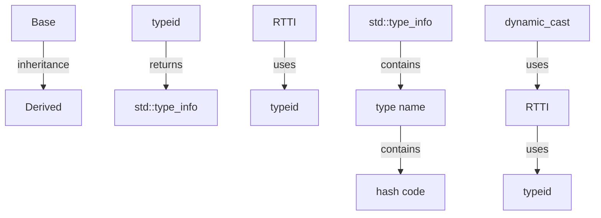

## Introduction
**typeid** and **RTTI (Run-Time Type Information)** are essential features in C++ that enable developers to determine the type of an object at runtime. This is particularly useful in scenarios where the type of an object is not known until runtime, such as when working with polymorphic objects or when using dynamic casting. In this section, we will explore the importance of **typeid** and **RTTI**, their real-world relevance, and why every C++ engineer should understand these concepts.

> **Note:** **typeid** and **RTTI** are not the same thing, although they are often used together. **typeid** is an operator that returns a **std::type_info** object, which contains information about the type of an object. **RTTI**, on the other hand, is a feature that allows you to determine the type of an object at runtime.

## Core Concepts
To understand **typeid** and **RTTI**, you need to grasp the following core concepts:

*   **Polymorphism**: The ability of an object to take on multiple forms, depending on the context in which it is used.
*   **Dynamic casting**: The process of casting an object to a different type at runtime, based on its actual type.
*   **std::type_info**: A class that contains information about a type, such as its name and hash code.
*   **type_id**: An operator that returns a **std::type_info** object for a given type.

> **Warning:** Using **typeid** and **RTTI** can have performance implications, as they require the compiler to generate additional code to support runtime type checking.

## How It Works Internally
When you use **typeid** or **RTTI**, the following steps occur:

1.  The compiler generates a **std::type_info** object for each type in your program.
2.  When you use **typeid** or **RTTI**, the compiler looks up the corresponding **std::type_info** object for the type of the object being queried.
3.  The **std::type_info** object contains information about the type, such as its name and hash code.
4.  The **typeid** operator returns a reference to the **std::type_info** object for the type of the object being queried.

> **Tip:** To improve performance when using **typeid** and **RTTI**, consider using **static_cast** or **reinterpret_cast** instead of **dynamic_cast**, as they do not require runtime type checking.

## Code Examples
Here are three complete, runnable examples that demonstrate the use of **typeid** and **RTTI**:

### Example 1: Basic Usage
```cpp
#include <iostream>
#include <typeinfo>

class Base {
public:
    virtual ~Base() {}
};

class Derived : public Base {
public:
    virtual ~Derived() {}
};

int main() {
    Base* base = new Derived();
    std::cout << "Type of base: " << typeid(*base).name() << std::endl;
    delete base;
    return 0;
}
```

### Example 2: Real-World Pattern
```cpp
#include <iostream>
#include <typeinfo>
#include <vector>

class Shape {
public:
    virtual ~Shape() {}
    virtual void draw() = 0;
};

class Circle : public Shape {
public:
    void draw() override {
        std::cout << "Drawing a circle." << std::endl;
    }
};

class Rectangle : public Shape {
public:
    void draw() override {
        std::cout << "Drawing a rectangle." << std::endl;
    }
};

int main() {
    std::vector<Shape*> shapes;
    shapes.push_back(new Circle());
    shapes.push_back(new Rectangle());

    for (auto shape : shapes) {
        std::cout << "Type of shape: " << typeid(*shape).name() << std::endl;
        shape->draw();
        delete shape;
    }

    return 0;
}
```

### Example 3: Advanced Usage
```cpp
#include <iostream>
#include <typeinfo>
#include <exception>

class Base {
public:
    virtual ~Base() {}
};

class Derived : public Base {
public:
    virtual ~Derived() {}
};

int main() {
    try {
        Base* base = new Derived();
        if (dynamic_cast<Derived*>(base) != nullptr) {
            std::cout << "Type of base: " << typeid(*base).name() << std::endl;
        } else {
            throw std::bad_cast();
        }
        delete base;
    } catch (const std::bad_cast& e) {
        std::cerr << "Error: " << e.what() << std::endl;
    }

    return 0;
}
```

## Visual Diagram


> **Note:** This diagram illustrates the relationships between **typeid**, **RTTI**, and **std::type_info**, as well as how **dynamic_cast** uses **RTTI** and **typeid**.

## Comparison
| Approach | Time Complexity | Space Complexity | Pros | Cons | Best For |
| --- | --- | --- | --- | --- | --- |
| **typeid** | O(1) | O(1) | Fast and efficient | Limited information | Determining type of an object |
| **RTTI** | O(1) | O(1) | Provides more information than **typeid** | Slower than **typeid** | Determining type of an object and performing dynamic casting |
| **dynamic_cast** | O(log n) | O(1) | Safe and efficient | Slow for large hierarchies | Performing dynamic casting in large hierarchies |
| **static_cast** | O(1) | O(1) | Fast and efficient | Not safe for polymorphic objects | Performing static casting for non-polymorphic objects |

> **Warning:** Using **dynamic_cast** can be slow for large hierarchies, as it requires traversing the hierarchy to determine the type of the object.

## Real-world Use Cases
Here are three real-world use cases for **typeid** and **RTTI**:

*   **Game development**: In game development, you may need to determine the type of an object at runtime to perform specific actions. For example, you may need to determine if an object is a player or an enemy to apply different game logic.
*   **Database systems**: In database systems, you may need to determine the type of an object at runtime to perform specific queries. For example, you may need to determine if an object is a customer or an order to apply different query logic.
*   **Web browsers**: In web browsers, you may need to determine the type of an object at runtime to perform specific actions. For example, you may need to determine if an object is a HTML element or a JavaScript object to apply different rendering logic.

> **Tip:** When using **typeid** and **RTTI**, consider using **std::type_index** to store the type of an object, as it provides a more efficient way to compare types.

## Common Pitfalls
Here are four common pitfalls to avoid when using **typeid** and **RTTI**:

*   **Using **typeid** with non-polymorphic objects**: **typeid** only works with polymorphic objects, so using it with non-polymorphic objects will result in undefined behavior.
*   **Using **RTTI** with incomplete types**: **RTTI** requires complete types, so using it with incomplete types will result in undefined behavior.
*   **Not checking the result of **dynamic_cast****: **dynamic_cast** can return nullptr if the cast fails, so not checking the result can result in null pointer dereferences.
*   **Using **typeid** or **RTTI** with templates**: **typeid** and **RTTI** do not work well with templates, as the type of the object is not known until instantiation time.

> **Interview:** Can you explain the difference between **typeid** and **RTTI**? How would you use **typeid** to determine the type of an object at runtime?

## Interview Tips
Here are three common interview questions related to **typeid** and **RTTI**, along with sample answers:

*   **What is the difference between **typeid** and **RTTI****?**: **typeid** is an operator that returns a **std::type_info** object for a given type, while **RTTI** is a feature that allows you to determine the type of an object at runtime. **RTTI** uses **typeid** to determine the type of an object.
*   **How would you use **typeid** to determine the type of an object at runtime?**: You can use **typeid** to determine the type of an object at runtime by calling the **typeid** operator on the object and comparing the result to a **std::type_info** object for the expected type.
*   **What is the time complexity of **dynamic_cast****?**: The time complexity of **dynamic_cast** is O(log n), where n is the number of types in the hierarchy.

> **Note:** When answering interview questions related to **typeid** and **RTTI**, be sure to explain the differences between **typeid** and **RTTI**, and how **RTTI** uses **typeid** to determine the type of an object.

## Key Takeaways
Here are ten key takeaways to remember when using **typeid** and **RTTI**:

*   **typeid** is an operator that returns a **std::type_info** object for a given type.
*   **RTTI** is a feature that allows you to determine the type of an object at runtime.
*   **typeid** only works with polymorphic objects.
*   **RTTI** requires complete types.
*   **dynamic_cast** can return nullptr if the cast fails.
*   **typeid** and **RTTI** do not work well with templates.
*   **std::type_index** provides a more efficient way to compare types.
*   **typeid** has a time complexity of O(1).
*   **RTTI** has a time complexity of O(1).
*   **dynamic_cast** has a time complexity of O(log n).

> **Tip:** When using **typeid** and **RTTI**, be sure to follow best practices, such as checking the result of **dynamic_cast** and using **std::type_index** to store the type of an object.