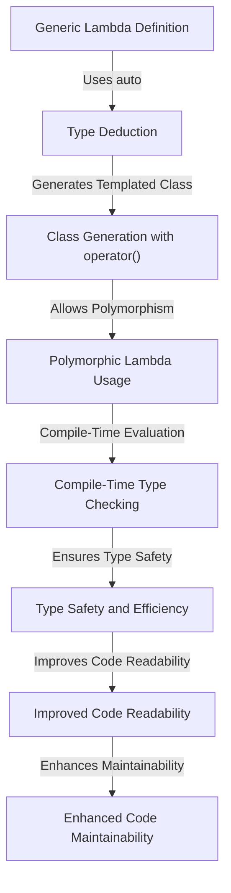

## Introduction
C++14 is a major update to the C++ programming language, introducing several key features that improve code readability, maintainability, and performance. In this study guide, we'll focus on three crucial aspects of C++14: **Generic Lambdas**, **Return Type Deduction**, and **std::make_unique**. These features have become essential tools for modern C++ development, allowing developers to write more expressive, efficient, and safe code. Every engineer should understand these concepts, as they are widely used in production environments and are likely to be encountered in real-world projects.

## Core Concepts
- **Generic Lambdas**: Also known as polymorphic lambdas, these are lambda expressions that can work with different data types, similar to how a template function works. They are defined using the `auto` keyword as a parameter type.
- **Return Type Deduction**: This feature allows the compiler to automatically deduce the return type of a function, simplifying the coding process and reducing the chance of type-related errors.
- **std::make_unique**: A function that creates a unique pointer, providing a safe and efficient way to manage dynamically allocated memory. It replaces the need to use `new` and `delete` manually, reducing the risk of memory leaks.

## How It Works Internally
Let's dive into the internal mechanics of these features:
- **Generic Lambdas**: When a generic lambda is defined, the compiler generates a class with a templated `operator()` for each type used with the lambda. This allows the lambda to work with different types seamlessly.
- **Return Type Deduction**: The compiler analyzes the return statements within a function to deduce its return type. If the types of all return statements are the same, that type is used; otherwise, the function must explicitly specify its return type to avoid compilation errors.
- **std::make_unique**: Internally, `std::make_unique` uses the `new` operator to allocate memory and then constructs a `std::unique_ptr` to manage this memory. This ensures that the memory is deallocated when the `unique_ptr` goes out of scope, preventing memory leaks.

## Code Examples
### Example 1: Basic Generic Lambda
```cpp
#include <iostream>

int main() {
    // Define a generic lambda that adds two values
    auto add = [](auto a, auto b) { return a + b; };
    
    // Use the lambda with different types
    std::cout << "Adding integers: " << add(5, 7) << std::endl;
    std::cout << "Adding floats: " << add(3.5f, 2.8f) << std::endl;
    
    return 0;
}
```
### Example 2: Using Return Type Deduction
```cpp
#include <iostream>

// Define a function with return type deduction
auto calculateArea(int width, int height) {
    return width * height;
}

int main() {
    // Use the function
    int area = calculateArea(10, 20);
    std::cout << "Area: " << area << std::endl;
    
    return 0;
}
```
### Example 3: Advanced Use of std::make_unique
```cpp
#include <memory>
#include <iostream>

class MyClass {
public:
    MyClass(int value) : value_(value) {}
    void print() { std::cout << "Value: " << value_ << std::endl; }
private:
    int value_;
};

int main() {
    // Create a unique pointer to MyClass
    auto ptr = std::make_unique<MyClass>(10);
    
    // Use the object
    ptr->print();
    
    return 0;
}
```
> **Tip:** When using `std::make_unique`, always prefer it over manual memory management with `new` and `delete` to ensure memory safety.

## Visual Diagram

This diagram illustrates the process of defining and using a generic lambda, from type deduction to the generation of a templated class that allows for polymorphic usage, ensuring type safety, efficiency, and improving code readability and maintainability.

## Comparison
| Feature | Description | Time Complexity | Space Complexity | Pros | Cons |
| --- | --- | --- | --- | --- | --- |
| Generic Lambdas | Polymorphic lambda expressions | O(1) | O(1) | Flexible, expressive | May lead to complex type deduction |
| Return Type Deduction | Automatic deduction of function return types | O(1) | O(1) | Simplifies coding, reduces type errors | Limited to functions with consistent return types |
| std::make_unique | Creates unique pointers for memory management | O(1) | O(1) | Ensures memory safety, efficient | Requires C++14 or later |

## Real-world Use Cases
1. **Game Development**: Companies like Epic Games (Unreal Engine) use C++14 features extensively for performance-critical code, such as physics engines and graphics rendering.
2. **Financial Applications**: Banks and financial institutions (e.g., Goldman Sachs) utilize C++14 for high-performance trading platforms and risk analysis tools, where memory safety and speed are crucial.
3. **Web Browsers**: Mozilla (Firefox) and Google (Chrome) employ C++14 in their rendering engines and other performance-sensitive components, benefiting from the language's efficiency and expressiveness.

## Common Pitfalls
1. **Incorrect Lambda Capture**: Failing to capture variables correctly in a lambda can lead to unexpected behavior or compilation errors.
   - Wrong: `auto lambda = [x] { return x; };` (assuming `x` is not in scope)
   - Right: `auto lambda = [x = x] { return x; };` (capturing `x` by value)
2. **Overreliance on Type Deduction**: While return type deduction simplifies coding, overusing it can make code less readable.
   - Wrong: Using type deduction for complex functions with multiple return types.
   - Right: Explicitly specifying return types for clarity and safety.
3. **Misusing std::make_unique**: Failing to understand the implications of using `std::make_unique` can lead to memory leaks or other issues.
   - Wrong: `std::unique_ptr<MyClass> ptr(new MyClass());` (not using `std::make_unique`)
   - Right: `auto ptr = std::make_unique<MyClass>();` (correct usage)
4. **Ignoring Move Semantics**: Not considering move semantics when working with unique pointers can result in unnecessary copies.
   - Wrong: `std::unique_ptr<MyClass> ptr1 = std::make_unique<MyClass>(); std::unique_ptr<MyClass> ptr2 = ptr1;` (copying instead of moving)
   - Right: `std::unique_ptr<MyClass> ptr1 = std::make_unique<MyClass>(); std::unique_ptr<MyClass> ptr2 = std::move(ptr1);` (moving instead of copying)

> **Warning:** Always prefer `std::make_unique` over manual memory management to prevent memory leaks and ensure code safety.

## Interview Tips
1. **What are the benefits of using generic lambdas?**
   - Weak answer: "They're just like regular lambdas but with auto."
   - Strong answer: "Generic lambdas provide type flexibility and polymorphism, making code more expressive and reusable."
2. **How does return type deduction improve code quality?**
   - Weak answer: "It saves typing."
   - Strong answer: "Return type deduction simplifies coding, reduces type-related errors, and improves code readability, but it should be used judiciously for clarity and safety."
3. **Why should I use std::make_unique instead of new?**
   - Weak answer: "It's just a best practice."
   - Strong answer: "std::make_unique ensures memory safety by automatically managing the lifetime of dynamically allocated objects, preventing memory leaks and reducing the risk of dangling pointers."

## Key Takeaways
* **Generic Lambdas**: Use `auto` as a parameter type in lambda expressions for polymorphism.
* **Return Type Deduction**: The compiler can automatically deduce the return type of a function, but ensure consistent return types.
* **std::make_unique**: Prefer `std::make_unique` over `new` for creating unique pointers to ensure memory safety.
* **Type Safety**: Always consider type safety when using generic lambdas and return type deduction.
* **Performance**: C++14 features can improve performance by reducing the need for explicit type conversions and manual memory management.
* **Code Readability**: Use these features to improve code readability and maintainability by making code more expressive and concise.
* **Best Practices**: Follow best practices for using generic lambdas, return type deduction, and `std::make_unique` to avoid common pitfalls.
* **Real-world Applications**: These features are used in real-world applications, including game development, financial applications, and web browsers, for their performance, safety, and expressiveness.
* **Time and Space Complexity**: Understanding the time and space complexity of these features (generally O(1)) is crucial for optimizing performance-critical code.