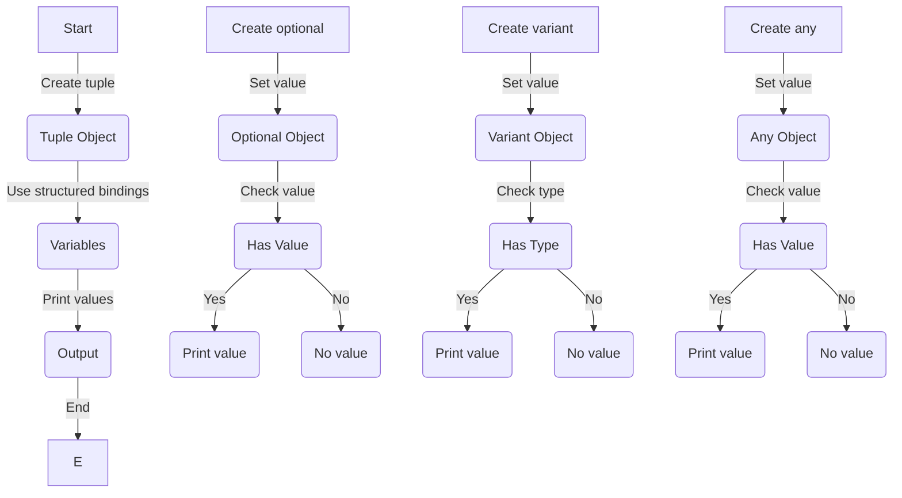

## Introduction
C++17 introduced several significant features that improve the language's expressiveness, safety, and performance. These features include **structured bindings**, `if constexpr`, `std::optional`, `std::variant`, and `std::any`. These features are crucial in modern C++ programming, as they enable developers to write more concise, efficient, and error-free code. In this section, we will explore the importance of these features, their real-world relevance, and why every engineer should be familiar with them.

C++17's structured bindings allow developers to bind the return values of functions to multiple variables, making the code more readable and expressive. `if constexpr` enables **compile-time evaluation** of conditional statements, which is essential for **template metaprogramming**. `std::optional`, `std::variant`, and `std::any` provide a way to handle **optional values**, **variant types**, and **type-erased values**, respectively, which are common in real-world applications.

> **Note:** Understanding these features is essential for any C++ developer, as they can significantly improve code quality, readability, and maintainability.

## Core Concepts
Let's dive deeper into the core concepts of these features:

*   **Structured bindings**: A way to bind the return values of functions to multiple variables, making the code more concise and readable.
*   `if constexpr`: A way to evaluate conditional statements at **compile-time**, which is essential for **template metaprogramming**.
*   `std::optional`: A class that represents a value that may or may not be present, which is useful for handling **optional values**.
*   `std::variant`: A union class that can hold different types of values, which is useful for handling **variant types**.
*   `std::any`: A class that can hold any type of value, which is useful for handling **type-erased values**.

> **Tip:** When using structured bindings, it's essential to consider the **return type** of the function, as it can affect the binding process.

## How It Works Internally
Let's explore the internal mechanics of these features:

*   **Structured bindings**: When using structured bindings, the compiler generates a **tuple** or **pair** object to hold the return values of the function. The binding process then assigns the values to the corresponding variables.
*   `if constexpr`: The compiler evaluates the conditional statement at **compile-time** and discards the branches that are not taken. This process is known as **constant folding**.
*   `std::optional`: The class uses a **bool** flag to indicate whether a value is present or not. If a value is present, it's stored in a **union** object.
*   `std::variant`: The class uses a **type index** to determine the type of the value stored in the **union** object.
*   `std::any`: The class uses a **type-erased** object to store the value, which is a **void\*** pointer to the actual object.

> **Warning:** When using `std::any`, be aware of the **performance overhead** due to the **type-erased** object, as it can lead to **dynamic typing** and **runtime checks**.

## Code Examples
Here are three complete and runnable code examples that demonstrate the usage of these features:

### Example 1: Basic Structured Bindings
```cpp
#include <iostream>
#include <tuple>

int main() {
    // Create a tuple object
    std::tuple<int, double, char> values = {1, 3.14, 'a'};

    // Use structured bindings to bind the values to variables
    auto [x, y, z] = values;

    // Print the values
    std::cout << "x: " << x << std::endl;
    std::cout << "y: " << y << std::endl;
    std::cout << "z: " << z << std::endl;

    return 0;
}
```

### Example 2: Using `if constexpr` for Template Metaprogramming
```cpp
#include <iostream>
#include <type_traits>

template <typename T>
void printType() {
    if constexpr (std::is_same_v<T, int>) {
        std::cout << "Type is int" << std::endl;
    } else if constexpr (std::is_same_v<T, double>) {
        std::cout << "Type is double" << std::endl;
    } else {
        std::cout << "Unknown type" << std::endl;
    }
}

int main() {
    printType<int>();
    printType<double>();
    printType<char>();

    return 0;
}
```

### Example 3: Using `std::optional`, `std::variant`, and `std::any`
```cpp
#include <iostream>
#include <optional>
#include <variant>
#include <any>

int main() {
    // Create an optional object
    std::optional<int> optionalValue = 10;
    if (optionalValue) {
        std::cout << "Optional value: " << *optionalValue << std::endl;
    } else {
        std::cout << "No optional value" << std::endl;
    }

    // Create a variant object
    std::variant<int, double> variantValue = 3.14;
    if (std::holds_alternative<double>(variantValue)) {
        std::cout << "Variant value: " << std::get<double>(variantValue) << std::endl;
    } else {
        std::cout << "No variant value" << std::endl;
    }

    // Create an any object
    std::any anyValue = 10;
    if (anyValue.has_value()) {
        try {
            int intValue = std::any_cast<int>(anyValue);
            std::cout << "Any value: " << intValue << std::endl;
        } catch (const std::bad_any_cast& e) {
            std::cout << "Invalid any value" << std::endl;
        }
    } else {
        std::cout << "No any value" << std::endl;
    }

    return 0;
}
```

## Visual Diagram

This diagram illustrates the process of creating and using structured bindings, optional objects, variant objects, and any objects.

> **Interview:** Be prepared to explain the differences between `std::optional`, `std::variant`, and `std::any`, as well as how to use them effectively in real-world applications.

## Comparison
| Feature | Time Complexity | Space Complexity | Pros | Cons | Best For |
| --- | --- | --- | --- | --- | --- |
| Structured Bindings | O(1) | O(1) | Concise code, readable | Limited to tuple/pair objects | Binding return values |
| `if constexpr` | O(1) | O(1) | Compile-time evaluation, efficient | Limited to template metaprogramming | Template metaprogramming |
| `std::optional` | O(1) | O(1) | Optional values, concise code | Limited to single value | Handling optional values |
| `std::variant` | O(1) | O(1) | Variant types, concise code | Limited to fixed set of types | Handling variant types |
| `std::any` | O(1) | O(1) | Type-erased values, flexible | Performance overhead, dynamic typing | Handling type-erased values |

## Real-world Use Cases
Here are three real-world use cases for these features:

1.  **Google's Abseil Library**: Uses structured bindings and `if constexpr` to provide a concise and efficient API for C++ developers.
2.  **Facebook's Folly Library**: Uses `std::optional` and `std::variant` to handle optional and variant types in a concise and efficient manner.
3.  **Microsoft's C++ Standard Library**: Uses `std::any` to provide a type-erased object that can store any type of value, which is useful for handling dynamic data.

> **Tip:** When using these features in real-world applications, consider the performance overhead and the trade-offs between conciseness, readability, and efficiency.

## Common Pitfalls
Here are four common pitfalls to avoid when using these features:

1.  **Incorrect binding**: When using structured bindings, ensure that the return type of the function is correct, as it can affect the binding process.
2.  **Incorrect type**: When using `if constexpr`, ensure that the type of the variable is correct, as it can affect the compile-time evaluation.
3.  **Optional value not checked**: When using `std::optional`, ensure that the value is checked before accessing it, as it can lead to runtime errors.
4.  **Variant type not checked**: When using `std::variant`, ensure that the type is checked before accessing it, as it can lead to runtime errors.

> **Warning:** Be aware of these common pitfalls and take steps to avoid them in your code.

## Interview Tips
Here are three common interview questions related to these features:

1.  **What is the difference between `std::optional` and `std::variant`?**: A strong answer should explain the difference between optional and variant types, as well as how to use them effectively in real-world applications.
2.  **How does `if constexpr` work?**: A strong answer should explain the compile-time evaluation of conditional statements and how it's used in template metaprogramming.
3.  **What is the performance overhead of using `std::any`?**: A strong answer should explain the performance overhead of using `std::any` and how to minimize it in real-world applications.

> **Interview:** Be prepared to answer these questions and provide examples of how you've used these features in real-world applications.

## Key Takeaways
Here are ten key takeaways to remember:

*   **Structured bindings**: Concise code, readable, but limited to tuple/pair objects.
*   `if constexpr`: Compile-time evaluation, efficient, but limited to template metaprogramming.
*   `std::optional`: Optional values, concise code, but limited to single value.
*   `std::variant`: Variant types, concise code, but limited to fixed set of types.
*   `std::any`: Type-erased values, flexible, but performance overhead and dynamic typing.
*   **Performance overhead**: Consider the trade-offs between conciseness, readability, and efficiency.
*   **Correct binding**: Ensure correct return type and binding process.
*   **Correct type**: Ensure correct type of variable and compile-time evaluation.
*   **Optional value checking**: Check optional value before accessing it.
*   **Variant type checking**: Check variant type before accessing it.

> **Note:** Remember these key takeaways and apply them to your real-world applications to write more concise, efficient, and error-free code.