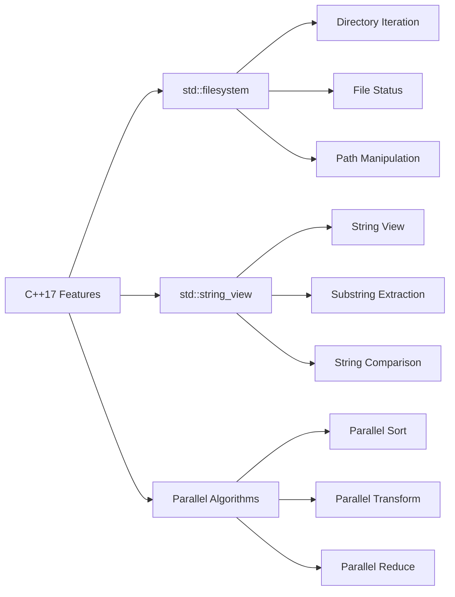

## Introduction
C++17 is a significant update to the C++ standard, introducing several key features that improve the language's expressiveness, performance, and safety. Among these features are `std::filesystem`, `std::string_view`, and Parallel Algorithms, which are the focus of this discussion. These features are crucial for modern C++ development, as they provide a more efficient and expressive way to work with file systems, strings, and parallel computation. In real-world scenarios, these features are used in operating systems, file managers, text editors, and high-performance computing applications.

## Core Concepts
- **`std::filesystem`**: Provides a comprehensive interface for working with file systems, including directory iteration, file status, and path manipulation. This library is built on top of the C++ Standard Library, ensuring a high level of portability and flexibility.
- **`std::string_view`**: Represents a non-owning view of a string, allowing for efficient string processing without unnecessary copies. This class is particularly useful in scenarios where string data is already available in memory, and copying it would be wasteful.
- **Parallel Algorithms**: Extend the C++ Standard Library's algorithm library with parallel versions of common algorithms, such as `std::sort`, `std::transform`, and `std::reduce`. These algorithms leverage multi-core processors to significantly improve the performance of computationally intensive tasks.

> **Note:** These features are designed to work together seamlessly, enabling developers to write more efficient, scalable, and maintainable code.

## How It Works Internally
- **`std::filesystem`**: Internally, `std::filesystem` relies on the underlying operating system's file system APIs to perform operations. This ensures that the library is highly portable and can work with various file systems, including NTFS, HFS+, and ext4. The library also provides a caching mechanism to improve performance by reducing the number of system calls.
- **`std::string_view`**: `std::string_view` works by storing a pointer to the beginning of the string data and the length of the string. This allows it to provide a view of the string without taking ownership of the data. The class also provides a range of member functions for manipulating the string view, including `substr`, `find`, and `compare`.
- **Parallel Algorithms**: Parallel Algorithms use a combination of techniques, including thread pools, work queues, and synchronization primitives, to execute algorithms in parallel. The library provides a high-level interface for parallelizing computations, allowing developers to focus on the logic of their algorithms rather than the details of parallel execution.

## Code Examples
### Example 1: Basic `std::filesystem` Usage
```cpp
#include <filesystem>
#include <iostream>

int main() {
    // Create a directory
    std::filesystem::create_directory("example");

    // List the contents of the directory
    for (const auto& entry : std::filesystem::directory_iterator("example")) {
        std::cout << entry.path().string() << std::endl;
    }

    return 0;
}
```

### Example 2: Using `std::string_view` for Efficient String Processing
```cpp
#include <string_view>
#include <iostream>

int main() {
    std::string originalString = "Hello, World!";
    std::string_view view = originalString;

    // Print the length of the string view
    std::cout << "Length: " << view.length() << std::endl;

    // Extract a substring
    std::string_view substring = view.substr(7);
    std::cout << "Substring: " << substring << std::endl;

    return 0;
}
```

### Example 3: Parallelizing a Computation with Parallel Algorithms
```cpp
#include <algorithm>
#include <execution>
#include <vector>
#include <iostream>

int main() {
    // Create a vector of numbers
    std::vector<int> numbers(1000000);
    for (int i = 0; i < 1000000; ++i) {
        numbers[i] = i;
    }

    // Sort the vector in parallel
    std::sort(std::execution::par, numbers.begin(), numbers.end());

    // Print the first 10 elements
    for (int i = 0; i < 10; ++i) {
        std::cout << numbers[i] << std::endl;
    }

    return 0;
}
```

## Visual Diagram

The diagram illustrates the relationships between the C++17 features discussed, including `std::filesystem`, `std::string_view`, and Parallel Algorithms. Each feature is connected to its respective components, demonstrating how they work together to provide a comprehensive set of tools for modern C++ development.

## Comparison
| Feature | Time Complexity | Space Complexity | Pros | Cons | Best For |
| --- | --- | --- | --- | --- | --- |
| `std::filesystem` | O(1) - O(n) | O(1) - O(n) | Portable, flexible, and efficient | May require additional system calls | File system operations, directory iteration |
| `std::string_view` | O(1) | O(1) | Efficient, non-owning, and flexible | Limited functionality compared to `std::string` | String processing, substring extraction |
| Parallel Algorithms | O(n/p) | O(n) | Highly parallelizable, scalable, and efficient | May require additional synchronization overhead | Computationally intensive tasks, parallel sorting |

## Real-world Use Cases
- **Google's File System**: Google's file system is designed to handle large amounts of data and provide high-performance file access. `std::filesystem` can be used to implement a similar file system, providing a comprehensive interface for working with files and directories.
- **Text Editors**: Text editors like Visual Studio Code and Sublime Text use `std::string_view` to efficiently process and manipulate text data. By using `std::string_view`, these editors can reduce memory usage and improve performance.
- **High-Performance Computing**: Parallel Algorithms are widely used in high-performance computing applications, such as scientific simulations, data analysis, and machine learning. By leveraging parallel computation, these applications can achieve significant performance gains and scale to large datasets.

## Common Pitfalls
- **Incorrect Usage of `std::filesystem`**: Failing to check the existence of a file or directory before attempting to access it can result in errors. Always use `std::filesystem::exists` to verify the existence of a file or directory before accessing it.
- **Insufficient Synchronization with Parallel Algorithms**: Failing to properly synchronize access to shared data when using Parallel Algorithms can result in data corruption or other concurrency-related issues. Always use synchronization primitives, such as mutexes or locks, to protect shared data.
- **Inefficient String Processing with `std::string_view`**: Failing to use `std::string_view` efficiently can result in performance degradation. Always use `std::string_view` to process strings in a non-owning manner, and avoid unnecessary copies or allocations.
- **Incorrect Handling of Errors with `std::filesystem`**: Failing to handle errors properly when using `std::filesystem` can result in unexpected behavior or crashes. Always use try-catch blocks to handle errors and exceptions thrown by `std::filesystem` functions.

## Interview Tips
- **What are the benefits of using `std::filesystem`?**: A strong answer should discuss the portability, flexibility, and efficiency of `std::filesystem`, as well as its ability to handle various file systems and provide a comprehensive interface for working with files and directories.
- **How does `std::string_view` improve string processing?**: A strong answer should discuss the non-owning nature of `std::string_view`, its ability to reduce memory usage and improve performance, and its suitability for efficient string processing.
- **What are the advantages of using Parallel Algorithms?**: A strong answer should discuss the scalability, efficiency, and parallelizability of Parallel Algorithms, as well as their ability to achieve significant performance gains and handle large datasets.

## Key Takeaways
- `std::filesystem` provides a comprehensive interface for working with file systems, including directory iteration, file status, and path manipulation.
- `std::string_view` represents a non-owning view of a string, allowing for efficient string processing without unnecessary copies.
- Parallel Algorithms provide a high-level interface for parallelizing computations, allowing developers to focus on the logic of their algorithms rather than the details of parallel execution.
- `std::filesystem` has a time complexity of O(1) - O(n) and a space complexity of O(1) - O(n), depending on the operation.
- `std::string_view` has a time complexity of O(1) and a space complexity of O(1), making it suitable for efficient string processing.
- Parallel Algorithms have a time complexity of O(n/p) and a space complexity of O(n), making them suitable for computationally intensive tasks and parallel sorting.
- Always use `std::filesystem::exists` to verify the existence of a file or directory before accessing it.
- Always use synchronization primitives to protect shared data when using Parallel Algorithms.
- Always use `std::string_view` to process strings in a non-owning manner, and avoid unnecessary copies or allocations.