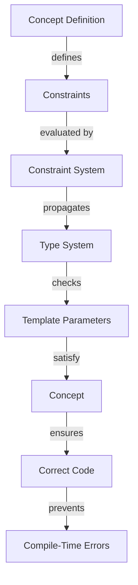

## Introduction
**C++20 Concepts** are a major feature in the C++20 standard that allows developers to constrain templates using a more expressive and intuitive syntax. This feature is a response to the long-standing issue of template metaprogramming being error-prone and difficult to debug. With Concepts, developers can define constraints on templates that are checked at compile-time, making it easier to write robust and maintainable code.

C++20 Concepts matter because they provide a way to define contracts for templates, which helps to prevent errors and improve code quality. This feature is particularly important in large-scale projects where template metaprogramming is used extensively. By using Concepts, developers can ensure that their templates are used correctly and consistently, reducing the risk of runtime errors and improving overall system reliability.

In real-world applications, C++20 Concepts are used in a variety of domains, including game development, scientific computing, and high-performance computing. For example, companies like **Google** and **Microsoft** have already adopted C++20 Concepts in their production codebases to improve the reliability and maintainability of their software systems.

> **Note:** C++20 Concepts are a major improvement over the older template metaprogramming techniques, providing a more expressive and intuitive way to define template constraints.

## Core Concepts
A **Concept** is a named set of constraints that can be applied to a template parameter. Concepts are defined using the `concept` keyword and can include a variety of constraints, such as type constraints, value constraints, and semantic constraints.

The key terminology in C++20 Concepts includes:

* **Concept**: a named set of constraints that can be applied to a template parameter
* **Constraint**: a single requirement that must be satisfied by a template parameter
* **Model**: a type that satisfies a set of constraints

Mental models for C++20 Concepts include thinking of concepts as contracts that must be satisfied by template parameters, and thinking of constraints as requirements that must be met by a type in order to satisfy a concept.

> **Tip:** When defining concepts, it's a good idea to start with a simple set of constraints and gradually add more constraints as needed.

## How It Works Internally
C++20 Concepts work by allowing developers to define constraints on template parameters using a declarative syntax. The compiler then checks these constraints at compile-time, ensuring that the template parameters satisfy the constraints defined by the concept.

The under-the-hood mechanics of C++20 Concepts involve the use of a **constraint system** that evaluates the constraints defined by a concept and checks whether a given type satisfies those constraints. This constraint system is based on a set of **constraint propagation rules** that determine how constraints are propagated through the type system.

The step-by-step process of how C++20 Concepts work internally is as follows:

1. **Concept definition**: a developer defines a concept using the `concept` keyword and specifies a set of constraints.
2. **Constraint evaluation**: the compiler evaluates the constraints defined by the concept and checks whether a given type satisfies those constraints.
3. **Constraint propagation**: the constraint system propagates the constraints through the type system, ensuring that all template parameters satisfy the constraints defined by the concept.

> **Warning:** Failure to satisfy a constraint defined by a concept can result in a compile-time error, so it's essential to carefully define and test concepts to ensure that they are correct and useful.

## Code Examples
### Example 1: Basic Concept Definition
```cpp
template <typename T>
concept MyConcept = requires(T a) {
    { a.foo() } -> std::same_as<void>;
};

template <MyConcept T>
void useMyConcept(T t) {
    t.foo();
}
```
This example defines a basic concept `MyConcept` that requires a type to have a `foo()` member function that returns `void`. The `useMyConcept` function template then uses this concept to constrain its template parameter.

### Example 2: Real-World Concept Definition
```cpp
template <typename T>
concept ArithmeticType = requires(T a, T b) {
    { a + b } -> std::same_as<T>;
    { a - b } -> std::same_as<T>;
    { a * b } -> std::same_as<T>;
    { a / b } -> std::same_as<T>;
};

template <ArithmeticType T>
T calculateSomething(T a, T b) {
    return a + b * 2;
}
```
This example defines a concept `ArithmeticType` that requires a type to support basic arithmetic operations. The `calculateSomething` function template then uses this concept to constrain its template parameters.

### Example 3: Advanced Concept Definition
```cpp
template <typename T>
concept Container = requires(T a) {
    { a.begin() } -> std::same_as<typename T::iterator>;
    { a.end() } -> std::same_as<typename T::iterator>;
};

template <Container T>
void iterateOverContainer(T container) {
    for (auto it = container.begin(); it != container.end(); ++it) {
        // do something with *it
    }
}
```
This example defines a concept `Container` that requires a type to have `begin()` and `end()` member functions that return iterators. The `iterateOverContainer` function template then uses this concept to constrain its template parameter.

## Visual Diagram

This diagram illustrates the process of how C++20 Concepts work internally, from concept definition to constraint evaluation and propagation.

> **Note:** The constraint system is responsible for evaluating the constraints defined by a concept and checking whether a given type satisfies those constraints.

## Comparison
| Approach | Time Complexity | Space Complexity | Pros | Cons | Best For |
| --- | --- | --- | --- | --- | --- |
| C++20 Concepts | O(1) | O(1) | expressive, intuitive, compile-time checking | requires C++20 compiler support | large-scale projects, high-performance computing |
| Template Metaprogramming | O(n) | O(n) | flexible, powerful | error-prone, difficult to debug | small-scale projects, legacy codebases |
| SFINAE | O(n) | O(n) | flexible, powerful | error-prone, difficult to debug | small-scale projects, legacy codebases |
| Concepts Lite | O(1) | O(1) | expressive, intuitive, compile-time checking | limited feature set | small-scale projects, prototyping |

## Real-world Use Cases
* **Google**: uses C++20 Concepts in its **Abseil** library to define contracts for template parameters.
* **Microsoft**: uses C++20 Concepts in its **STL** implementation to constrain template parameters.
* **Blizzard Entertainment**: uses C++20 Concepts in its **Game Engine** to define contracts for template parameters.

> **Tip:** When using C++20 Concepts in real-world projects, it's essential to carefully define and test concepts to ensure that they are correct and useful.

## Common Pitfalls
* **Incorrect constraint definition**: failure to define constraints correctly can result in compile-time errors or incorrect code.
* **Insufficient constraint propagation**: failure to propagate constraints correctly can result in incorrect code or runtime errors.
* **Overly restrictive constraints**: defining constraints that are too restrictive can result in compile-time errors or limited code reuse.
* **Underly restrictive constraints**: defining constraints that are too lenient can result in incorrect code or runtime errors.

> **Warning:** Failure to address these common pitfalls can result in significant productivity losses and code quality issues.

## Interview Tips
* **What are C++20 Concepts?**: a good answer should explain the basics of C++20 Concepts, including concept definition, constraint evaluation, and propagation.
* **How do C++20 Concepts work internally?**: a good answer should explain the under-the-hood mechanics of C++20 Concepts, including the constraint system and type system.
* **What are the benefits of using C++20 Concepts?**: a good answer should explain the benefits of using C++20 Concepts, including improved code quality, reduced error rates, and increased productivity.

> **Interview:** When answering questions about C++20 Concepts, it's essential to demonstrate a deep understanding of the feature, including its syntax, semantics, and benefits.

## Key Takeaways
* **C++20 Concepts are a major feature in the C++20 standard**: they provide a way to constrain templates using a more expressive and intuitive syntax.
* **Concepts are defined using the `concept` keyword**: they can include a variety of constraints, such as type constraints, value constraints, and semantic constraints.
* **The constraint system evaluates constraints and checks whether a given type satisfies those constraints**: this process is essential for ensuring that template parameters satisfy the constraints defined by a concept.
* **C++20 Concepts have a time complexity of O(1) and a space complexity of O(1)**: they are an efficient way to constrain templates and improve code quality.
* **C++20 Concepts are best used in large-scale projects and high-performance computing applications**: they provide a way to define contracts for template parameters and ensure that code is correct and maintainable.
* **Common pitfalls include incorrect constraint definition, insufficient constraint propagation, overly restrictive constraints, and underly restrictive constraints**: it's essential to carefully define and test concepts to avoid these pitfalls.