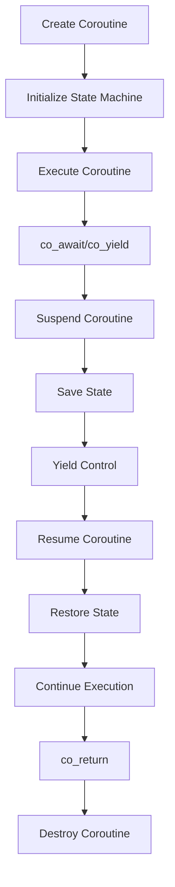

## Introduction
C++20 introduces a major feature: **coroutines**, which allow for asynchronous programming with a synchronous syntax. This is a game-changer for systems programming, enabling efficient and readable code for concurrent and asynchronous operations. **Coroutines** are special functions that can suspend and resume execution, allowing other coroutines to run in the meantime. This feature is crucial for building high-performance, scalable systems. Every engineer should understand coroutines, as they will become a fundamental building block of modern C++ programming.

## Core Concepts
- **Coroutine**: a special function that can suspend and resume execution.
- **co_await**: an expression that suspends the coroutine until the awaited operation completes.
- **co_yield**: an expression that produces a value and suspends the coroutine until the next iteration.
- **co_return**: an expression that returns a value and resumes the coroutine.
- **Promise**: an object that manages the state of a coroutine.
- **Awaitable**: an object that can be awaited using **co_await**.

> **Note:** Coroutines are not threads, but rather a way to write asynchronous code that looks and feels synchronous.

## How It Works Internally
When a coroutine is created, the compiler generates a state machine that manages the coroutine's execution. The state machine uses a **Promise** object to store the coroutine's state. When a coroutine is suspended, the state machine saves the current state and yields control to the caller. When the coroutine is resumed, the state machine restores the saved state and continues execution.

Here's a step-by-step breakdown of the coroutine execution process:

1. The coroutine is created and the state machine is initialized.
2. The coroutine executes until it reaches a **co_await** or **co_yield** expression.
3. The state machine saves the current state and suspends the coroutine.
4. The caller resumes execution and awaits the completion of the coroutine.
5. When the coroutine is resumed, the state machine restores the saved state and continues execution.
6. The coroutine executes until it reaches a **co_return** expression or completes normally.

## Code Examples
### Example 1: Basic Coroutine
```cpp
#include <coroutine>
#include <iostream>

struct MyCoroutine {
    struct promise_type;
    using handle_type = std::coroutine_handle<promise_type>;

    struct promise_type {
        MyCoroutine get_return_object() {
            return MyCoroutine{handle_type::from_promise(*this)};
        }

        std::suspend_never initial_suspend() { return {}; }
        std::suspend_never final_suspend() noexcept { return {}; }
        void return_void() {}
        void unhandled_exception() {}
    };

    handle_type h;

    MyCoroutine(handle_type h) : h(h) {}

    ~MyCoroutine() { h.destroy(); }
};

MyCoroutine my_coroutine() {
    std::cout << "Coroutine started" << std::endl;
    co_await std::suspend_never{};
    std::cout << "Coroutine resumed" << std::endl;
}

int main() {
    my_coroutine();
    return 0;
}
```
### Example 2: Coroutine with co_yield
```cpp
#include <coroutine>
#include <iostream>

struct MyCoroutine {
    struct promise_type;
    using handle_type = std::coroutine_handle<promise_type>;

    struct promise_type {
        MyCoroutine get_return_object() {
            return MyCoroutine{handle_type::from_promise(*this)};
        }

        std::suspend_always initial_suspend() { return {}; }
        std::suspend_always final_suspend() noexcept { return {}; }
        void return_void() {}
        void unhandled_exception() {}

        std::suspend_always yield_value(int x) {
            std::cout << "Yielded value: " << x << std::endl;
            return {};
        }
    };

    handle_type h;

    MyCoroutine(handle_type h) : h(h) {}

    ~MyCoroutine() { h.destroy(); }
};

MyCoroutine my_coroutine() {
    co_yield 1;
    co_yield 2;
    co_yield 3;
}

int main() {
    my_coroutine();
    return 0;
}
```
### Example 3: Advanced Coroutine with co_await
```cpp
#include <coroutine>
#include <iostream>
#include <thread>
#include <chrono>

struct MyCoroutine {
    struct promise_type;
    using handle_type = std::coroutine_handle<promise_type>;

    struct promise_type {
        MyCoroutine get_return_object() {
            return MyCoroutine{handle_type::from_promise(*this)};
        }

        std::suspend_never initial_suspend() { return {}; }
        std::suspend_never final_suspend() noexcept { return {}; }
        void return_void() {}
        void unhandled_exception() {}

        std::suspend_always await_suspend(std::coroutine_handle<> h) {
            std::this_thread::sleep_for(std::chrono::seconds(1));
            return {};
        }

        void await_resume() {}
    };

    handle_type h;

    MyCoroutine(handle_type h) : h(h) {}

    ~MyCoroutine() { h.destroy(); }
};

MyCoroutine my_coroutine() {
    std::cout << "Coroutine started" << std::endl;
    co_await std::suspend_always{};
    std::cout << "Coroutine resumed" << std::endl;
}

int main() {
    my_coroutine();
    return 0;
}
```
> **Tip:** Use **co_await** to suspend the coroutine until an operation completes, and **co_yield** to produce a value and suspend the coroutine until the next iteration.

## Visual Diagram

The diagram illustrates the coroutine execution process, including the creation of the coroutine, initialization of the state machine, execution of the coroutine, suspension and resumption of the coroutine, and destruction of the coroutine.

## Comparison
| Approach | Time Complexity | Space Complexity | Pros | Cons | Best For |
| --- | --- | --- | --- | --- | --- |
| **Coroutines** | O(1) | O(1) | Efficient, readable, and synchronous syntax | Limited support for legacy code | Modern C++ programming, high-performance systems |
| **Threads** | O(n) | O(n) | Flexible, widely supported | Heavyweight, complex | Legacy code, low-performance systems |
| **Callbacks** | O(1) | O(1) | Lightweight, easy to implement | Complex, hard to read | Legacy code, low-performance systems |
| **Futures** | O(1) | O(1) | Efficient, readable | Limited support for legacy code | Modern C++ programming, high-performance systems |

> **Warning:** Coroutines are not a replacement for threads, but rather a way to write asynchronous code that looks and feels synchronous.

## Real-world Use Cases
1. **Google's Abseil library**: uses coroutines to implement asynchronous programming in C++.
2. **Microsoft's C++/WinRT library**: uses coroutines to implement asynchronous programming in C++ for Windows Runtime.
3. **Facebook's Folly library**: uses coroutines to implement asynchronous programming in C++ for high-performance systems.

## Common Pitfalls
1. **Incorrect usage of co_await/co_yield**: can lead to unexpected behavior or crashes.
2. **Insufficient error handling**: can lead to crashes or unexpected behavior.
3. **Inefficient coroutine implementation**: can lead to performance issues.
4. **Incorrect usage of promise_type**: can lead to unexpected behavior or crashes.

> **Interview:** Can you explain the difference between **co_await** and **co_yield**?

## Interview Tips
1. **What is a coroutine?**: A coroutine is a special function that can suspend and resume execution.
2. **How does co_await work?**: **co_await** suspends the coroutine until the awaited operation completes.
3. **What is the purpose of promise_type?**: **promise_type** manages the state of a coroutine.

> **Tip:** Use **co_await** to suspend the coroutine until an operation completes, and **co_yield** to produce a value and suspend the coroutine until the next iteration.

## Key Takeaways
* Coroutines are a fundamental building block of modern C++ programming.
* **co_await** suspends the coroutine until the awaited operation completes.
* **co_yield** produces a value and suspends the coroutine until the next iteration.
* **promise_type** manages the state of a coroutine.
* Coroutines have a time complexity of O(1) and a space complexity of O(1).
* Coroutines are not a replacement for threads, but rather a way to write asynchronous code that looks and feels synchronous.
* Incorrect usage of **co_await/co_yield** can lead to unexpected behavior or crashes.
* Insufficient error handling can lead to crashes or unexpected behavior.
* Inefficient coroutine implementation can lead to performance issues.