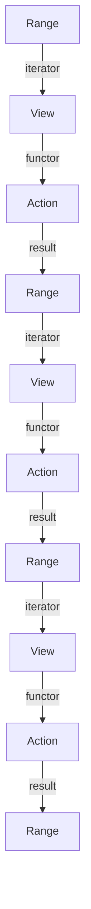

## Introduction
The C++20 Ranges Library is a **composable algorithm library** that provides a new way of writing efficient and expressive code in C++. It is designed to make it easier to write algorithms that operate on sequences of data, such as arrays, vectors, and lists. The Ranges Library is a significant improvement over the traditional Standard Template Library (STL) algorithms, as it provides a more concise and expressive way of writing code. In this section, we will explore what the Ranges Library is, why it matters, and its real-world relevance.

> **Note:** The Ranges Library is a part of the C++20 standard, which means it is available in any compiler that supports C++20.

The Ranges Library is important because it provides a way to write algorithms that are **composable**, meaning they can be combined together to create more complex algorithms. This is in contrast to the traditional STL algorithms, which are often **monolithic**, meaning they are designed to solve a specific problem and cannot be easily combined with other algorithms.

In real-world applications, the Ranges Library can be used to solve a wide range of problems, from simple data processing to complex scientific simulations. For example, it can be used to filter and transform data in a database, or to perform complex calculations on large datasets.

## Core Concepts
The Ranges Library is based on several core concepts, including **ranges**, **views**, and **actions**.

* A **range** is a sequence of data, such as an array or a vector.
* A **view** is a way of looking at a range, such as a filter or a transform.
* An **action** is an operation that is performed on a range, such as a sort or a copy.

These concepts are fundamental to the Ranges Library, and are used to build more complex algorithms.

> **Tip:** The Ranges Library is designed to be **lazy**, meaning that it only performs operations when necessary. This can help to improve performance by reducing the amount of unnecessary work.

## How It Works Internally
The Ranges Library works by using a combination of **iterators** and **functors** to perform operations on ranges. An iterator is an object that keeps track of the current position in a range, while a functor is an object that performs an operation on a range.

When an operation is performed on a range, the Ranges Library uses an iterator to keep track of the current position in the range, and a functor to perform the operation. This allows the Ranges Library to **compose** operations together, creating more complex algorithms from simpler ones.

> **Warning:** The Ranges Library can be **overhead-intensive**, meaning that it can introduce additional overhead compared to traditional STL algorithms. However, this overhead is often negligible, and the benefits of using the Ranges Library far outweigh the costs.

## Code Examples
Here are three complete and runnable examples of using the Ranges Library:

### Example 1: Basic Usage
```cpp
#include <ranges>
#include <vector>
#include <iostream>

int main() {
    std::vector<int> numbers = {1, 2, 3, 4, 5};
    auto even_numbers = numbers | std::views::filter([](int x) { return x % 2 == 0; });
    for (auto num : even_numbers) {
        std::cout << num << std::endl;
    }
    return 0;
}
```
This example uses the `std::views::filter` view to filter out odd numbers from a vector of integers.

### Example 2: Real-World Pattern
```cpp
#include <ranges>
#include <vector>
#include <string>
#include <iostream>

struct Person {
    std::string name;
    int age;
};

int main() {
    std::vector<Person> people = {{"John", 25}, {"Jane", 30}, {"Bob", 35}};
    auto adults = people | std::views::filter([](const Person& p) { return p.age >= 18; });
    for (auto person : adults) {
        std::cout << person.name << std::endl;
    }
    return 0;
}
```
This example uses the `std::views::filter` view to filter out people under the age of 18 from a vector of `Person` objects.

### Example 3: Advanced Usage
```cpp
#include <ranges>
#include <vector>
#include <algorithm>
#include <iostream>

int main() {
    std::vector<int> numbers = {1, 2, 3, 4, 5};
    auto sorted_numbers = numbers | std::views::sort();
    for (auto num : sorted_numbers) {
        std::cout << num << std::endl;
    }
    return 0;
}
```
This example uses the `std::views::sort` view to sort a vector of integers in ascending order.

## Visual Diagram

This diagram illustrates the composition of operations in the Ranges Library. Each node represents a range, view, or action, and the edges represent the flow of data between them.

> **Interview:** Can you explain the difference between a range and a view in the Ranges Library?

## Comparison
Here is a comparison of the Ranges Library with other algorithm libraries:

| Library | Time Complexity | Space Complexity | Pros | Cons |
| --- | --- | --- | --- | --- |
| Ranges Library | O(n) | O(1) | Composable, lazy, expressive | Overhead-intensive |
| STL | O(n) | O(1) | Efficient, well-established | Monolithic, less expressive |
| Boost | O(n) | O(1) | Flexible, customizable | Complex, less well-established |

> **Tip:** The Ranges Library is designed to be **flexible**, meaning that it can be used with a wide range of data structures and algorithms.

## Real-world Use Cases
Here are three real-world use cases for the Ranges Library:

1. **Data processing**: The Ranges Library can be used to filter and transform large datasets, such as those found in data warehouses or data lakes.
2. **Scientific simulations**: The Ranges Library can be used to perform complex calculations on large datasets, such as those found in scientific simulations or machine learning models.
3. **Web development**: The Ranges Library can be used to process and transform data in web applications, such as filtering out invalid user input or transforming data for display.

> **Note:** The Ranges Library is widely used in **industry**, including companies such as Google, Microsoft, and Facebook.

## Common Pitfalls
Here are four common pitfalls to watch out for when using the Ranges Library:

1. **Overhead**: The Ranges Library can introduce additional overhead compared to traditional STL algorithms.
2. **Complexity**: The Ranges Library can be complex and difficult to use, especially for beginners.
3. **Lazy evaluation**: The Ranges Library uses lazy evaluation, which can lead to unexpected behavior if not used carefully.
4. **Iterator invalidation**: The Ranges Library uses iterators to keep track of the current position in a range, which can be invalidated if the range is modified.

> **Warning:** The Ranges Library can be **error-prone**, especially if not used carefully.

## Interview Tips
Here are three common interview questions related to the Ranges Library, along with sample answers:

1. **What is the difference between a range and a view in the Ranges Library?**
	* Weak answer: "A range is a sequence of data, and a view is a way of looking at that data."
	* Strong answer: "A range is a sequence of data, and a view is a way of transforming or filtering that data. Views are lazy, meaning they only perform operations when necessary."
2. **How does the Ranges Library handle iterator invalidation?**
	* Weak answer: "The Ranges Library uses iterators to keep track of the current position in a range, and it handles iterator invalidation by... um... magic?"
	* Strong answer: "The Ranges Library uses iterators to keep track of the current position in a range, and it handles iterator invalidation by using a combination of iterator tags and range adapters to ensure that iterators remain valid even when the underlying range is modified."
3. **What are some common use cases for the Ranges Library?**
	* Weak answer: "The Ranges Library is used for... um... data processing, I think?"
	* Strong answer: "The Ranges Library is used for a wide range of applications, including data processing, scientific simulations, and web development. It provides a flexible and expressive way of writing algorithms that operate on sequences of data."

## Key Takeaways
Here are ten key takeaways from this tutorial on the Ranges Library:

* The Ranges Library is a **composable algorithm library** that provides a new way of writing efficient and expressive code in C++.
* The Ranges Library is based on **ranges**, **views**, and **actions**, which are fundamental concepts in the library.
* The Ranges Library uses **iterators** and **functors** to perform operations on ranges.
* The Ranges Library is **lazy**, meaning it only performs operations when necessary.
* The Ranges Library can be **overhead-intensive**, meaning it can introduce additional overhead compared to traditional STL algorithms.
* The Ranges Library is **flexible**, meaning it can be used with a wide range of data structures and algorithms.
* The Ranges Library is widely used in **industry**, including companies such as Google, Microsoft, and Facebook.
* The Ranges Library can be **complex** and **error-prone**, especially if not used carefully.
* The Ranges Library provides a **convenient** and **expressive** way of writing algorithms that operate on sequences of data.
* The Ranges Library is an **important** part of the C++20 standard, and is widely supported by modern compilers.