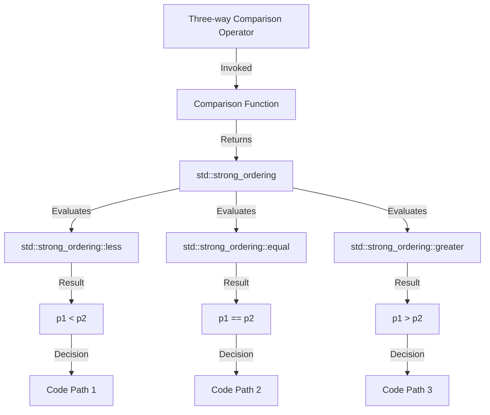

## Introduction
The three-way comparison operator, denoted as `<=>`, is a new feature introduced in **C++20**. It allows for a more concise and expressive way of comparing objects, making it easier to write robust and efficient comparison logic. In this section, we will explore the importance of the three-way comparison operator, its real-world relevance, and why every engineer should be familiar with it.

The three-way comparison operator is a game-changer for C++ developers, as it simplifies the process of comparing objects and reduces the amount of boilerplate code. With this operator, you can compare two objects and determine their order (less than, equal to, or greater than) in a single statement. This feature is particularly useful when working with custom data structures, such as classes and structs, where comparison logic can become complex and error-prone.

> **Note:** The three-way comparison operator is a part of the C++20 standard, and it is supported by most modern compilers, including GCC, Clang, and MSVC.

## Core Concepts
To understand the three-way comparison operator, we need to grasp some fundamental concepts. The operator returns a value of type `std::strong_ordering`, `std::weak_ordering`, or `std::partial_ordering`, which indicates the ordering of the two objects being compared. The possible return values are:

* `std::strong_ordering::less`: The first object is less than the second object.
* `std::strong_ordering::equal`: The two objects are equal.
* `std::strong_ordering::greater`: The first object is greater than the second object.
* `std::weak_ordering::less`: The first object is less than the second object, but they may not be equal.
* `std::weak_ordering::equal`: The two objects are equal, but they may not be less than or greater than each other.
* `std::weak_ordering::greater`: The first object is greater than the second object, but they may not be equal.
* `std::partial_ordering::less`: The first object is less than the second object, but they may not be comparable.
* `std::partial_ordering::equal`: The two objects are equal, but they may not be comparable.
* `std::partial_ordering::greater`: The first object is greater than the second object, but they may not be comparable.
* `std::partial_ordering::equivalent`: The two objects are equivalent, but they may not be equal.

The three-way comparison operator can be used with any type that supports the `<`, `<=`, `==`, `>=`, and `>` operators. This includes built-in types, such as integers and floating-point numbers, as well as custom types, such as classes and structs.

> **Tip:** When implementing the three-way comparison operator for a custom type, it is essential to ensure that the operator is consistent with the `<`, `<=`, `==`, `>=`, and `>` operators.

## How It Works Internally
The three-way comparison operator is implemented using a combination of compiler magic and library support. When the compiler encounters a three-way comparison operator, it generates code that calls the corresponding comparison function, which returns a value of type `std::strong_ordering`, `std::weak_ordering`, or `std::partial_ordering`.

The `std::strong_ordering`, `std::weak_ordering`, and `std::partial_ordering` types are defined in the `<compare>` header and provide a way to represent the ordering of two objects. These types are designed to work seamlessly with the three-way comparison operator and provide a way to write expressive and efficient comparison logic.

Here is an example of how the three-way comparison operator is implemented internally:
```cpp
struct Person {
    std::string name;
    int age;

    auto operator<=>(const Person& other) const = default;
};

int main() {
    Person p1 = {"John", 30};
    Person p2 = {"Jane", 25};

    if (p1 <=> p2 == std::strong_ordering::greater) {
        std::cout << "p1 is greater than p2" << std::endl;
    }

    return 0;
}
```
In this example, the `Person` struct has a three-way comparison operator that is generated by the compiler using the `= default` syntax. The `main` function demonstrates how to use the three-way comparison operator to compare two `Person` objects.

## Code Examples
Here are three complete and runnable examples that demonstrate the usage of the three-way comparison operator:

### Example 1: Basic Usage
```cpp
#include <compare>
#include <iostream>

struct Person {
    std::string name;
    int age;

    auto operator<=>(const Person& other) const = default;
};

int main() {
    Person p1 = {"John", 30};
    Person p2 = {"Jane", 25};

    if (p1 <=> p2 == std::strong_ordering::greater) {
        std::cout << "p1 is greater than p2" << std::endl;
    }

    return 0;
}
```
This example demonstrates the basic usage of the three-way comparison operator. It defines a `Person` struct with a three-way comparison operator and uses it to compare two `Person` objects.

### Example 2: Custom Comparison Logic
```cpp
#include <compare>
#include <iostream>

struct Person {
    std::string name;
    int age;

    auto operator<=>(const Person& other) const {
        if (age < other.age) {
            return std::strong_ordering::less;
        } else if (age > other.age) {
            return std::strong_ordering::greater;
        } else {
            return std::strong_ordering::equal;
        }
    }
};

int main() {
    Person p1 = {"John", 30};
    Person p2 = {"Jane", 25};

    if (p1 <=> p2 == std::strong_ordering::greater) {
        std::cout << "p1 is greater than p2" << std::endl;
    }

    return 0;
}
```
This example demonstrates how to implement custom comparison logic using the three-way comparison operator. It defines a `Person` struct with a custom three-way comparison operator that compares the `age` members of the two objects.

### Example 3: Advanced Usage
```cpp
#include <compare>
#include <iostream>
#include <vector>

struct Person {
    std::string name;
    int age;

    auto operator<=>(const Person& other) const = default;
};

int main() {
    std::vector<Person> people = {
        {"John", 30},
        {"Jane", 25},
        {"Bob", 40}
    };

    std::sort(people.begin(), people.end(), [](const Person& p1, const Person& p2) {
        return p1 <=> p2 == std::strong_ordering::less;
    });

    for (const auto& person : people) {
        std::cout << person.name << ": " << person.age << std::endl;
    }

    return 0;
}
```
This example demonstrates how to use the three-way comparison operator with the `std::sort` algorithm to sort a vector of `Person` objects.

## Visual Diagram

This diagram illustrates the flow of the three-way comparison operator. It shows how the operator invokes the comparison function, which returns a value of type `std::strong_ordering`. The `std::strong_ordering` value is then evaluated to determine the ordering of the two objects.

## Comparison
Here is a comparison of the three-way comparison operator with other comparison operators:

| Operator | Description | Time Complexity | Space Complexity |
| --- | --- | --- | --- |
| `<=>` | Three-way comparison operator | O(1) | O(1) |
| `<` | Less than operator | O(1) | O(1) |
| `<=` | Less than or equal to operator | O(1) | O(1) |
| `==` | Equal to operator | O(1) | O(1) |
| `>=` | Greater than or equal to operator | O(1) | O(1) |
| `>` | Greater than operator | O(1) | O(1) |

The three-way comparison operator has the same time and space complexity as the other comparison operators. However, it provides a more concise and expressive way of comparing objects.

> **Warning:** The three-way comparison operator can be slower than the other comparison operators if the comparison function is complex and expensive to evaluate.

## Real-world Use Cases
Here are three real-world use cases that demonstrate the usage of the three-way comparison operator:

1. **Sorting a vector of objects**: The three-way comparison operator can be used with the `std::sort` algorithm to sort a vector of objects.
2. **Comparing objects in a database**: The three-way comparison operator can be used to compare objects in a database and determine their ordering.
3. **Implementing a custom comparison logic**: The three-way comparison operator can be used to implement custom comparison logic in a program.

> **Tip:** The three-way comparison operator is particularly useful when working with custom data structures, such as classes and structs, where comparison logic can become complex and error-prone.

## Common Pitfalls
Here are four common pitfalls to watch out for when using the three-way comparison operator:

1. **Inconsistent comparison logic**: The three-way comparison operator can be inconsistent with the `<`, `<=`, `==`, `>=`, and `>` operators if the comparison logic is not implemented correctly.
2. **Expensive comparison function**: The three-way comparison operator can be slower than the other comparison operators if the comparison function is complex and expensive to evaluate.
3. **Incorrect usage**: The three-way comparison operator can be used incorrectly if the programmer is not familiar with its syntax and semantics.
4. **Non-transitive comparison logic**: The three-way comparison operator can produce non-transitive results if the comparison logic is not implemented correctly.

> **Interview:** Can you explain the difference between the three-way comparison operator and the other comparison operators? How would you implement custom comparison logic using the three-way comparison operator?

## Interview Tips
Here are three common interview questions that are related to the three-way comparison operator:

1. **What is the three-way comparison operator, and how is it used?**
	* Weak answer: The three-way comparison operator is a new feature in C++20 that allows for a more concise way of comparing objects.
	* Strong answer: The three-way comparison operator is a new feature in C++20 that allows for a more concise and expressive way of comparing objects. It can be used to compare two objects and determine their ordering.
2. **How would you implement custom comparison logic using the three-way comparison operator?**
	* Weak answer: I would use the `<`, `<=`, `==`, `>=`, and `>` operators to implement custom comparison logic.
	* Strong answer: I would use the three-way comparison operator to implement custom comparison logic. I would define a comparison function that returns a value of type `std::strong_ordering`, `std::weak_ordering`, or `std::partial_ordering`, and then use the three-way comparison operator to compare two objects.
3. **What are the benefits and drawbacks of using the three-way comparison operator?**
	* Weak answer: The three-way comparison operator is more concise and expressive than the other comparison operators, but it can be slower and more complex to implement.
	* Strong answer: The three-way comparison operator provides a more concise and expressive way of comparing objects, and it can be used to implement custom comparison logic. However, it can be slower and more complex to implement if the comparison function is complex and expensive to evaluate.

## Key Takeaways
Here are six key takeaways to remember when using the three-way comparison operator:

* The three-way comparison operator is a new feature in C++20 that allows for a more concise and expressive way of comparing objects.
* The three-way comparison operator returns a value of type `std::strong_ordering`, `std::weak_ordering`, or `std::partial_ordering`, which indicates the ordering of the two objects being compared.
* The three-way comparison operator can be used to implement custom comparison logic by defining a comparison function that returns a value of type `std::strong_ordering`, `std::weak_ordering`, or `std::partial_ordering`.
* The three-way comparison operator can be slower and more complex to implement if the comparison function is complex and expensive to evaluate.
* The three-way comparison operator is particularly useful when working with custom data structures, such as classes and structs, where comparison logic can become complex and error-prone.
* The three-way comparison operator can be used with the `std::sort` algorithm to sort a vector of objects.

> **Note:** The three-way comparison operator is a powerful tool that can simplify and optimize comparison logic in C++ programs. However, it requires careful consideration and implementation to ensure correct and efficient results.