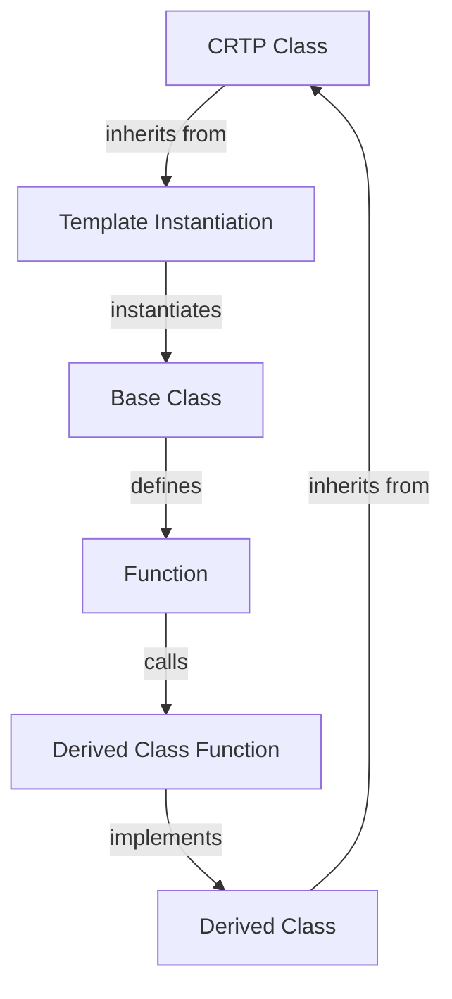

## Introduction
The **Curiously Recurring Template Pattern (CRTP)** is a C++ idiom that allows for static polymorphism, enabling a class to inherit from a template instantiation of itself. This pattern is a fundamental concept in **template metaprogramming**, which is a technique for writing generic code that can be instantiated at compile-time. The CRTP is a powerful tool for building high-performance, flexible, and reusable code. In this article, we will delve into the world of CRTP, exploring its core concepts, internal mechanics, and real-world applications.

> **Note:** The CRTP is a complex topic, but mastering it can significantly improve your skills as a C++ developer. It's essential to understand the basics of template metaprogramming before diving into the CRTP.

## Core Concepts
The CRTP is based on the concept of **static polymorphism**, which allows for the resolution of function calls at compile-time, rather than runtime. This is achieved through the use of **template instantiation**, where a template class is instantiated with a specific type. The CRTP takes this concept a step further by allowing a class to inherit from a template instantiation of itself.

*   **Template instantiation**: The process of creating a concrete class from a template class by specifying the template parameters.
*   **Static polymorphism**: The ability to resolve function calls at compile-time, rather than runtime.
*   **CRTP**: A C++ idiom that allows a class to inherit from a template instantiation of itself.

## How It Works Internally
The CRTP works by using a template class that inherits from a template instantiation of itself. This creates a recursive relationship between the classes, allowing for static polymorphism.

Here's a step-by-step breakdown of how the CRTP works:

1.  A template class is defined with a template parameter.
2.  The template class inherits from a template instantiation of itself, using the template parameter as the base class.
3.  The template class defines a function that calls a function on the base class.
4.  When the template class is instantiated, the compiler resolves the function call at compile-time.

> **Warning:** The CRTP can lead to complex and hard-to-debug code if not used carefully. It's essential to follow best practices and use tools like `clang-tidy` to ensure code quality.

## Code Examples
Here are three complete and runnable examples of the CRTP in action:

### Example 1: Basic CRTP
```cpp
template <typename T>
class CRTP {
public:
    void foo() {
        static_cast<T*>(this)->foo_impl();
    }
};

class MyClass : public CRTP<MyClass> {
public:
    void foo_impl() {
        std::cout << "Hello, world!" << std::endl;
    }
};

int main() {
    MyClass obj;
    obj.foo();  // Output: Hello, world!
    return 0;
}
```

### Example 2: Real-World Pattern
```cpp
template <typename T>
class Logger {
public:
    void log(const std::string& message) {
        static_cast<T*>(this)->log_impl(message);
    }
};

class ConsoleLogger : public Logger<ConsoleLogger> {
public:
    void log_impl(const std::string& message) {
        std::cout << "Console: " << message << std::endl;
    }
};

class FileLogger : public Logger<FileLogger> {
public:
    void log_impl(const std::string& message) {
        std::ofstream file("log.txt", std::ios_base::app);
        file << "File: " << message << std::endl;
    }
};

int main() {
    ConsoleLogger consoleLogger;
    consoleLogger.log("Hello, world!");  // Output: Console: Hello, world!

    FileLogger fileLogger;
    fileLogger.log("Hello, world!");  // Appends to log.txt
    return 0;
}
```

### Example 3: Advanced CRTP
```cpp
template <typename T>
class Factory {
public:
    T* create() {
        return static_cast<T*>(this)->create_impl();
    }
};

class MyClassFactory : public Factory<MyClassFactory> {
public:
    MyClass* create_impl() {
        return new MyClass();
    }
};

class MyOtherClassFactory : public Factory<MyOtherClassFactory> {
public:
    MyOtherClass* create_impl() {
        return new MyOtherClass();
    }
};

int main() {
    MyClassFactory myClassFactory;
    MyClass* obj = myClassFactory.create();
    delete obj;

    MyOtherClassFactory myOtherClassFactory;
    MyOtherClass* otherObj = myOtherClassFactory.create();
    delete otherObj;
    return 0;
}
```

> **Tip:** Use the CRTP to implement the **Factory pattern**, which allows for the creation of objects without specifying the exact class of object that will be created.

## Visual Diagram

This diagram illustrates the recursive relationship between the CRTP class, template instantiation, base class, and derived class.

## Comparison
| Approach | Time Complexity | Space Complexity | Pros | Cons | Best For |
| --- | --- | --- | --- | --- | --- |
| CRTP | O(1) | O(1) | Static polymorphism, high-performance | Complex code, hard to debug | High-performance applications, game development |
| Virtual Functions | O(1) | O(1) | Dynamic polymorphism, easy to use | Slower than CRTP, more memory overhead | General-purpose programming, scripting |
| Function Pointers | O(1) | O(1) | Fast, flexible | Error-prone, hard to maintain | Embedded systems, low-level programming |
| std::function | O(1) | O(1) | Type-safe, flexible | Slower than CRTP, more memory overhead | General-purpose programming, scripting |

## Real-world Use Cases
The CRTP is used in various real-world applications, including:

*   **Game development**: The CRTP is used in game engines like Unreal Engine and Unity to implement high-performance, flexible, and reusable code.
*   **High-performance computing**: The CRTP is used in high-performance computing applications like scientific simulations and data analysis to optimize performance and minimize memory overhead.
*   **Embedded systems**: The CRTP is used in embedded systems like microcontrollers and real-time operating systems to implement efficient and reliable code.

> **Interview:** When asked about the CRTP in an interview, be prepared to explain the concept of static polymorphism, template instantiation, and the recursive relationship between the CRTP class and its base class. You should also be able to provide examples of how the CRTP is used in real-world applications.

## Common Pitfalls
Here are some common pitfalls to avoid when using the CRTP:

*   **Infinite recursion**: Be careful not to create an infinite recursion by inheriting from a template instantiation of itself without a base case.
*   **Compile-time errors**: The CRTP can lead to complex and hard-to-debug code. Use tools like `clang-tidy` to ensure code quality and catch errors at compile-time.
*   **Performance overhead**: The CRTP can introduce performance overhead due to the recursive relationship between the classes. Optimize performance by minimizing the number of template instantiations and using techniques like **template specialization**.

## Interview Tips
Here are some common interview questions related to the CRTP:

*   **What is the CRTP, and how does it work?**: Explain the concept of static polymorphism, template instantiation, and the recursive relationship between the CRTP class and its base class.
*   **How do you implement the CRTP in C++?**: Provide an example of how to implement the CRTP in C++, including the definition of the template class, the base class, and the derived class.
*   **What are the benefits and drawbacks of using the CRTP?**: Discuss the benefits of using the CRTP, including high-performance, flexibility, and reusability, as well as the drawbacks, including complex code and potential performance overhead.

## Key Takeaways
Here are the key takeaways from this article:

*   The CRTP is a powerful tool for building high-performance, flexible, and reusable code.
*   The CRTP is based on the concept of static polymorphism, which allows for the resolution of function calls at compile-time.
*   The CRTP works by using a template class that inherits from a template instantiation of itself.
*   The CRTP can lead to complex and hard-to-debug code if not used carefully.
*   The CRTP is used in various real-world applications, including game development, high-performance computing, and embedded systems.
*   The CRTP has a time complexity of O(1) and a space complexity of O(1), making it suitable for high-performance applications.
*   The CRTP can be used to implement the Factory pattern, which allows for the creation of objects without specifying the exact class of object that will be created.