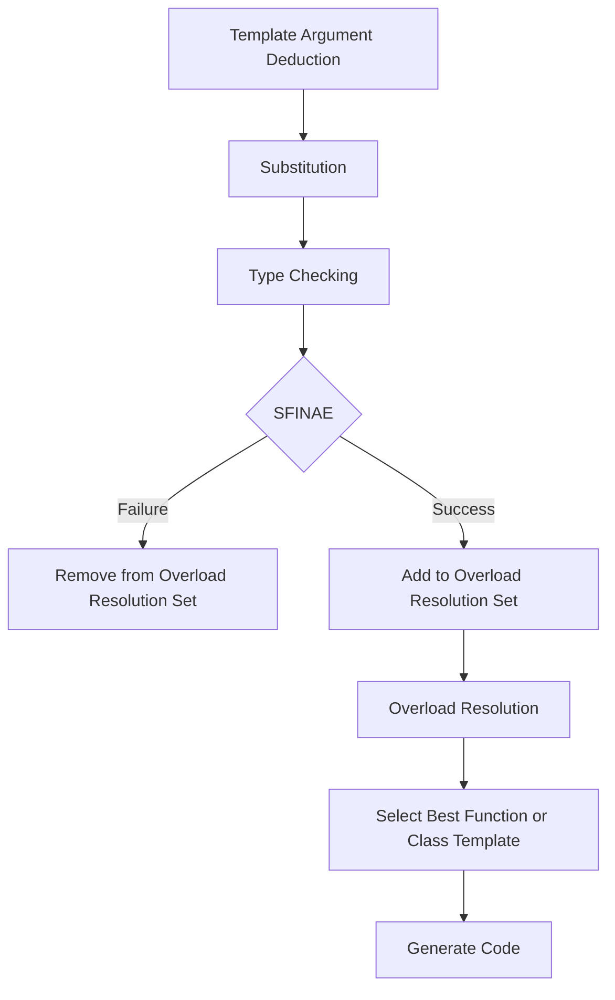

## Introduction
**SFINAE: Substitution Failure Is Not An Error** is a fundamental concept in C++ template metaprogramming. It's a technique that allows the compiler to remove functions from the overload resolution set if the substitution of template arguments into the function template results in an invalid type or expression. SFINAE is crucial for writing generic and flexible code, as it enables the compiler to automatically select the most suitable function or class template based on the given types. In this study note, we will delve into the world of SFINAE, exploring its core concepts, internal mechanics, and providing code examples to demonstrate its power.

## Core Concepts
SFINAE is based on the idea that the compiler should not consider a function template as a candidate for overload resolution if the substitution of its template arguments results in an invalid type or expression. This is in contrast to the usual behavior of the compiler, which would normally report an error when encountering an invalid type or expression. The key terminology related to SFINAE includes:
* **Substitution**: The process of replacing template parameters with actual types or values.
* **Failure**: The situation when the substitution results in an invalid type or expression.
* **Not an Error**: The compiler does not report an error when a substitution failure occurs, but instead removes the function template from the overload resolution set.

## How It Works Internally
When the compiler encounters a function template, it performs the following steps:
1. **Template Argument Deduction**: The compiler attempts to deduce the template arguments from the given function arguments.
2. **Substitution**: The compiler substitutes the deduced template arguments into the function template.
3. **Type Checking**: The compiler checks the resulting types and expressions for validity.
4. **SFINAE**: If the substitution results in an invalid type or expression, the compiler removes the function template from the overload resolution set.
5. **Overload Resolution**: The compiler selects the best function or class template from the remaining candidates.

> **Note:** SFINAE is a compile-time mechanism, which means that the compiler evaluates the validity of the types and expressions during the compilation process.

## Code Examples
### Example 1: Basic SFINAE
```cpp
#include <iostream>

template <typename T>
auto foo(T t) -> decltype(t.foo()) {
    return t.foo();
}

template <typename T>
void foo(T t) {
    std::cout << "Default implementation" << std::endl;
}

struct MyClass {
    void foo() {
        std::cout << "MyClass::foo()" << std::endl;
    }
};

int main() {
    MyClass obj;
    foo(obj); // Output: MyClass::foo()
    foo(5);    // Output: Default implementation
    return 0;
}
```
In this example, the `foo` function template uses SFINAE to select the correct implementation based on the presence of a `foo` member function in the given type.

### Example 2: Real-World Pattern
```cpp
#include <iostream>
#include <string>

template <typename T>
auto to_string(T t) -> decltype(t.to_string()) {
    return t.to_string();
}

template <typename T>
std::string to_string(T t) {
    return std::to_string(t);
}

struct Person {
    std::string name;
    std::string to_string() {
        return name;
    }
};

int main() {
    Person person;
    person.name = "John";
    std::cout << to_string(person) << std::endl; // Output: John
    std::cout << to_string(5) << std::endl;       // Output: 5
    return 0;
}
```
This example demonstrates how SFINAE can be used to provide a generic `to_string` function that works with different types.

### Example 3: Advanced SFINAE
```cpp
#include <iostream>
#include <type_traits>

template <typename T, typename = void>
struct has_foo : std::false_type {};

template <typename T>
struct has_foo<T, std::void_t<decltype(std::declval<T>().foo())>> : std::true_type {};

template <typename T>
auto foo(T t) -> std::enable_if_t<has_foo<T>::value> {
    return t.foo();
}

template <typename T>
void foo(T t) {
    std::cout << "Default implementation" << std::endl;
}

struct MyClass {
    void foo() {
        std::cout << "MyClass::foo()" << std::endl;
    }
};

int main() {
    MyClass obj;
    foo(obj); // Output: MyClass::foo()
    foo(5);    // Output: Default implementation
    return 0;
}
```
In this example, we use SFINAE to check if a given type has a `foo` member function, and select the correct implementation accordingly.

## Visual Diagram

This diagram illustrates the internal mechanics of SFINAE, from template argument deduction to overload resolution.

## Comparison
| Approach | Time Complexity | Space Complexity | Pros | Cons | Best For |
| --- | --- | --- | --- | --- | --- |
| SFINAE | O(1) | O(1) | Flexible, generic, and efficient | Complex, hard to debug | Generic programming, metaprogramming |
| Overload Resolution | O(n) | O(n) | Simple, easy to understand | Limited, inflexible | Small-scale programming, simple use cases |
| Template Specialization | O(1) | O(1) | Fast, efficient | Limited, inflexible | Specific use cases, performance-critical code |
| Runtime Polymorphism | O(1) | O(n) | Flexible, dynamic | Slow, overhead | Large-scale programming, complex systems |

> **Warning:** SFINAE can lead to complex and hard-to-debug code if not used carefully.

## Real-world Use Cases
1. **Boost Library**: The Boost library uses SFINAE extensively to provide generic and flexible functionality.
2. **Google's Abseil Library**: Abseil uses SFINAE to implement its generic and efficient algorithms.
3. **LLVM Compiler**: The LLVM compiler uses SFINAE to optimize its compilation process.

## Common Pitfalls
1. **Overly Complex SFINAE**: Using SFINAE with too many template parameters and complex logic can lead to hard-to-debug code.
2. **Incorrect SFINAE**: Using SFINAE incorrectly can result in unexpected behavior or compilation errors.
3. **SFINAE and Overload Resolution**: SFINAE can interact with overload resolution in unexpected ways, leading to surprises.
4. **Debugging SFINAE**: Debugging SFINAE-related issues can be challenging due to the complex nature of the code.

> **Tip:** Use SFINAE judiciously and with caution, and always test your code thoroughly.

## Interview Tips
1. **What is SFINAE?**: Be prepared to explain the basics of SFINAE and its purpose.
2. **How does SFINAE work?**: Understand the internal mechanics of SFINAE and be able to explain them.
3. **SFINAE vs. Overload Resolution**: Know the differences between SFINAE and overload resolution, and be able to explain when to use each.
4. **Common SFINAE Pitfalls**: Be aware of common pitfalls and mistakes when using SFINAE.

> **Interview:** Can you explain how SFINAE is used in the Boost library?

## Key Takeaways
* SFINAE is a fundamental concept in C++ template metaprogramming.
* SFINAE allows the compiler to remove functions from the overload resolution set if the substitution of template arguments results in an invalid type or expression.
* SFINAE is used to provide generic and flexible functionality.
* SFINAE can be complex and hard to debug if not used carefully.
* SFINAE has a time complexity of O(1) and a space complexity of O(1).
* SFINAE is best used for generic programming, metaprogramming, and performance-critical code.
* SFINAE can interact with overload resolution in unexpected ways.
* Debugging SFINAE-related issues can be challenging.
* SFINAE is used extensively in the Boost library, Google's Abseil library, and the LLVM compiler.