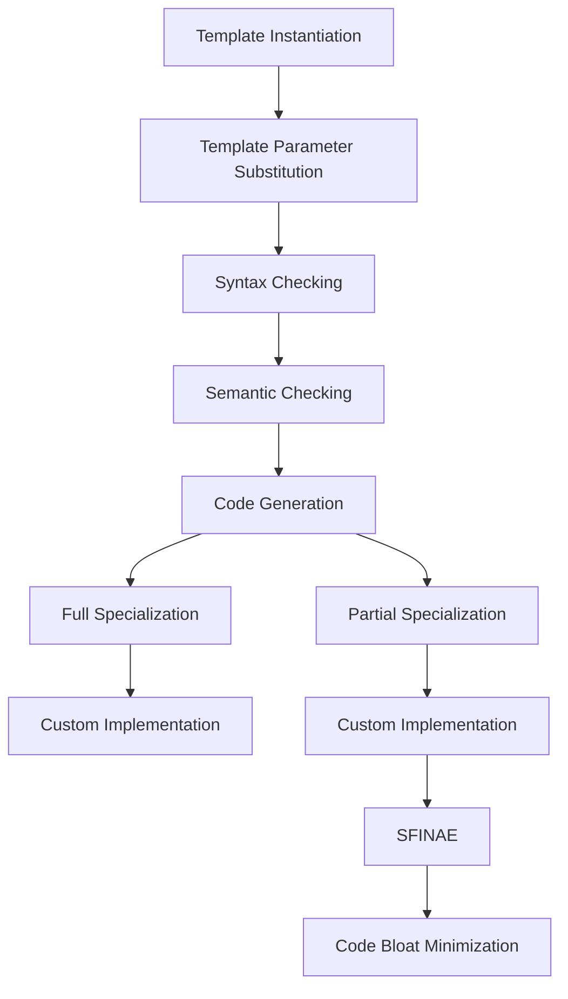

## Introduction
**Template Specialization** is a crucial concept in C++ that allows developers to customize template classes or functions for specific types. It enables the creation of optimized implementations for particular data types, which can significantly improve performance. In this section, we will explore the world of template specialization, including full and partial specialization, and its real-world relevance. 
> **Note:** Template specialization is essential in C++ because it allows developers to write generic code that can be optimized for specific use cases, making it a fundamental concept in **C++ metaprogramming**.

Template specialization is used in various areas of C++ programming, such as:
- **Container Classes:** Specializing container classes for specific data types can improve performance by reducing memory allocation and deallocation overhead.
- **Mathematical Operations:** Specializing mathematical operations for specific data types can improve performance by using optimized algorithms and reducing overhead.
- **Database Systems:** Specializing database systems for specific data types can improve performance by reducing query overhead and improving data retrieval.

## Core Concepts
- **Full Specialization:** A full specialization is a complete replacement of a template class or function for a specific type. It provides a custom implementation for a particular type, which can improve performance and reduce overhead.
- **Partial Specialization:** A partial specialization is a specialization of a template class or function for a subset of its template parameters. It allows developers to create custom implementations for specific combinations of template parameters.
- **Template Instantiation:** Template instantiation is the process of creating a concrete class or function from a template class or function. It involves replacing template parameters with actual types and creating a new class or function.
- **SFINAE (Substitution Failure Is Not An Error):** SFINAE is a technique used in template metaprogramming to selectively remove functions from the overload set based on template parameter substitution.

## How It Works Internally
When a template is instantiated, the compiler performs the following steps:
1. **Template Parameter Substitution:** The compiler replaces template parameters with actual types.
2. **Syntax Checking:** The compiler checks the syntax of the template class or function.
3. **Semantic Checking:** The compiler checks the semantics of the template class or function.
4. **Code Generation:** The compiler generates code for the template class or function.

> **Warning:** Template instantiation can lead to code bloat if not managed properly. Developers should use techniques like SFINAE to minimize code bloat.

## Code Examples
### Example 1: Full Specialization
```cpp
template <typename T>
class Container {
public:
    void add(T value) {
        // Generic implementation
    }
};

// Full specialization for int
template <>
class Container<int> {
public:
    void add(int value) {
        // Custom implementation for int
    }
};

int main() {
    Container<int> container;
    container.add(5); // Uses custom implementation for int
    return 0;
}
```

### Example 2: Partial Specialization
```cpp
template <typename T, typename U>
class Pair {
public:
    void set(T value1, U value2) {
        // Generic implementation
    }
};

// Partial specialization for T = int and U = double
template <typename U>
class Pair<int, U> {
public:
    void set(int value1, U value2) {
        // Custom implementation for T = int and U = double
    }
};

int main() {
    Pair<int, double> pair;
    pair.set(5, 3.14); // Uses custom implementation for T = int and U = double
    return 0;
}
```

### Example 3: SFINAE
```cpp
template <typename T>
class HasMember {
public:
    template <typename U = T>
    static auto test(int) -> decltype(U::member, void(), std::true_type{});
    template <typename U = T>
    static auto test(...) -> std::false_type;
    static constexpr bool value = decltype(test<T>(0))::value;
};

struct Foo {
    int member;
};

int main() {
    std::cout << std::boolalpha << HasMember<Foo>::value << std::endl; // true
    std::cout << std::boolalpha << HasMember<int>::value << std::endl; // false
    return 0;
}
```

## Visual Diagram

The diagram illustrates the template instantiation process, including template parameter substitution, syntax checking, semantic checking, code generation, full specialization, partial specialization, and SFINAE.

## Comparison
| Approach | Time Complexity | Space Complexity | Pros | Cons | Best For |
| --- | --- | --- | --- | --- | --- |
| Full Specialization | O(1) | O(1) | Custom implementation, improved performance | Code bloat | Specific data types |
| Partial Specialization | O(1) | O(1) | Custom implementation, improved performance | Code bloat | Specific combinations of template parameters |
| SFINAE | O(1) | O(1) | Selective function removal, code bloat minimization | Complex syntax | Template metaprogramming |
| Template Instantiation | O(n) | O(n) | Generic implementation, flexibility | Code bloat | Generic programming |

## Real-world Use Cases
1. **Google's Abseil Library:** The Abseil library uses template specialization to provide optimized implementations for specific data types, improving performance and reducing overhead.
2. **Microsoft's STL:** The Microsoft STL uses template specialization to provide custom implementations for specific containers and algorithms, improving performance and reducing overhead.
3. **Boost Library:** The Boost library uses template specialization to provide optimized implementations for specific data types and algorithms, improving performance and reducing overhead.

## Common Pitfalls
1. **Code Bloat:** Template instantiation can lead to code bloat if not managed properly. Developers should use techniques like SFINAE to minimize code bloat.
2. **Over-Specialization:** Over-specialization can lead to code duplication and maintenance issues. Developers should use partial specialization to minimize code duplication.
3. **Incorrect Syntax:** Incorrect syntax can lead to compilation errors. Developers should use syntax checking tools to ensure correct syntax.
4. **Performance Issues:** Performance issues can arise from incorrect implementation. Developers should use profiling tools to identify performance bottlenecks.

## Interview Tips
1. **What is template specialization?** A good answer should include a definition of template specialization, its benefits, and its uses.
2. **How does SFINAE work?** A good answer should include an explanation of SFINAE, its syntax, and its use cases.
3. **What is the difference between full and partial specialization?** A good answer should include a definition of full and partial specialization, their uses, and their benefits.

## Key Takeaways
* **Template specialization** is a crucial concept in C++ that allows developers to customize template classes or functions for specific types.
* **Full specialization** provides a custom implementation for a particular type, improving performance and reducing overhead.
* **Partial specialization** provides a custom implementation for a subset of template parameters, improving performance and reducing overhead.
* **SFINAE** is a technique used in template metaprogramming to selectively remove functions from the overload set based on template parameter substitution.
* **Template instantiation** can lead to code bloat if not managed properly. Developers should use techniques like SFINAE to minimize code bloat.
* **Code bloat** can be minimized using techniques like SFINAE and partial specialization.
* **Performance issues** can arise from incorrect implementation. Developers should use profiling tools to identify performance bottlenecks.
* **Correct syntax** is essential for template specialization. Developers should use syntax checking tools to ensure correct syntax.
* **Over-specialization** can lead to code duplication and maintenance issues. Developers should use partial specialization to minimize code duplication.