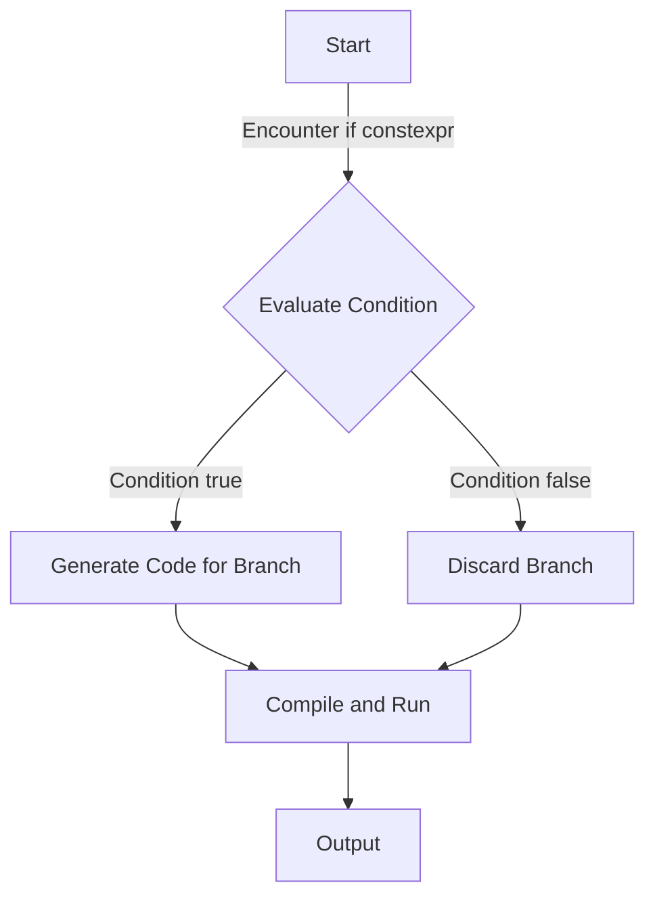

## Introduction
**if constexpr** is a feature introduced in C++17 that allows for compile-time branching. This means that the compiler can evaluate certain conditions and discard the branches that are not taken, resulting in more efficient code. This feature is particularly useful in template metaprogramming, where the compiler needs to evaluate conditions at compile time. In this section, we will explore the basics of **if constexpr** and its real-world relevance.

> **Note:** Before the introduction of **if constexpr**, C++ developers had to use other techniques such as SFINAE (Substitution Failure Is Not An Error) to achieve similar results. However, **if constexpr** provides a more straightforward and expressive way to achieve compile-time branching.

## Core Concepts
To understand **if constexpr**, we need to grasp the following key concepts:

* **Compile-time evaluation**: The compiler evaluates certain expressions at compile time, allowing for more efficient code generation.
* **Branching**: The code can take different paths based on conditions evaluated at compile time.
* **Template metaprogramming**: A technique where the compiler generates code at compile time based on template parameters.

> **Tip:** Think of **if constexpr** as a way to "short-circuit" the compilation process, allowing the compiler to eliminate branches that are not taken.

## How It Works Internally
When the compiler encounters an **if constexpr** statement, it evaluates the condition at compile time. If the condition is true, the compiler generates code for the associated branch. If the condition is false, the compiler discards the branch and generates no code for it.

Here is a step-by-step breakdown of how **if constexpr** works:

1. The compiler encounters an **if constexpr** statement.
2. The compiler evaluates the condition at compile time.
3. If the condition is true, the compiler generates code for the associated branch.
4. If the condition is false, the compiler discards the branch and generates no code for it.

> **Warning:** It's essential to remember that **if constexpr** is a compile-time feature, and any runtime evaluation will not work as expected.

## Code Examples
Here are three complete and runnable examples of **if constexpr**:

### Example 1: Basic Usage
```cpp
#include <iostream>

template <bool Condition>
void foo() {
    if constexpr (Condition) {
        std::cout << "Condition is true" << std::endl;
    } else {
        std::cout << "Condition is false" << std::endl;
    }
}

int main() {
    foo<true>();
    foo<false>();
    return 0;
}
```

### Example 2: Real-World Pattern
```cpp
#include <iostream>
#include <type_traits>

template <typename T>
void print_type() {
    if constexpr (std::is_same_v<T, int>) {
        std::cout << "Type is int" << std::endl;
    } else if constexpr (std::is_same_v<T, float>) {
        std::cout << "Type is float" << std::endl;
    } else {
        std::cout << "Type is unknown" << std::endl;
    }
}

int main() {
    print_type<int>();
    print_type<float>();
    print_type<double>();
    return 0;
}
```

### Example 3: Advanced Usage
```cpp
#include <iostream>
#include <type_traits>

template <typename T, typename... Ts>
void print_types() {
    if constexpr (sizeof...(Ts) > 0) {
        std::cout << "Types are: ";
        (std::cout << ... << std::integral_constant<char, ', '>{} << typeid(T).name()) << std::endl;
        print_types<Ts...>();
    } else {
        std::cout << "No more types" << std::endl;
    }
}

int main() {
    print_types<int, float, double>();
    return 0;
}
```

> **Interview:** Can you explain the difference between **if constexpr** and a regular **if** statement? (Answer: **if constexpr** is evaluated at compile time, while a regular **if** statement is evaluated at runtime.)

## Visual Diagram


The diagram illustrates the compile-time evaluation of the condition and the subsequent branching based on the condition's truth value.

## Comparison
| Approach | Time Complexity | Space Complexity | Pros | Cons | Best For |
| --- | --- | --- | --- | --- | --- |
| **if constexpr** | O(1) | O(1) | Compile-time evaluation, efficient code generation | Limited to compile-time evaluation | Template metaprogramming, compile-time branching |
| SFINAE | O(n) | O(n) | Flexible, can handle complex conditions | Verbose, error-prone | Complex template metaprogramming, legacy code |
| **if** statement | O(1) | O(1) | Simple, easy to use | Runtime evaluation, less efficient | Runtime branching, non-template code |

## Real-world Use Cases
Here are three production examples of **if constexpr**:

1. **Google's Abseil library**: Uses **if constexpr** to implement template metaprogramming and compile-time branching.
2. **Boost library**: Employs **if constexpr** to optimize code generation and improve performance.
3. **C++ Standard Library**: Utilizes **if constexpr** to implement various algorithms and data structures, such as `std::array` and `std::tuple`.

> **Tip:** When using **if constexpr**, consider the trade-off between compile-time evaluation and runtime evaluation, and choose the approach that best fits your use case.

## Common Pitfalls
Here are four common mistakes to avoid when using **if constexpr**:

1. **Incorrect condition evaluation**: Make sure to evaluate the condition correctly, taking into account the compile-time context.
2. **Insufficient error handling**: Implement proper error handling to handle cases where the condition is not met.
3. **Inconsistent branching**: Ensure that the branching is consistent and well-defined, avoiding ambiguous or undefined behavior.
4. **Overuse of **if constexpr****: Use **if constexpr** judiciously, as excessive use can lead to complex and hard-to-maintain code.

> **Warning:** Be cautious when using **if constexpr** with recursive templates, as it can lead to infinite recursion and compilation errors.

## Interview Tips
Here are three common interview questions related to **if constexpr**:

1. **What is the difference between **if constexpr** and a regular **if** statement?**
	* Weak answer: They are the same.
	* Strong answer: **if constexpr** is evaluated at compile time, while a regular **if** statement is evaluated at runtime.
2. **Can you explain how **if constexpr** works internally?**
	* Weak answer: It's a simple if statement.
	* Strong answer: The compiler evaluates the condition at compile time, and generates code for the associated branch if the condition is true.
3. **How would you use **if constexpr** in a real-world scenario?**
	* Weak answer: I would use it for everything.
	* Strong answer: I would use it for template metaprogramming and compile-time branching, where the condition can be evaluated at compile time.

## Key Takeaways
Here are ten key takeaways to remember:

* **if constexpr** is evaluated at compile time.
* **if constexpr** is used for compile-time branching.
* **if constexpr** is a more expressive and efficient way to achieve compile-time evaluation.
* Use **if constexpr** judiciously, as excessive use can lead to complex code.
* **if constexpr** is particularly useful in template metaprogramming.
* The compiler evaluates the condition at compile time and generates code for the associated branch.
* **if constexpr** has a time complexity of O(1) and a space complexity of O(1).
* **if constexpr** can be used to optimize code generation and improve performance.
* **if constexpr** is a feature introduced in C++17.
* **if constexpr** is a powerful tool for C++ developers, but requires careful consideration and use.