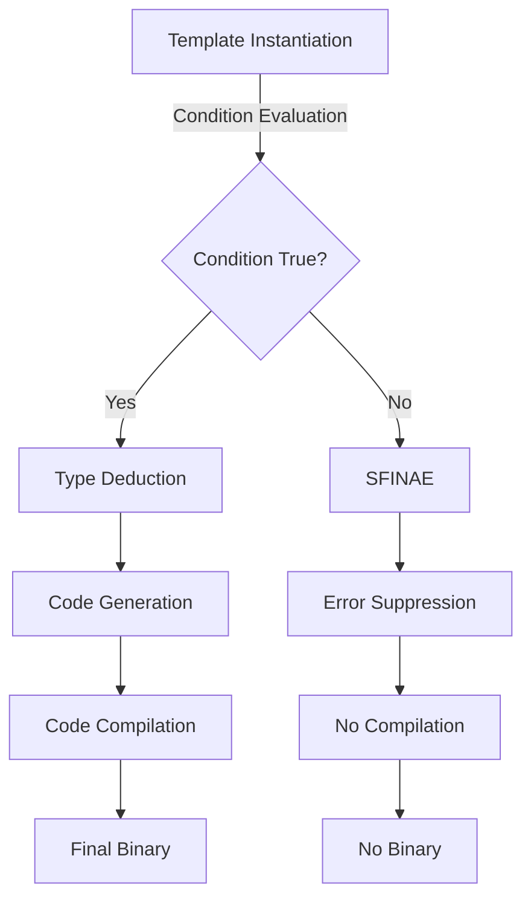

## Introduction
**std::enable_if** is a C++ template that allows for conditional compilation based on the type of a template parameter. It is a crucial tool in metaprogramming, enabling developers to write more flexible and generic code. In this study note, we will delve into the world of **std::enable_if**, exploring its core concepts, internal mechanics, and practical applications. We will also examine real-world use cases, common pitfalls, and interview tips to help you master this essential C++ feature.

> **Note:** **std::enable_if** is a part of the C++ Standard Template Library (STL), which provides a set of pre-built templates and functions for common programming tasks.

## Core Concepts
**std::enable_if** is a template that takes two parameters: a boolean condition and a type. If the condition is true, the template evaluates to the specified type; otherwise, it is disabled, and the compiler will not instantiate it. This allows developers to write code that is only compiled when certain conditions are met.

* **SFINAE (Substitution Failure Is Not An Error):** **std::enable_if** relies on SFINAE, a C++ mechanism that allows the compiler to silently ignore failed template substitutions.
* **Type Traits:** **std::enable_if** often uses type traits, such as **std::is_same** or **std::is_base_of**, to evaluate the condition.
* **Metafunctions:** **std::enable_if** can be used to implement metafunctions, which are functions that operate on types rather than values.

## How It Works Internally
When the compiler encounters a template that uses **std::enable_if**, it performs the following steps:

1. **Template instantiation:** The compiler attempts to instantiate the template with the provided arguments.
2. **Condition evaluation:** The compiler evaluates the condition specified in **std::enable_if**.
3. **SFINAE:** If the condition is false, the compiler applies SFINAE and silently ignores the failed template substitution.
4. **Type deduction:** If the condition is true, the compiler deduces the type of the template parameter.

> **Warning:** **std::enable_if** can lead to complex and hard-to-debug code if not used carefully. It is essential to understand the underlying mechanics and use it judiciously.

## Code Examples
### Example 1: Basic Usage
```cpp
#include <type_traits>
#include <iostream>

template <typename T, typename = std::enable_if_t<std::is_same_v<T, int>>>
void foo(T t) {
    std::cout << "foo(int): " << t << std::endl;
}

int main() {
    foo(42);  // OK
    foo(3.14); // Error: no matching function for call to 'foo'
    return 0;
}
```
### Example 2: Real-World Pattern
```cpp
#include <type_traits>
#include <iostream>

template <typename T, typename = std::enable_if_t<std::is_base_of_v<std::exception, T>>>
void handleException(T& e) {
    std::cout << "Handling exception: " << e.what() << std::endl;
}

int main() {
    try {
        throw std::runtime_error("Test exception");
    } catch (std::exception& e) {
        handleException(e);
    }
    return 0;
}
```
### Example 3: Advanced Usage
```cpp
#include <type_traits>
#include <iostream>

template <typename T, typename = std::enable_if_t<std::is_same_v<T, std::string> || std::is_same_v<T, const char*>>>
void printString(T str) {
    std::cout << "Printing string: " << str << std::endl;
}

int main() {
    printString("Hello, world!");  // OK
    printString(std::string("Hello, world!"));  // OK
    printString(42);  // Error: no matching function for call to 'printString'
    return 0;
}
```
## Visual Diagram

The diagram illustrates the internal mechanics of **std::enable_if**, showing how the compiler evaluates the condition and applies SFINAE if necessary.

## Comparison
| Approach | Time Complexity | Space Complexity | Pros | Cons | Best For |
| --- | --- | --- | --- | --- | --- |
| **std::enable_if** | O(1) | O(1) | Flexible, generic code | Complex, hard to debug | Metaprogramming, type traits |
| **if constexpr** | O(1) | O(1) | Simplified syntax, easier debugging | Limited to C++17 and later | Conditional compilation, type traits |
| **SFINAE** | O(1) | O(1) | Powerful, flexible | Complex, hard to understand | Metaprogramming, type traits |
| **Tag Dispatching** | O(1) | O(1) | Simple, easy to understand | Limited flexibility | Type-based dispatching |

## Real-world Use Cases
1. **Google's Protocol Buffers:** Protocol Buffers use **std::enable_if** to implement conditional compilation for different data types.
2. **Boost Libraries:** The Boost Libraries use **std::enable_if** extensively for metaprogramming and type traits.
3. **Qt Framework:** The Qt Framework uses **std::enable_if** to implement type-safe and generic code for GUI development.

## Common Pitfalls
1. **Overly complex conditions:** Using complex conditions can lead to hard-to-debug code and unexpected behavior.
```cpp
// Wrong
template <typename T, typename = std::enable_if_t<std::is_same_v<T, int> && std::is_same_v<T, float>>>
void foo(T t) {
    // ...
}

// Right
template <typename T, typename = std::enable_if_t<std::is_same_v<T, int>>>
void foo(T t) {
    // ...
}
```
2. **Incorrect SFINAE usage:** Failing to apply SFINAE correctly can lead to compilation errors.
```cpp
// Wrong
template <typename T>
void foo(T t) {
    std::enable_if_t<std::is_same_v<T, int>>;
}

// Right
template <typename T, typename = std::enable_if_t<std::is_same_v<T, int>>>
void foo(T t) {
    // ...
}
```
3. **Type trait misuse:** Using type traits incorrectly can lead to unexpected behavior.
```cpp
// Wrong
template <typename T, typename = std::enable_if_t<std::is_same_v<T, int>>>
void foo(T t) {
    std::cout << std::is_same_v<T, float> << std::endl;
}

// Right
template <typename T, typename = std::enable_if_t<std::is_same_v<T, int>>>
void foo(T t) {
    std::cout << std::is_same_v<T, int> << std::endl;
}
```
4. **Lack of documentation:** Failing to document **std::enable_if** usage can make the code hard to understand and maintain.
```cpp
// Wrong
template <typename T, typename = std::enable_if_t<std::is_same_v<T, int>>>
void foo(T t) {
    // ...
}

// Right
/**
 * foo function template.
 * @tparam T Type parameter.
 * @param t Value parameter.
 * @note Uses std::enable_if to enable compilation only for int type.
 */
template <typename T, typename = std::enable_if_t<std::is_same_v<T, int>>>
void foo(T t) {
    // ...
}
```
> **Tip:** Use **std::enable_if** judiciously and document its usage clearly to avoid common pitfalls.

## Interview Tips
1. **What is **std::enable_if****?** Expect the interviewer to ask about the basics of **std::enable_if**, including its syntax and purpose.
* Weak answer: "It's a template that does something with types."
* Strong answer: "**std::enable_if** is a template that allows for conditional compilation based on the type of a template parameter. It uses SFINAE to enable or disable compilation."
2. **How does **std::enable_if** work internally?** The interviewer may ask about the internal mechanics of **std::enable_if**, including SFINAE and type traits.
* Weak answer: "It just works magically."
* Strong answer: "**std::enable_if** works by evaluating a condition at compile-time. If the condition is true, the template is instantiated; otherwise, SFINAE is applied, and the compiler ignores the failed template substitution."
3. **What are some common use cases for **std::enable_if****?** Expect the interviewer to ask about real-world applications of **std::enable_if**, including metaprogramming and type traits.
* Weak answer: "I don't know."
* Strong answer: "**std::enable_if** is commonly used in metaprogramming and type traits to implement conditional compilation and type-safe code. It's also used in libraries like Boost and Qt."

## Key Takeaways
* **std::enable_if** is a powerful tool for conditional compilation and metaprogramming.
* **std::enable_if** uses SFINAE to enable or disable compilation based on a condition.
* **std::enable_if** is commonly used in type traits and metaprogramming to implement type-safe and generic code.
* **std::enable_if** can lead to complex and hard-to-debug code if not used carefully.
* **std::enable_if** is a part of the C++ Standard Template Library (STL).
* **std::enable_if** has a time complexity of O(1) and a space complexity of O(1).
* **std::enable_if** is typically used with type traits, such as **std::is_same** or **std::is_base_of**.
* **std::enable_if** can be used to implement metafunctions, which are functions that operate on types rather than values.