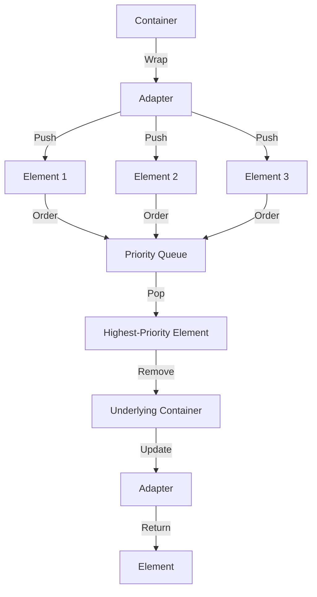

## Introduction
Adapters are a fundamental concept in C++ Standard Template Library (STL) that enable containers to be used as stacks, queues, or priority queues. They provide a way to modify the behavior of a container without changing its underlying structure. In this section, we will delve into the world of adapters, exploring their importance, real-world relevance, and why every engineer needs to know about them.
> **Note:** Adapters are not containers themselves but rather wrappers around existing containers, allowing for a different interface and behavior.

Adapters are crucial in software development as they enable developers to use containers in a more flexible and efficient manner. For instance, a stack can be implemented using a vector or a list, while a queue can be implemented using a deque or a list. This flexibility is essential in real-world applications where different data structures are required to solve specific problems.
> **Tip:** When working with adapters, it's essential to understand the underlying container and its characteristics, as this will influence the performance and behavior of the adapter.

## Core Concepts
To grasp adapters, it's vital to understand the core concepts and terminology associated with them. Here are some key definitions:
* **Stack:** A Last-In-First-Out (LIFO) data structure, where elements are added and removed from the top.
* **Queue:** A First-In-First-Out (FIFO) data structure, where elements are added to the end and removed from the front.
* **Priority Queue:** A data structure where elements are ordered based on their priority, and the highest-priority element is removed first.
* **Adapter:** A wrapper around a container that modifies its behavior and interface.

Mental models and analogies can help make these concepts more accessible. For example, a stack can be thought of as a pile of plates, where plates are added and removed from the top. A queue can be thought of as a line of people waiting to enter a concert, where people are added to the end and removed from the front.
> **Warning:** When using adapters, it's essential to be aware of the underlying container's limitations and characteristics, as these can affect the performance and behavior of the adapter.

## How It Works Internally
To understand how adapters work internally, let's take a look at the under-the-hood mechanics of the stack, queue, and priority queue adapters.

The stack adapter works by wrapping a container, such as a vector or a list, and providing a push and pop interface. When an element is pushed onto the stack, it is added to the end of the underlying container. When an element is popped from the stack, it is removed from the end of the underlying container.
```cpp
std::vector<int> vec;
std::stack<int> stack(vec);
stack.push(1);
stack.push(2);
stack.pop(); // removes 2 from the stack
```
The queue adapter works similarly, but it provides an enqueue and dequeue interface. When an element is enqueued, it is added to the end of the underlying container. When an element is dequeued, it is removed from the front of the underlying container.
```cpp
std::deque<int> deq;
std::queue<int> queue(deq);
queue.push(1);
queue.push(2);
queue.pop(); // removes 1 from the queue
```
The priority queue adapter works by wrapping a container, such as a vector or a list, and providing a push and pop interface. When an element is pushed onto the priority queue, it is added to the underlying container and ordered based on its priority. When an element is popped from the priority queue, it is removed from the underlying container and the highest-priority element is returned.
```cpp
std::vector<int> vec;
std::priority_queue<int> pq(vec);
pq.push(1);
pq.push(2);
pq.push(3);
pq.pop(); // removes 3 from the priority queue
```
> **Interview:** What is the time complexity of pushing and popping an element from a stack, queue, and priority queue? The time complexity of pushing and popping an element from a stack and queue is O(1), while the time complexity of pushing and popping an element from a priority queue is O(log n).

## Code Examples
Here are three complete and runnable code examples that demonstrate the use of adapters:

### Example 1: Basic Stack Usage
```cpp
#include <iostream>
#include <stack>

int main() {
    std::stack<int> stack;
    stack.push(1);
    stack.push(2);
    stack.push(3);
    while (!stack.empty()) {
        std::cout << stack.top() << std::endl;
        stack.pop();
    }
    return 0;
}
```
This example demonstrates the basic usage of a stack adapter, where elements are pushed onto the stack and then popped off.

### Example 2: Real-World Queue Usage
```cpp
#include <iostream>
#include <queue>
#include <string>

int main() {
    std::queue<std::string> queue;
    queue.push("John");
    queue.push("Jane");
    queue.push("Bob");
    while (!queue.empty()) {
        std::cout << queue.front() << std::endl;
        queue.pop();
    }
    return 0;
}
```
This example demonstrates the real-world usage of a queue adapter, where elements are enqueued and then dequeued.

### Example 3: Advanced Priority Queue Usage
```cpp
#include <iostream>
#include <queue>
#include <vector>

struct Person {
    std::string name;
    int age;
};

struct Compare {
    bool operator()(const Person& a, const Person& b) {
        return a.age < b.age;
    }
};

int main() {
    std::priority_queue<Person, std::vector<Person>, Compare> pq;
    pq.push({ "John", 25 });
    pq.push({ "Jane", 30 });
    pq.push({ "Bob", 20 });
    while (!pq.empty()) {
        std::cout << pq.top().name << std::endl;
        pq.pop();
    }
    return 0;
}
```
This example demonstrates the advanced usage of a priority queue adapter, where elements are ordered based on their priority.

## Visual Diagram

This diagram illustrates the core concept of adapters, where a container is wrapped and modified to provide a different interface and behavior.

## Comparison
| Adapter | Time Complexity (Push) | Time Complexity (Pop) | Space Complexity |
| --- | --- | --- | --- |
| Stack | O(1) | O(1) | O(n) |
| Queue | O(1) | O(1) | O(n) |
| Priority Queue | O(log n) | O(log n) | O(n) |
| Vector | O(1) | O(1) | O(n) |
| List | O(1) | O(1) | O(n) |

This comparison table highlights the time and space complexity of different adapters and containers.

## Real-world Use Cases
Here are three real-world use cases that demonstrate the usage of adapters:

1. **Google's Search Engine:** Google's search engine uses a priority queue to order search results based on their relevance and importance.
2. **Amazon's Recommendation System:** Amazon's recommendation system uses a queue to process user requests and provide personalized recommendations.
3. **Facebook's News Feed:** Facebook's news feed uses a stack to display user updates and notifications in real-time.

## Common Pitfalls
Here are four common pitfalls to watch out for when using adapters:

1. **Incorrect Usage:** Using an adapter incorrectly can lead to unexpected behavior and errors. For example, using a stack as a queue can lead to elements being added and removed in the wrong order.
```cpp
std::stack<int> stack;
stack.push(1);
stack.push(2);
stack.pop(); // incorrect usage
```
2. **Performance Issues:** Adapters can introduce performance issues if not used correctly. For example, using a priority queue with a large number of elements can lead to slow performance.
```cpp
std::priority_queue<int> pq;
for (int i = 0; i < 1000000; i++) {
    pq.push(i);
}
```
3. **Memory Leaks:** Adapters can introduce memory leaks if not used correctly. For example, using a stack with a large number of elements can lead to memory leaks if not properly cleaned up.
```cpp
std::stack<int> stack;
for (int i = 0; i < 1000000; i++) {
    stack.push(i);
}
```
4. **Thread Safety:** Adapters can introduce thread safety issues if not used correctly. For example, using a queue in a multi-threaded environment can lead to data corruption and crashes.
```cpp
std::queue<int> queue;
std::thread t1([&queue] {
    queue.push(1);
});
std::thread t2([&queue] {
    queue.pop();
});
```
> **Warning:** When using adapters, it's essential to be aware of these common pitfalls and take steps to avoid them.

## Interview Tips
Here are three common interview questions related to adapters, along with weak and strong answers:

1. **What is the time complexity of pushing and popping an element from a stack?**
Weak answer: "I think it's O(n) or something."
Strong answer: "The time complexity of pushing and popping an element from a stack is O(1), as it involves adding and removing elements from the top of the stack."
2. **How would you implement a priority queue using a vector?**
Weak answer: "I would use a vector and add elements to the end, then sort the vector every time an element is added or removed."
Strong answer: "I would use a vector and add elements to the end, then use a heapify algorithm to maintain the priority queue property. This would involve using a binary heap data structure and updating the heap every time an element is added or removed."
3. **What is the difference between a stack and a queue?**
Weak answer: "I think a stack is like a queue, but with a different name."
Strong answer: "A stack is a Last-In-First-Out (LIFO) data structure, where elements are added and removed from the top. A queue is a First-In-First-Out (FIFO) data structure, where elements are added to the end and removed from the front. The key difference between the two is the order in which elements are added and removed."

## Key Takeaways
Here are six key takeaways to remember when working with adapters:

* **Adapters are not containers:** Adapters are wrappers around existing containers that modify their behavior and interface.
* **Stacks are LIFO:** Stacks are Last-In-First-Out data structures, where elements are added and removed from the top.
* **Queues are FIFO:** Queues are First-In-First-Out data structures, where elements are added to the end and removed from the front.
* **Priority queues are ordered:** Priority queues are data structures where elements are ordered based on their priority, and the highest-priority element is removed first.
* **Adapters can introduce performance issues:** Adapters can introduce performance issues if not used correctly, such as using a priority queue with a large number of elements.
* **Adapters can introduce thread safety issues:** Adapters can introduce thread safety issues if not used correctly, such as using a queue in a multi-threaded environment.