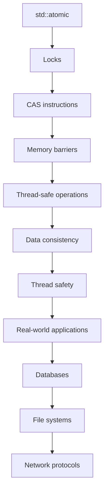

## Introduction
The `std::atomic<T>` class in C++ provides a way to perform thread-safe operations on shared variables. It ensures that multiple threads can access and modify a variable without causing data races or other concurrency issues. In a multi-threaded environment, `std::atomic<T>` is essential for maintaining the integrity of shared data. **Real-world relevance**: In production systems, `std::atomic<T>` is used in applications such as databases, file systems, and network protocols, where data consistency and thread safety are critical.

> **Note:** `std::atomic<T>` is a class template that can be used with various data types, including integers, pointers, and custom classes.

## Core Concepts
The `std::atomic<T>` class provides several key features:
* **Atomicity**: Ensures that operations on the variable are executed as a single, indivisible unit.
* **Thread safety**: Prevents data races and other concurrency issues by using locks or other synchronization mechanisms.
* **Memory ordering**: Provides control over the order in which memory operations are executed, ensuring that changes to shared variables are visible to all threads.

> **Warning:** Using `std::atomic<T>` does not automatically ensure thread safety; it is still possible to write incorrect code that causes concurrency issues.

## How It Works Internally
The `std::atomic<T>` class uses a combination of hardware and software mechanisms to provide atomicity and thread safety. The internal implementation varies depending on the platform and compiler, but it typically involves the use of:
* **Locks**: To synchronize access to the shared variable and prevent concurrent modifications.
* **CAS (Compare-and-Swap) instructions**: To perform atomic operations, such as incrementing a counter or updating a pointer.
* **Memory barriers**: To ensure that changes to shared variables are visible to all threads and to prevent reordering of memory operations.

> **Tip:** Understanding the internal implementation of `std::atomic<T>` can help you write more efficient and effective concurrent code.

## Code Examples
### Example 1: Basic Usage
```cpp
#include <atomic>
#include <thread>

std::atomic<int> counter(0);

void incrementCounter() {
    counter++;
}

int main() {
    std::thread t1(incrementCounter);
    std::thread t2(incrementCounter);
    t1.join();
    t2.join();
    std::cout << "Counter: " << counter << std::endl;
    return 0;
}
```
This example demonstrates the basic usage of `std::atomic<T>` to perform thread-safe increments on a shared counter variable.

### Example 2: Real-World Pattern
```cpp
#include <atomic>
#include <thread>
#include <vector>

std::atomic<int> counter(0);
std::vector<std::thread> threads;

void worker() {
    for (int i = 0; i < 10000; i++) {
        counter++;
    }
}

int main() {
    for (int i = 0; i < 10; i++) {
        threads.emplace_back(worker);
    }
    for (auto& thread : threads) {
        thread.join();
    }
    std::cout << "Counter: " << counter << std::endl;
    return 0;
}
```
This example demonstrates a real-world pattern using `std::atomic<T>` to perform thread-safe increments on a shared counter variable in a multi-threaded environment.

### Example 3: Advanced Usage
```cpp
#include <atomic>
#include <thread>
#include <condition_variable>
#include <mutex>

std::atomic<bool> flag(false);
std::condition_variable cv;
std::mutex mtx;

void waitUntilFlag() {
    std::unique_lock<std::mutex> lock(mtx);
    cv.wait(lock, []{ return flag; });
}

void setFlag() {
    flag = true;
    cv.notify_one();
}

int main() {
    std::thread t1(waitUntilFlag);
    std::thread t2(setFlag);
    t1.join();
    t2.join();
    return 0;
}
```
This example demonstrates an advanced usage of `std::atomic<T>` in combination with condition variables and mutexes to implement a thread-safe flag.

## Visual Diagram

This diagram illustrates the internal mechanics of `std::atomic<T>` and its role in providing thread safety and data consistency in real-world applications.

## Comparison
| Approach | Time Complexity | Space Complexity | Pros | Cons | Best For |
| --- | --- | --- | --- | --- | --- |
| `std::atomic<T>` | O(1) | O(1) | Thread-safe, efficient | Limited functionality | Shared variables, concurrent programming |
| `std::mutex` | O(1) | O(1) | Flexible, widely applicable | Heavyweight, overhead | Synchronizing access to shared resources |
| `std::lock_guard` | O(1) | O(1) | Exception-safe, convenient | Limited functionality | Synchronizing access to shared resources |
| `std::condition_variable` | O(1) | O(1) | Efficient, flexible | Complex, error-prone | Implementing conditional waits |

## Real-world Use Cases
* **Google's File System**: Uses `std::atomic<T>` to ensure thread safety and data consistency in its distributed file system.
* **Apache Cassandra**: Employs `std::atomic<T>` to provide thread-safe access to shared variables in its NoSQL database.
* **Netflix's Ribbon**: Utilizes `std::atomic<T>` to implement thread-safe load balancing and fault tolerance in its client-side load balancer.

## Common Pitfalls
* **Incorrect usage of `std::atomic<T>`**: Failing to use `std::atomic<T>` correctly can lead to data races and other concurrency issues.
* **Insufficient synchronization**: Not using sufficient synchronization mechanisms can cause data inconsistencies and thread safety issues.
* **Overuse of locks**: Excessive use of locks can lead to performance bottlenecks and decreased concurrency.
* **Lack of memory ordering**: Failing to consider memory ordering can cause unexpected behavior and data inconsistencies.

> **Warning:** Avoid using `std::atomic<T>` as a replacement for proper synchronization; instead, use it as a complement to ensure thread safety and data consistency.

## Interview Tips
* **What is the purpose of `std::atomic<T>`?**: Answer: To provide thread-safe access to shared variables and ensure data consistency in concurrent programming.
* **How does `std::atomic<T>` work internally?**: Answer: It uses a combination of locks, CAS instructions, and memory barriers to provide atomicity and thread safety.
* **What are the benefits and drawbacks of using `std::atomic<T>`?**: Answer: Benefits include thread safety and data consistency, while drawbacks include limited functionality and potential performance overhead.

## Key Takeaways
* `std::atomic<T>` provides thread-safe access to shared variables and ensures data consistency in concurrent programming.
* `std::atomic<T>` uses a combination of locks, CAS instructions, and memory barriers to provide atomicity and thread safety.
* `std::atomic<T>` is essential for maintaining data consistency and thread safety in real-world applications, such as databases, file systems, and network protocols.
* Correct usage of `std::atomic<T>` requires careful consideration of memory ordering and synchronization mechanisms.
* `std::atomic<T>` can be used in combination with other synchronization mechanisms, such as mutexes and condition variables, to implement complex concurrent algorithms.
* The time complexity of `std::atomic<T>` operations is O(1), and the space complexity is also O(1).
* `std::atomic<T>` is widely applicable in concurrent programming, but its functionality is limited compared to other synchronization mechanisms.