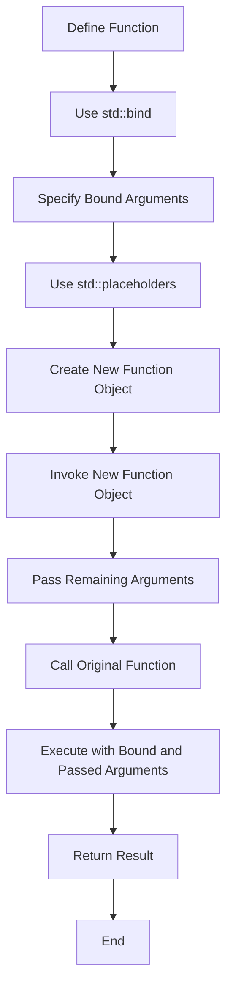

## Introduction
**std::bind** and **std::placeholders** are two fundamental components of the C++ Standard Template Library (STL) that enable functional programming and flexible function invocation. **std::bind** allows you to bind one or more arguments to a function, creating a new function object that can be invoked later. **std::placeholders** are used in conjunction with **std::bind** to specify which arguments should be bound and which should be passed when the bound function is invoked. In real-world scenarios, these components are crucial for tasks such as event handling, asynchronous programming, and higher-order functions. Every engineer should understand **std::bind** and **std::placeholders** to leverage the full potential of C++.

## Core Concepts
- **Function Objects**: These are objects that can be invoked like functions. They are typically created using **std::bind** or **std::function**.
- **std::bind**: A function template that creates a new function object by binding one or more arguments to an existing function.
- **std::placeholders**: A set of objects (_1, _2, _3, etc.) used with **std::bind** to specify the positions of arguments in the bound function.
- **Mental Model**: Think of **std::bind** as a way to "freeze" some arguments of a function, creating a new function with fewer arguments. **std::placeholders** help in specifying which arguments to freeze and which to keep flexible.

## How It Works Internally
When you use **std::bind** to bind a function, it internally creates a new function object that stores the bound arguments and the original function pointer. When this new function object is invoked, it calls the original function with the bound arguments and any additional arguments passed during invocation. **std::placeholders** are used during the binding process to specify the positions of arguments that should be bound and those that should be passed later.

Here's a simplified overview of the steps involved in using **std::bind** and **std::placeholders**:
1. Define a function you want to bind.
2. Use **std::bind** to create a new function object, specifying the function and any arguments to bind, using **std::placeholders** for arguments to be passed later.
3. Invoke the new function object, passing any remaining arguments.

## Code Examples
### Example 1: Basic Usage
```cpp
#include <iostream>
#include <functional>

void greet(const std::string& name, int age) {
    std::cout << "Hello, " << name << "! You are " << age << " years old." << std::endl;
}

int main() {
    // Bind the greet function with "Alice" as the name
    auto boundGreet = std::bind(greet, "Alice", std::placeholders::_1);
    
    // Invoke the bound function with age 30
    boundGreet(30);
    
    return 0;
}
```
### Example 2: Real-world Pattern
```cpp
#include <iostream>
#include <vector>
#include <algorithm>
#include <functional>

// A simple struct to represent a person
struct Person {
    std::string name;
    int age;
};

// Function to print a person's details
void printPerson(const Person& person) {
    std::cout << person.name << " is " << person.age << " years old." << std::endl;
}

int main() {
    // Create a vector of Person objects
    std::vector<Person> people = {
        {"Bob", 25},
        {"Alice", 30},
        {"Charlie", 20}
    };
    
    // Bind printPerson for each person, using a lambda to capture the person
    for (const auto& person : people) {
        auto printBound = std::bind(printPerson, person);
        printBound(); // Invoke the bound function
    }
    
    return 0;
}
```
### Example 3: Advanced Usage with Multiple Placeholders
```cpp
#include <iostream>
#include <functional>

// Function that takes three arguments
void complexFunction(int a, const std::string& b, double c) {
    std::cout << "Arguments: " << a << ", " << b << ", " << c << std::endl;
}

int main() {
    // Bind complexFunction with the first argument as 10
    auto boundFunction = std::bind(complexFunction, 10, std::placeholders::_1, std::placeholders::_2);
    
    // Invoke the bound function with "Hello" and 3.14
    boundFunction("Hello", 3.14);
    
    return 0;
}
```

## Visual Diagram

The diagram illustrates the process of creating and invoking a bound function using **std::bind** and **std::placeholders**.

## Comparison
| Approach | Time Complexity | Space Complexity | Pros | Cons | Best For |
|----------|----------------|-----------------|------|------|----------|
| **std::bind** | O(1) | O(1) | Flexible argument binding, easy to use | Limited control over function object creation | Event handling, higher-order functions |
| **std::function** | O(1) | O(1) | General-purpose function wrapper, type-erased | May incur overhead due to type erasure | Generic programming, callback functions |
| **Lambda Expressions** | O(1) | O(1) | Concise syntax, capture variables from surrounding scope | Limited expressiveness compared to **std::bind** | Small, one-off functions, event handlers |
| **Function Pointers** | O(1) | O(1) | Low-level, direct function invocation | Error-prone, lacks flexibility | Performance-critical code, legacy systems |

## Real-world Use Cases
1. **Event Handling**: In GUI applications, **std::bind** can be used to connect event handlers (functions) with specific events, such as button clicks, using **std::placeholders** to pass event data.
2. **Asynchronous Programming**: **std::bind** can be used to create callback functions that are invoked when asynchronous operations complete, passing results or errors as arguments.
3. **Higher-Order Functions**: **std::bind** enables the creation of higher-order functions that take other functions as arguments or return functions as results, which is essential in functional programming.

## Common Pitfalls
1. **Incorrect Placeholder Usage**: Using **std::placeholders** incorrectly can lead to compile-time errors or unexpected behavior at runtime.
    ```cpp
    // Wrong: Using _1 without specifying the argument position
    auto bound = std::bind(func, _1);
    ```
    ```cpp
    // Right: Specify the argument position correctly
    auto bound = std::bind(func, std::placeholders::_1);
    ```
2. **Binding by Value Instead of Reference**: Binding arguments by value instead of reference can lead to unexpected behavior, especially when dealing with mutable objects.
    ```cpp
    // Wrong: Binding by value
    auto bound = std::bind(func, std::string("Hello"));
    ```
    ```cpp
    // Right: Binding by reference
    std::string str = "Hello";
    auto bound = std::bind(func, std::ref(str));
    ```
3. **Not Checking for Null Function Pointers**: Failing to check if a function pointer is null before invoking it can lead to runtime errors.
    ```cpp
    // Wrong: Not checking for null
    if (func) {
        func();
    }
    ```
    ```cpp
    // Right: Checking for null
    if (func != nullptr) {
        func();
    }
    ```
4. **Overlooking Type Erasure with std::function**: Using **std::function** without considering type erasure can lead to performance issues or unexpected behavior.

## Interview Tips
1. **What is std::bind, and how does it work?**: Explain that **std::bind** is a function template that creates a new function object by binding one or more arguments to an existing function, using **std::placeholders** to specify argument positions.
    - Weak answer: "It's used for binding functions, but I'm not sure how it works internally."
    - Strong answer: "std::bind creates a new function object that stores the bound arguments and the original function pointer. When invoked, it calls the original function with the bound and passed arguments."
2. **How do you use std::placeholders with std::bind?**: Describe how **std::placeholders** are used to specify the positions of arguments in the bound function.
    - Weak answer: "I think you just use _1, _2, etc., but I'm not sure what they represent."
    - Strong answer: "std::placeholders::_1, _2, etc., represent the positions of arguments in the bound function. You use them with std::bind to specify which arguments should be bound and which should be passed when invoking the bound function."
3. **What are some common pitfalls when using std::bind and std::placeholders?**: Discuss common mistakes such as incorrect placeholder usage, binding by value instead of reference, and overlooking type erasure with **std::function**.
    - Weak answer: "I'm not sure, but I try to be careful when using them."
    - Strong answer: "Some common pitfalls include using std::placeholders incorrectly, binding arguments by value instead of reference, and not considering type erasure when using std::function. It's essential to understand these pitfalls to use std::bind and std::placeholders effectively."

## Key Takeaways
- **std::bind** creates a new function object by binding one or more arguments to an existing function.
- **std::placeholders** are used to specify the positions of arguments in the bound function.
- Binding arguments by value instead of reference can lead to unexpected behavior.
- **std::function** may incur overhead due to type erasure.
- **std::bind** and **std::placeholders** are essential for functional programming and flexible function invocation in C++.
- Understanding the internal mechanics of **std::bind** and **std::placeholders** is crucial for effective use.
- Common pitfalls include incorrect placeholder usage, binding by value, and overlooking type erasure.
- **std::bind** and **std::placeholders** are widely used in real-world applications, including event handling, asynchronous programming, and higher-order functions.