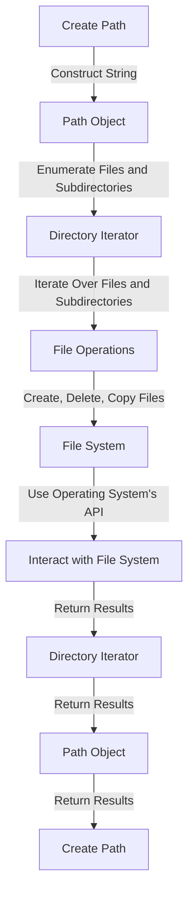

## Introduction
The **std::filesystem** library, introduced in **C++17**, provides a comprehensive and modern way to interact with file systems. It offers a wide range of functions and classes for working with files, directories, and paths, making it easier to write portable and efficient code. In this section, we will explore the importance of **std::filesystem**, its real-world relevance, and why every C++ developer should be familiar with it.

> **Note:** The **std::filesystem** library is a significant improvement over the older **std::filesystem** experimental feature, which was introduced in **C++14**. The new library provides a more comprehensive and well-designed interface for working with file systems.

## Core Concepts
In this section, we will cover the core concepts of the **std::filesystem** library, including **paths**, **directories**, and **files**.

*   A **path** is a sequence of directories and/or files that lead to a specific location in the file system. It can be absolute (e.g., `/home/user/documents`) or relative (e.g., `./documents`).
*   A **directory** is a container that holds files and/or subdirectories. It is represented by the **std::filesystem::directory_entry** class.
*   A **file** is a named resource that stores data. It is represented by the **std::filesystem::directory_entry** class, which is the same class used to represent directories.

> **Tip:** When working with **std::filesystem**, it is essential to understand the difference between **paths**, **directories**, and **files**. A **path** is a string that represents a location in the file system, while a **directory** or **file** is an object that represents a specific entity in the file system.

## How It Works Internally
The **std::filesystem** library provides a platform-independent interface for working with file systems. Under the hood, it uses the operating system's APIs to interact with the file system. Here is a step-by-step breakdown of how it works:

1.  **Path Construction**: When you create a **std::filesystem::path** object, it constructs a string that represents the path. The string is then used to interact with the file system.
2.  **Directory Iteration**: When you iterate over a directory using **std::filesystem::directory_iterator**, it uses the operating system's API to enumerate the files and subdirectories in the directory.
3.  **File Operations**: When you perform file operations such as creating, deleting, or copying files, the **std::filesystem** library uses the operating system's API to execute the operations.

> **Warning:** When working with **std::filesystem**, it is essential to handle errors properly. The library throws exceptions when errors occur, so you should use try-catch blocks to handle them.

## Code Examples
In this section, we will explore three complete and runnable examples that demonstrate the usage of the **std::filesystem** library.

### Example 1: Basic Usage
```cpp
#include <filesystem>
#include <iostream>

int main() {
    // Create a path object
    std::filesystem::path path = "/home/user/documents";

    // Check if the path exists
    if (std::filesystem::exists(path)) {
        std::cout << "The path exists." << std::endl;
    } else {
        std::cout << "The path does not exist." << std::endl;
    }

    return 0;
}
```

### Example 2: Directory Iteration
```cpp
#include <filesystem>
#include <iostream>

int main() {
    // Create a directory iterator
    std::filesystem::directory_iterator dir("/home/user/documents");

    // Iterate over the files and subdirectories in the directory
    for (const auto& entry : dir) {
        if (entry.is_directory()) {
            std::cout << "Directory: " << entry.path().filename() << std::endl;
        } else {
            std::cout << "File: " << entry.path().filename() << std::endl;
        }
    }

    return 0;
}
```

### Example 3: File Operations
```cpp
#include <filesystem>
#include <iostream>

int main() {
    // Create a path object
    std::filesystem::path src = "/home/user/documents/file.txt";
    std::filesystem::path dest = "/home/user/documents/file_copy.txt";

    // Copy the file
    try {
        std::filesystem::copy_file(src, dest);
        std::cout << "The file was copied successfully." << std::endl;
    } catch (const std::filesystem::filesystem_error& e) {
        std::cout << "An error occurred: " << e.what() << std::endl;
    }

    return 0;
}
```

## Visual Diagram

The diagram above illustrates the workflow of the **std::filesystem** library. It shows how the library constructs a path object, iterates over files and subdirectories, performs file operations, and interacts with the file system using the operating system's API.

> **Note:** The diagram is a simplified representation of the workflow and does not show all the details of the library's internal mechanics.

## Comparison
The following table compares the **std::filesystem** library with other file system libraries:

| Library | Time Complexity | Space Complexity | Pros | Cons | Best For |
| --- | --- | --- | --- | --- | --- |
| **std::filesystem** | O(1) - O(n) | O(1) - O(n) | Platform-independent, comprehensive interface | Steep learning curve | Cross-platform file system operations |
| **POSIX** | O(1) - O(n) | O(1) - O(n) | Low-level, fine-grained control | Non-portable, complex API | Unix-like systems, low-level file system operations |
| **Win32** | O(1) - O(n) | O(1) - O(n) | High-performance, Windows-specific features | Non-portable, complex API | Windows systems, high-performance file system operations |
| **Boost::filesystem** | O(1) - O(n) | O(1) - O(n) | Cross-platform, comprehensive interface | Dependent on Boost library | Cross-platform file system operations, Boost-dependent projects |

> **Tip:** When choosing a file system library, consider the trade-offs between platform independence, performance, and complexity. The **std::filesystem** library is a good choice for cross-platform file system operations, while **POSIX** and **Win32** are better suited for low-level, platform-specific operations.

## Real-world Use Cases
The **std::filesystem** library is widely used in various industries and applications, including:

1.  **File managers**: The **std::filesystem** library is used in file managers to provide a platform-independent interface for interacting with the file system.
2.  **Text editors**: Text editors use the **std::filesystem** library to perform file operations such as creating, deleting, and copying files.
3.  **Game engines**: Game engines use the **std::filesystem** library to manage game assets, such as textures, models, and audio files.
4.  **Web browsers**: Web browsers use the **std::filesystem** library to manage downloaded files and interact with the file system.

> **Interview:** When asked about the **std::filesystem** library in an interview, be prepared to discuss its features, benefits, and use cases. Emphasize its platform independence, comprehensive interface, and performance.

## Common Pitfalls
When working with the **std::filesystem** library, there are several common pitfalls to avoid:

1.  **Not handling errors**: Failing to handle errors can lead to unexpected behavior and crashes.
2.  **Not checking for file existence**: Not checking for file existence before performing operations can lead to errors and exceptions.
3.  **Not using try-catch blocks**: Not using try-catch blocks can lead to unhandled exceptions and crashes.
4.  **Not using const correctness**: Not using const correctness can lead to unnecessary copies and modifications of file system objects.

> **Warning:** When working with the **std::filesystem** library, it is essential to follow best practices and avoid common pitfalls to ensure reliable and efficient code.

## Interview Tips
When asked about the **std::filesystem** library in an interview, be prepared to discuss the following topics:

1.  **Features and benefits**: Discuss the features and benefits of the **std::filesystem** library, such as its platform independence and comprehensive interface.
2.  **Use cases**: Discuss the use cases of the **std::filesystem** library, such as file managers, text editors, game engines, and web browsers.
3.  **Error handling**: Discuss the importance of error handling when working with the **std::filesystem** library, and how to handle errors using try-catch blocks.
4.  **Best practices**: Discuss best practices when working with the **std::filesystem** library, such as using const correctness and avoiding common pitfalls.

> **Tip:** When answering interview questions about the **std::filesystem** library, be sure to provide specific examples and use cases to demonstrate your knowledge and experience.

## Key Takeaways
The following are key takeaways when working with the **std::filesystem** library:

*   The **std::filesystem** library provides a platform-independent interface for interacting with the file system.
*   The library offers a comprehensive set of features and functions for working with files, directories, and paths.
*   Error handling is essential when working with the **std::filesystem** library, and try-catch blocks should be used to handle exceptions.
*   Best practices, such as using const correctness and avoiding common pitfalls, should be followed to ensure reliable and efficient code.
*   The **std::filesystem** library is widely used in various industries and applications, including file managers, text editors, game engines, and web browsers.
*   When working with the **std::filesystem** library, it is essential to understand the difference between **paths**, **directories**, and **files**.
*   The library provides a high-performance and efficient way to interact with the file system, making it suitable for a wide range of applications and use cases.
*   The **std::filesystem** library is a part of the C++ Standard Library, and its functionality is available on all platforms that support C++17.
*   The library is designed to be easy to use and provides a simple and intuitive interface for working with the file system.