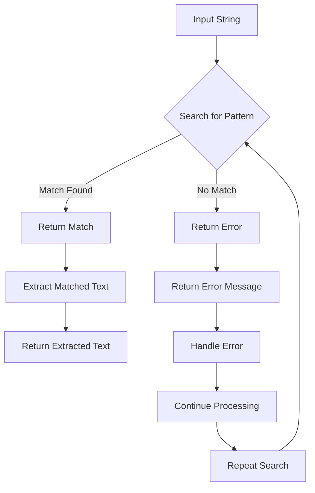

## Introduction
**std::regex** is a C++ library that provides support for regular expressions, which are a powerful tool for pattern matching in strings. Regular expressions are a way to describe a search pattern using a formal language, and they are commonly used in text processing, data validation, and data extraction. The **std::regex** library is part of the C++ Standard Template Library (STL) and provides a set of classes and functions for working with regular expressions. In this section, we will introduce the basics of regular expressions and the **std::regex** library.

Regular expressions are used in many real-world applications, such as:
* Data validation: Checking if a string matches a certain pattern, such as an email address or a phone number.
* Text processing: Searching and replacing patterns in text, such as finding all occurrences of a certain word.
* Data extraction: Extracting data from text, such as parsing a log file to extract certain information.

> **Note:** Regular expressions are a powerful tool, but they can also be complex and difficult to read. It's essential to use them carefully and to test them thoroughly to ensure they work as expected.

## Core Concepts
The **std::regex** library provides several core concepts that are essential to understand when working with regular expressions:
* **Pattern**: A regular expression pattern is a string that describes a search pattern. It can contain special characters, such as `.` or `*`, that have special meanings.
* **Matcher**: A matcher is an object that is used to search for a pattern in a string. It can be used to find all occurrences of the pattern or to replace the pattern with a new string.
* **Flags**: Flags are used to modify the behavior of the matcher. For example, the `std::regex_constants::icase` flag can be used to make the search case-insensitive.

Some key terminology to understand when working with regular expressions includes:
* **Literal characters**: Characters that are matched literally, such as the character `a`.
* **Metacharacters**: Characters that have special meanings, such as the character `.`.
* **Character classes**: Sets of characters that can be matched, such as the set of all digits.

> **Tip:** When working with regular expressions, it's essential to use a good editor or tool that can help you visualize and test your patterns.

## How It Works Internally
The **std::regex** library uses a finite state machine to parse and match regular expressions. The finite state machine is created by compiling the regular expression pattern into a set of states and transitions. The states represent the current position in the pattern, and the transitions represent the possible next states based on the input character.

When a string is matched against a regular expression pattern, the finite state machine is used to scan the string and determine if it matches the pattern. The machine starts in an initial state and transitions to new states based on the input characters. If the machine reaches a final state, the string matches the pattern.

The time complexity of matching a regular expression pattern is O(n), where n is the length of the string. The space complexity is O(m), where m is the length of the pattern.

> **Warning:** Regular expressions can be slow and memory-intensive if they are not optimized properly. It's essential to use efficient patterns and to avoid using excessive backtracking.

## Code Examples
### Example 1: Basic Usage
```cpp
#include <regex>
#include <string>
#include <iostream>

int main() {
    std::string str = "Hello, world!";
    std::regex pattern("world");
    if (std::regex_search(str, pattern)) {
        std::cout << "Found a match!" << std::endl;
    } else {
        std::cout << "No match found." << std::endl;
    }
    return 0;
}
```
This example demonstrates the basic usage of the **std::regex** library. It searches for the pattern "world" in the string "Hello, world!" and prints a message if a match is found.

### Example 2: Real-World Pattern
```cpp
#include <regex>
#include <string>
#include <iostream>

int main() {
    std::string email = "john.doe@example.com";
    std::regex pattern("^[a-zA-Z0-9._%+-]+@[a-zA-Z0-9.-]+\\.[a-zA-Z]{2,}$");
    if (std::regex_match(email, pattern)) {
        std::cout << "Valid email address." << std::endl;
    } else {
        std::cout << "Invalid email address." << std::endl;
    }
    return 0;
}
```
This example demonstrates a real-world pattern for validating email addresses. It uses a regular expression to check if the email address matches a certain format.

### Example 3: Advanced Usage
```cpp
#include <regex>
#include <string>
#include <iostream>
#include <vector>

int main() {
    std::string log = "2022-01-01 12:00:00 INFO: User logged in.";
    std::regex pattern("^(\\d{4}-\\d{2}-\\d{2}) (\\d{2}:\\d{2}:\\d{2}) (INFO|WARNING|ERROR): (.*)$");
    std::smatch match;
    if (std::regex_match(log, match, pattern)) {
        std::cout << "Date: " << match[1].str() << std::endl;
        std::cout << "Time: " << match[2].str() << std::endl;
        std::cout << "Level: " << match[3].str() << std::endl;
        std::cout << "Message: " << match[4].str() << std::endl;
    } else {
        std::cout << "Invalid log format." << std::endl;
    }
    return 0;
}
```
This example demonstrates advanced usage of the **std::regex** library. It uses a regular expression to parse a log message and extract the date, time, level, and message.

## Visual Diagram

This diagram illustrates the basic flow of searching for a pattern in a string using the **std::regex** library.

## Comparison
| Approach | Time Complexity | Space Complexity | Pros | Cons | Best For |
| --- | --- | --- | --- | --- | --- |
| **std::regex** | O(n) | O(m) | Powerful pattern matching, flexible | Slow and memory-intensive if not optimized | Text processing, data validation |
| **std::string::find** | O(n) | O(1) | Simple and efficient, easy to use | Limited functionality, no pattern matching | Simple string searching |
| **std::string::substr** | O(n) | O(1) | Simple and efficient, easy to use | Limited functionality, no pattern matching | Simple string extraction |
| **Boost Regex** | O(n) | O(m) | Powerful pattern matching, flexible | Slow and memory-intensive if not optimized, external library | Text processing, data validation |

## Real-world Use Cases
1. **Data Validation**: Google uses regular expressions to validate user input data, such as email addresses and phone numbers.
2. **Text Processing**: Amazon uses regular expressions to process and extract data from text, such as product descriptions and customer reviews.
3. **Log Analysis**: Microsoft uses regular expressions to parse and analyze log messages, such as error messages and system logs.

## Common Pitfalls
1. **Inefficient Patterns**: Using patterns that are too complex or inefficient can lead to slow performance and high memory usage.
2. **Incorrect Flag Usage**: Using incorrect flags or not using flags at all can lead to incorrect matching behavior.
3. **Unescaped Characters**: Not escaping special characters in patterns can lead to incorrect matching behavior.
4. **Inadequate Error Handling**: Not handling errors properly can lead to crashes or unexpected behavior.

> **Warning:** Regular expressions can be complex and difficult to read. It's essential to use them carefully and to test them thoroughly to ensure they work as expected.

## Interview Tips
1. **Be Prepared to Explain Patterns**: Be prepared to explain and write regular expression patterns, including how to use special characters and character classes.
2. **Understand Flag Usage**: Understand how to use flags to modify the behavior of regular expressions, such as case-insensitivity and multiline matching.
3. **Know Common Pitfalls**: Know common pitfalls and mistakes to avoid when using regular expressions, such as inefficient patterns and incorrect flag usage.

> **Interview:** What is the difference between `std::regex` and `std::string::find`? How would you use each in a real-world scenario?

## Key Takeaways
* **std::regex** is a powerful tool for pattern matching in strings.
* Regular expressions can be slow and memory-intensive if not optimized properly.
* **std::regex** uses a finite state machine to parse and match regular expressions.
* The time complexity of matching a regular expression pattern is O(n), where n is the length of the string.
* The space complexity is O(m), where m is the length of the pattern.
* **std::regex** provides several core concepts, including patterns, matchers, and flags.
* Regular expressions are used in many real-world applications, such as data validation, text processing, and log analysis.
* It's essential to use regular expressions carefully and to test them thoroughly to ensure they work as expected.