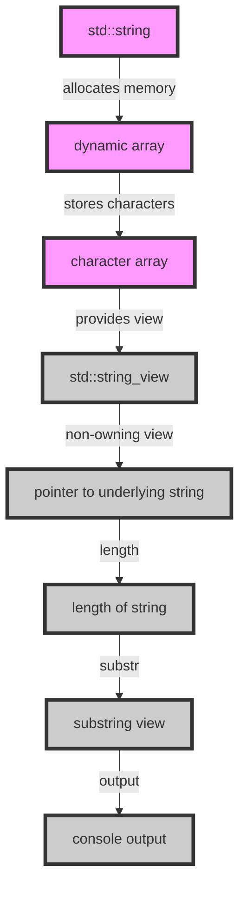

## Introduction
The `std::string` and `std::string_view` classes in C++ are essential components of the Standard Template Library (STL). `std::string` is a dynamic string class that provides a wide range of operations for manipulating strings, while `std::string_view` is a non-owning view of a string that allows for efficient and flexible string processing. In this section, we will explore the importance of these classes, their real-world relevance, and why every C++ engineer should be familiar with them.
> **Note:** The `std::string` class is one of the most widely used classes in the STL, and understanding its inner workings and usage is crucial for any C++ programmer.

## Core Concepts
The `std::string` class is a dynamic string class that provides a wide range of operations for manipulating strings. It is a templated class, which means it can be used with different character types, such as `char`, `wchar_t`, and `char16_t`. The `std::string_view` class, on the other hand, is a non-owning view of a string that allows for efficient and flexible string processing.
> **Warning:** One common mistake when using `std::string` is to use the `std::string` constructor to create a new string from a C-style string, which can lead to unnecessary copies and performance issues.

Key terminology:

* **Dynamic string**: A string that can grow or shrink in size dynamically.
* **Non-owning view**: A class that provides a view of a string without taking ownership of the underlying memory.
* **Character type**: The type of character used to represent the string, such as `char` or `wchar_t`.

## How It Works Internally
The `std::string` class uses a dynamic array to store its characters, which allows it to grow or shrink in size dynamically. The `std::string_view` class, on the other hand, uses a pointer to the underlying string and a length to provide a non-owning view of the string.
> **Tip:** When using `std::string`, it is often more efficient to use the `reserve` method to preallocate memory for the string, rather than relying on dynamic reallocation.

Here is a step-by-step breakdown of how the `std::string` class works internally:

1. Memory allocation: The `std::string` class allocates memory for the string using a dynamic array.
2. Character insertion: When characters are inserted into the string, the `std::string` class checks if the current capacity is sufficient to hold the new characters. If not, it allocates new memory and copies the existing characters to the new memory.
3. Character removal: When characters are removed from the string, the `std::string` class updates the length of the string and may deallocate memory if the string is empty.

## Code Examples
### Example 1: Basic `std::string` usage
```cpp
#include <string>
#include <iostream>

int main() {
    std::string str = "Hello, World!";
    std::cout << str << std::endl;
    return 0;
}
```
This example demonstrates the basic usage of the `std::string` class, including creating a new string and outputting it to the console.

### Example 2: `std::string_view` usage
```cpp
#include <string_view>
#include <iostream>

int main() {
    std::string str = "Hello, World!";
    std::string_view view = str;
    std::cout << view << std::endl;
    return 0;
}
```
This example demonstrates the usage of the `std::string_view` class, including creating a non-owning view of a string and outputting it to the console.

### Example 3: Efficient string processing using `std::string_view`
```cpp
#include <string_view>
#include <iostream>

int main() {
    std::string str = "Hello, World!";
    std::string_view view = str;
    std::string_view substr = view.substr(7); // Get the substring "World!"
    std::cout << substr << std::endl;
    return 0;
}
```
This example demonstrates the efficient string processing capabilities of the `std::string_view` class, including creating a substring view without allocating new memory.

## Visual Diagram

This diagram illustrates the internal workings of the `std::string` and `std::string_view` classes, including memory allocation, character storage, and non-owning views.

## Comparison
| Class | Time Complexity | Space Complexity | Pros | Cons |
| --- | --- | --- | --- | --- |
| `std::string` | O(n) for insertion and removal | O(n) for storage | dynamic string, flexible | memory allocation overhead |
| `std::string_view` | O(1) for creation, O(n) for substr | O(1) for storage | efficient, non-owning view | limited functionality |
| `const char*` | O(1) for creation, O(n) for substr | O(1) for storage | lightweight, easy to use | limited functionality, error-prone |
| `std::vector<char>` | O(n) for insertion and removal | O(n) for storage | flexible, dynamic | memory allocation overhead |

## Real-world Use Cases
1. **Google's Chromium browser**: The Chromium browser uses `std::string` and `std::string_view` extensively for string processing and manipulation.
2. **Facebook's Folly library**: The Folly library provides a wide range of string processing functions, including those using `std::string` and `std::string_view`.
3. **Microsoft's Visual Studio**: The Visual Studio IDE uses `std::string` and `std::string_view` for string processing and manipulation in its code editor and debugger.

## Common Pitfalls
1. **Unnecessary copies**: Using the `std::string` constructor to create a new string from a C-style string can lead to unnecessary copies and performance issues.
```cpp
// Wrong way
std::string str = std::string("Hello, World!");

// Right way
std::string str = "Hello, World!";
```
2. **Memory allocation overhead**: Using `std::string` can lead to memory allocation overhead, especially for large strings.
```cpp
// Wrong way
std::string str;
str += "Hello, ";
str += "World!";

// Right way
std::string str;
str.reserve(13);
str += "Hello, ";
str += "World!";
```
3. **Limited functionality**: Using `const char*` or `std::vector<char>` can limit the functionality of string processing and manipulation.
```cpp
// Wrong way
const char* str = "Hello, World!";
// No substr or find methods available

// Right way
std::string str = "Hello, World!";
std::string substr = str.substr(7); // Get the substring "World!"
```
4. **Error-prone**: Using `const char*` can lead to error-prone code, especially when dealing with null-terminated strings.
```cpp
// Wrong way
const char* str = "Hello, World!";
if (str == NULL) { // Always false
    // Handle error
}

// Right way
std::string str = "Hello, World!";
if (str.empty()) { // Check for empty string
    // Handle error
}
```

## Interview Tips
1. **What is the difference between `std::string` and `std::string_view`?**
	* Weak answer: "One is a string class and the other is a view class."
	* Strong answer: "The `std::string` class is a dynamic string class that provides a wide range of operations for manipulating strings, while the `std::string_view` class is a non-owning view of a string that allows for efficient and flexible string processing."
2. **How do you optimize string processing in C++?**
	* Weak answer: "Use `std::string` and `std::string_view`."
	* Strong answer: "Use `std::string` and `std::string_view` with careful consideration of memory allocation and deallocation, and use `reserve` and `substr` methods to optimize string processing."
3. **What are the trade-offs between using `std::string` and `std::string_view`?**
	* Weak answer: "One is faster and the other is slower."
	* Strong answer: "The `std::string` class provides a wide range of operations for manipulating strings, but may incur memory allocation overhead, while the `std::string_view` class provides efficient and flexible string processing, but may limit functionality."

## Key Takeaways
* The `std::string` class is a dynamic string class that provides a wide range of operations for manipulating strings.
* The `std::string_view` class is a non-owning view of a string that allows for efficient and flexible string processing.
* Memory allocation and deallocation are critical considerations when using `std::string`.
* Using `reserve` and `substr` methods can optimize string processing.
* The trade-offs between using `std::string` and `std::string_view` depend on the specific use case and requirements.
* `std::string` and `std::string_view` are essential components of the C++ Standard Template Library (STL).
* Understanding the internal workings of `std::string` and `std::string_view` is crucial for optimizing string processing and manipulation in C++.
* Using `const char*` or `std::vector<char>` can limit functionality and lead to error-prone code.