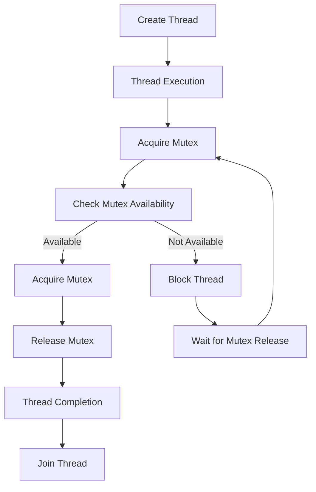

## Introduction
The **C++ Standard Template Library (STL)** provides a set of concurrency utilities that enable developers to write efficient and safe multithreaded programs. At the heart of these utilities are **std::thread**, **std::mutex**, **std::lock_guard**, and **std::unique_lock**. These classes work together to manage threads, synchronize access to shared resources, and prevent common pitfalls like deadlocks and data corruption. In this article, we will delve into the world of C++ concurrency, exploring the concepts, mechanics, and best practices for using these essential classes.

> **Note:** Multithreading is a fundamental concept in computer science, and understanding how to use **std::thread**, **std::mutex**, **std::lock_guard**, and **std::unique_lock** is crucial for any C++ developer.

## Core Concepts
Before diving into the implementation details, let's define some key terms:

* **Thread**: A thread is a separate flow of execution within a program. Threads can run concurrently, improving the overall performance and responsiveness of an application.
* **Mutex** (short for **mutual exclusion**): A mutex is a synchronization primitive that allows only one thread to access a shared resource at a time.
* **Lock guard**: A lock guard is a class that automatically acquires and releases a mutex, ensuring that the mutex is always released, even in the presence of exceptions.
* **Unique lock**: A unique lock is a class that provides exclusive access to a mutex, allowing only one thread to acquire the lock at a time.

## How It Works Internally
When a thread is created using **std::thread**, the operating system allocates a new thread control block (TCB) to manage the thread's execution. The TCB contains information like the thread's ID, stack pointer, and instruction pointer.

When a thread attempts to acquire a mutex using **std::lock_guard** or **std::unique_lock**, the following steps occur:

1. The thread checks if the mutex is available (i.e., not locked by another thread).
2. If the mutex is available, the thread acquires the mutex and sets its state to "locked."
3. If the mutex is not available, the thread blocks until the mutex is released by another thread.
4. When the thread releases the mutex, the mutex's state is set to "unlocked," and any waiting threads are notified.

> **Tip:** Using **std::lock_guard** and **std::unique_lock** can simplify mutex management and prevent common pitfalls like deadlocks and data corruption.

## Code Examples
Here are three complete and runnable examples demonstrating the use of **std::thread**, **std::mutex**, **std::lock_guard**, and **std::unique_lock**:

### Example 1: Basic Thread Creation
```cpp
#include <iostream>
#include <thread>

void printHello() {
    std::cout << "Hello from thread!" << std::endl;
}

int main() {
    std::thread t(printHello);
    t.join(); // Wait for the thread to finish
    return 0;
}
```

### Example 2: Mutex Synchronization
```cpp
#include <iostream>
#include <thread>
#include <mutex>

std::mutex mtx;
int counter = 0;

void incrementCounter() {
    for (int i = 0; i < 100000; ++i) {
        std::lock_guard<std::mutex> lock(mtx);
        counter++;
    }
}

int main() {
    std::thread t1(incrementCounter);
    std::thread t2(incrementCounter);
    t1.join();
    t2.join();
    std::cout << "Final counter value: " << counter << std::endl;
    return 0;
}
```

### Example 3: Unique Lock with Timeout
```cpp
#include <iostream>
#include <thread>
#include <mutex>
#include <chrono>

std::mutex mtx;
bool dataReady = false;

void waitForData() {
    std::unique_lock<std::mutex> lock(mtx);
    if (!lock.try_lock_for(std::chrono::seconds(5))) {
        std::cout << "Timeout: data not ready" << std::endl;
        return;
    }
    std::cout << "Data ready: " << dataReady << std::endl;
}

int main() {
    std::thread t(waitForData);
    std::this_thread::sleep_for(std::chrono::seconds(3));
    {
        std::lock_guard<std::mutex> lock(mtx);
        dataReady = true;
    }
    t.join();
    return 0;
}
```

## Visual Diagram

This diagram illustrates the basic flow of thread creation, mutex acquisition, and thread completion.

> **Warning:** Failing to release a mutex can lead to deadlocks and data corruption. Always use **std::lock_guard** or **std::unique_lock** to ensure proper mutex management.

## Comparison
Here's a comparison table highlighting the key differences between **std::mutex**, **std::lock_guard**, and **std::unique_lock**:

| Approach | Time Complexity | Space Complexity | Pros | Cons | Best For |
| --- | --- | --- | --- | --- | --- |
| **std::mutex** | O(1) | O(1) | Simple, efficient | Prone to deadlocks, data corruption | Low-level synchronization |
| **std::lock_guard** | O(1) | O(1) | Automatic mutex release, exception-safe | Limited flexibility | High-level synchronization, safe mutex management |
| **std::unique_lock** | O(1) | O(1) | Flexible locking, timeout support | More complex than **std::lock_guard** | Advanced synchronization, timeout scenarios |

## Real-world Use Cases
Here are three real-world examples of using **std::thread**, **std::mutex**, **std::lock_guard**, and **std::unique_lock**:

1. **Google's Chromium Browser**: Chromium uses **std::thread** and **std::mutex** to manage the rendering of web pages, ensuring that multiple threads can access shared resources safely.
2. **Microsoft's Windows Operating System**: Windows uses **std::thread** and **std::mutex** to manage system resources, such as file handles and network connections.
3. **Apache's HTTP Server**: Apache uses **std::thread** and **std::mutex** to manage multiple concurrent connections, ensuring that each connection is handled safely and efficiently.

> **Interview:** What's the difference between **std::mutex** and **std::lock_guard**? How would you use them in a real-world scenario?

## Common Pitfalls
Here are four common pitfalls to watch out for when using **std::thread**, **std::mutex**, **std::lock_guard**, and **std::unique_lock**:

1. **Deadlocks**: Failing to release a mutex can lead to deadlocks, where two or more threads are blocked indefinitely.
2. **Data Corruption**: Failing to synchronize access to shared resources can lead to data corruption, where multiple threads modify the same data simultaneously.
3. **Starvation**: Failing to release a mutex can lead to starvation, where a thread is unable to acquire the mutex due to other threads holding it for an extended period.
4. **Livelocks**: Failing to release a mutex can lead to livelocks, where two or more threads are unable to acquire the mutex due to constant retries.

> **Tip:** Use **std::lock_guard** and **std::unique_lock** to simplify mutex management and prevent common pitfalls.

## Interview Tips
Here are three common interview questions related to **std::thread**, **std::mutex**, **std::lock_guard**, and **std::unique_lock**:

1. **What's the difference between **std::mutex** and **std::lock_guard****?**
	* Weak answer: "They're both used for synchronization, but I'm not sure what the difference is."
	* Strong answer: "**std::mutex** is a low-level synchronization primitive, while **std::lock_guard** is a high-level class that automatically manages the mutex."
2. **How would you use **std::thread** and **std::mutex** to manage a shared resource?**
	* Weak answer: "I would use **std::thread** to create multiple threads and **std::mutex** to lock the shared resource."
	* Strong answer: "I would use **std::thread** to create multiple threads, and **std::mutex** to synchronize access to the shared resource. I would also use **std::lock_guard** to ensure proper mutex management."
3. **What's the benefit of using **std::unique_lock** over **std::lock_guard****?**
	* Weak answer: "I'm not sure, but I think **std::unique_lock** is more flexible."
	* Strong answer: "**std::unique_lock** provides more flexibility than **std::lock_guard**, allowing for timeout scenarios and more complex locking strategies."

## Key Takeaways
Here are ten key takeaways to remember when working with **std::thread**, **std::mutex**, **std::lock_guard**, and **std::unique_lock**:

* **std::thread** is used to create multiple threads of execution.
* **std::mutex** is a low-level synchronization primitive that allows only one thread to access a shared resource at a time.
* **std::lock_guard** is a high-level class that automatically manages a mutex, ensuring proper release and exception safety.
* **std::unique_lock** is a flexible locking class that provides timeout support and more complex locking strategies.
* Always use **std::lock_guard** or **std::unique_lock** to manage mutexes and prevent common pitfalls like deadlocks and data corruption.
* **std::thread** and **std::mutex** can be used to manage shared resources safely and efficiently.
* **std::unique_lock** provides more flexibility than **std::lock_guard**, but can be more complex to use.
* Always consider the time and space complexity of synchronization algorithms when designing concurrent systems.
* **std::thread**, **std::mutex**, **std::lock_guard**, and **std::unique_lock** are essential classes for any C++ developer working with concurrent systems.
* Understanding the internal mechanics of these classes is crucial for writing efficient and safe concurrent code.