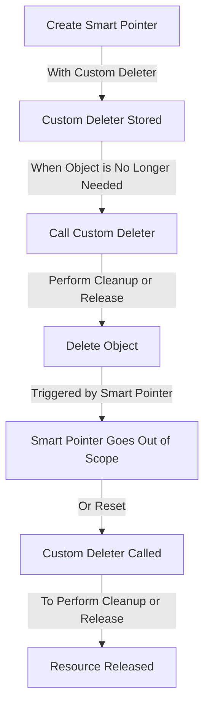

## Introduction
Custom deleters are a crucial concept in C++ that allows developers to customize the behavior of smart pointers when deleting objects. They are essential for managing resources that require specific cleanup or release mechanisms. In this section, we will explore what custom deleters are, why they matter, and their real-world relevance. 
> **Note:** Custom deleters are often used in conjunction with `std::unique_ptr` and `std::shared_ptr` to ensure proper resource management.

Custom deleters are important because they provide a way to decouple the creation and deletion of objects, allowing for more flexible and efficient memory management. They are particularly useful when working with third-party libraries or frameworks that require specific cleanup procedures. 
> **Warning:** Failing to use custom deleters when necessary can lead to memory leaks or resource corruption.

In real-world scenarios, custom deleters are commonly used in systems programming, game development, and high-performance computing. They are also useful when working with legacy code that requires specific cleanup mechanisms. 
> **Tip:** When using custom deleters, it's essential to consider the performance implications and ensure that the deletion process is efficient and thread-safe.

## Core Concepts
A custom deleter is a function or function object that is used to delete an object when it is no longer needed. It is typically used in conjunction with smart pointers, such as `std::unique_ptr` or `std::shared_ptr`, to ensure proper resource management. 
> **Interview:** What is a custom deleter, and how is it used in C++? (Answer: A custom deleter is a function or function object that is used to delete an object when it is no longer needed. It is typically used in conjunction with smart pointers to ensure proper resource management.)

The key terminology related to custom deleters includes:
* **Deleter**: A function or function object that is used to delete an object.
* **Smart pointer**: A class that provides automatic memory management for dynamically allocated objects.
* **Resource management**: The process of managing resources, such as memory or file handles, to ensure proper cleanup and release.

Mental models for custom deleters include considering the deletion process as a separate step from the creation process, and thinking of custom deleters as a way to decouple these two steps. 
> **Note:** Custom deleters can be used to manage resources other than memory, such as file handles or network connections.

## How It Works Internally
When a custom deleter is used with a smart pointer, the deletion process is triggered when the smart pointer goes out of scope or is reset. The custom deleter is then called to perform the necessary cleanup or release operations. 
> **Warning:** Custom deleters must be thread-safe to ensure proper behavior in multi-threaded environments.

The step-by-step process for using a custom deleter with a smart pointer is as follows:
1. Create a custom deleter function or function object that performs the necessary cleanup or release operations.
2. Create a smart pointer, such as `std::unique_ptr` or `std::shared_ptr`, and pass the custom deleter to its constructor.
3. Use the smart pointer to manage the object, and when the object is no longer needed, the custom deleter will be called to perform the necessary cleanup or release operations.

The under-the-hood mechanics of custom deleters involve the use of function pointers or function objects to store the deletion function. When the smart pointer is destroyed, the stored deletion function is called to perform the necessary cleanup or release operations. 
> **Tip:** Custom deleters can be used to implement custom smart pointer classes that provide additional features or functionality.

## Code Examples
### Example 1: Basic Custom Deleter
```cpp
#include <iostream>
#include <memory>

// Custom deleter function
void customDeleter(int* p) {
    std::cout << "Deleting object..." << std::endl;
    delete p;
}

int main() {
    // Create a smart pointer with a custom deleter
    std::unique_ptr<int, decltype(&customDeleter)> ptr(new int, customDeleter);
    *ptr = 10;
    std::cout << *ptr << std::endl;
    return 0;
}
```
This example demonstrates the basic usage of a custom deleter with a `std::unique_ptr`. The custom deleter function is used to print a message when the object is deleted.

### Example 2: Custom Deleter with a Class
```cpp
#include <iostream>
#include <memory>

class MyClass {
public:
    MyClass() { std::cout << "Constructing object..." << std::endl; }
    ~MyClass() { std::cout << "Destructing object..." << std::endl; }
};

// Custom deleter class
class CustomDeleter {
public:
    void operator()(MyClass* p) {
        std::cout << "Deleting object..." << std::endl;
        delete p;
    }
};

int main() {
    // Create a smart pointer with a custom deleter
    std::unique_ptr<MyClass, CustomDeleter> ptr(new MyClass, CustomDeleter());
    return 0;
}
```
This example demonstrates the usage of a custom deleter class with a `std::unique_ptr`. The custom deleter class is used to print a message when the object is deleted.

### Example 3: Custom Deleter with a Lambda Function
```cpp
#include <iostream>
#include <memory>

class MyClass {
public:
    MyClass() { std::cout << "Constructing object..." << std::endl; }
    ~MyClass() { std::cout << "Destructing object..." << std::endl; }
};

int main() {
    // Create a smart pointer with a custom deleter lambda function
    auto customDeleter = [](MyClass* p) {
        std::cout << "Deleting object..." << std::endl;
        delete p;
    };
    std::unique_ptr<MyClass, decltype(customDeleter)> ptr(new MyClass, customDeleter);
    return 0;
}
```
This example demonstrates the usage of a custom deleter lambda function with a `std::unique_ptr`. The custom deleter lambda function is used to print a message when the object is deleted.

## Visual Diagram

This diagram illustrates the process of using a custom deleter with a smart pointer. The custom deleter is stored when the smart pointer is created, and it is called when the object is no longer needed to perform the necessary cleanup or release operations.

## Comparison
| Approach | Time Complexity | Space Complexity | Pros | Cons | Best For |
| --- | --- | --- | --- | --- | --- |
| Custom Deleter | O(1) | O(1) | Flexible and efficient | Can be complex to implement | Managing resources that require specific cleanup or release mechanisms |
| Raw Pointer | O(1) | O(1) | Simple to use | Prone to memory leaks and dangling pointers | Legacy code or simple applications |
| Smart Pointer | O(1) | O(1) | Automatic memory management | Can be slower than raw pointers | Most C++ applications |
| Manual Memory Management | O(1) | O(1) | Low-level control | Error-prone and time-consuming | Systems programming or high-performance computing |

## Real-world Use Cases
1. **Game Development**: Custom deleters are used in game development to manage resources such as textures, models, and audio files. They ensure that these resources are properly released when they are no longer needed, reducing memory leaks and improving performance.
2. **Systems Programming**: Custom deleters are used in systems programming to manage system resources such as file handles, network connections, and process IDs. They ensure that these resources are properly released when they are no longer needed, preventing resource leaks and improving system stability.
3. **High-Performance Computing**: Custom deleters are used in high-performance computing to manage resources such as memory blocks, GPU buffers, and network connections. They ensure that these resources are properly released when they are no longer needed, reducing memory leaks and improving performance.

## Common Pitfalls
1. **Forgetting to Use a Custom Deleter**: Forgetting to use a custom deleter can lead to memory leaks or resource corruption.
```cpp
// Wrong
std::unique_ptr<int> ptr(new int);
```
```cpp
// Right
std::unique_ptr<int, decltype(&customDeleter)> ptr(new int, customDeleter);
```
2. **Using a Raw Pointer**: Using a raw pointer can lead to memory leaks or dangling pointers.
```cpp
// Wrong
int* ptr = new int;
```
```cpp
// Right
std::unique_ptr<int> ptr(new int);
```
3. **Not Considering Thread Safety**: Not considering thread safety can lead to crashes or undefined behavior.
```cpp
// Wrong
void customDeleter(int* p) {
    delete p;
}
```
```cpp
// Right
void customDeleter(int* p) {
    std::lock_guard<std::mutex> lock(mutex);
    delete p;
}
```
4. **Not Handling Exceptions**: Not handling exceptions can lead to memory leaks or resource corruption.
```cpp
// Wrong
void customDeleter(int* p) {
    delete p;
}
```
```cpp
// Right
void customDeleter(int* p) {
    try {
        delete p;
    } catch (const std::exception& e) {
        // Handle exception
    }
}
```

## Interview Tips
1. **What is a custom deleter, and how is it used in C++?**: A custom deleter is a function or function object that is used to delete an object when it is no longer needed. It is typically used in conjunction with smart pointers to ensure proper resource management.
2. **How do you implement a custom deleter for a smart pointer?**: To implement a custom deleter for a smart pointer, you can use a function or function object that performs the necessary cleanup or release operations. You can then pass this function or function object to the smart pointer's constructor.
3. **What are the benefits and drawbacks of using a custom deleter?**: The benefits of using a custom deleter include flexible and efficient resource management, while the drawbacks include complexity and potential performance overhead.

## Key Takeaways
* Custom deleters are used to manage resources that require specific cleanup or release mechanisms.
* Custom deleters are typically used in conjunction with smart pointers to ensure proper resource management.
* Custom deleters can be implemented using functions, function objects, or lambda functions.
* Custom deleters must be thread-safe to ensure proper behavior in multi-threaded environments.
* Custom deleters must handle exceptions to prevent memory leaks or resource corruption.
* Custom deleters can be used to implement custom smart pointer classes that provide additional features or functionality.
* Custom deleters have a time complexity of O(1) and a space complexity of O(1).
* Custom deleters are commonly used in game development, systems programming, and high-performance computing.