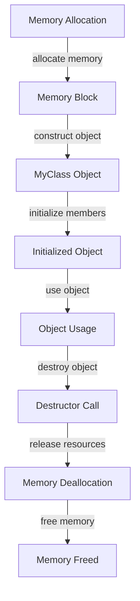

## Introduction
**Placement new** is a feature in C++ that allows for more control over memory allocation and object construction. It is an overloaded version of the `new` operator that allows you to specify the memory location where the object should be constructed. This can be useful in situations where you want to reuse memory that has already been allocated or when you want to avoid the overhead of dynamic memory allocation.

> **Note:** Placement new is not a replacement for the standard `new` operator, but rather a specialized tool that can be used in specific situations.

In real-world applications, placement new is often used in performance-critical code, such as game development, high-frequency trading, or other applications where memory allocation and deallocation can be a bottleneck. For example, the **Google Chrome** browser uses placement new to optimize memory allocation for its rendering engine.

## Core Concepts
The core concept behind placement new is the ability to separate memory allocation from object construction. When you use the standard `new` operator, it performs two operations: memory allocation and object construction. With placement new, you can allocate memory separately and then use placement new to construct an object at that location.

> **Warning:** Placement new can be error-prone if not used correctly. It requires careful management of memory and object lifetime to avoid memory leaks or crashes.

The key terminology to understand when working with placement new is:

* **Memory allocation**: The process of reserving a block of memory for use by your program.
* **Object construction**: The process of initializing an object's members and setting up its internal state.
* **Placement new**: A specialized version of the `new` operator that allows you to specify the memory location where the object should be constructed.

## How It Works Internally
When you use placement new, the following steps occur:

1. Memory allocation: You allocate a block of memory using a mechanism such as `malloc` or `operator new`.
2. Object construction: You use placement new to construct an object at the allocated memory location.
3. Destructor call: When the object is no longer needed, you must call its destructor explicitly to release any resources it holds.

The internal mechanics of placement new involve the following:

* The `new` operator is overloaded to take an additional argument, which is the memory location where the object should be constructed.
* The `new` operator performs the necessary checks and calculations to determine the size of the object and the memory location.
* The object is constructed at the specified memory location using the `placement new` operator.

## Code Examples
### Example 1: Basic Usage
```cpp
#include <iostream>

class MyClass {
public:
    MyClass(int value) : value_(value) {
        std::cout << "MyClass constructed with value " << value_ << std::endl;
    }

    ~MyClass() {
        std::cout << "MyClass destroyed" << std::endl;
    }

    void printValue() {
        std::cout << "MyClass value: " << value_ << std::endl;
    }

private:
    int value_;
};

int main() {
    void* memory = ::operator new(sizeof(MyClass));
    MyClass* obj = new (memory) MyClass(42);
    obj->printValue();
    obj->~MyClass(); // explicit destructor call
    ::operator delete(memory);
    return 0;
}
```
### Example 2: Real-World Pattern
```cpp
#include <iostream>

class PoolAllocator {
public:
    PoolAllocator(size_t blockSize, size_t numBlocks) : blockSize_(blockSize), numBlocks_(numBlocks) {
        memory_ = ::operator new(blockSize * numBlocks);
    }

    ~PoolAllocator() {
        ::operator delete(memory_);
    }

    void* allocate() {
        if (nextBlock_ >= numBlocks_) {
            return nullptr; // out of memory
        }
        void* block = memory_ + (nextBlock_ * blockSize_);
        nextBlock_++;
        return block;
    }

    template <typename T>
    T* construct(void* block) {
        return new (block) T();
    }

private:
    size_t blockSize_;
    size_t numBlocks_;
    void* memory_;
    size_t nextBlock_ = 0;
};

class MyClass {
public:
    MyClass() {
        std::cout << "MyClass constructed" << std::endl;
    }

    ~MyClass() {
        std::cout << "MyClass destroyed" << std::endl;
    }
};

int main() {
    PoolAllocator allocator(sizeof(MyClass), 10);
    void* block = allocator.allocate();
    MyClass* obj = allocator.construct<MyClass>(block);
    // ...
    obj->~MyClass(); // explicit destructor call
    return 0;
}
```
### Example 3: Advanced Usage
```cpp
#include <iostream>

class MyClass {
public:
    MyClass(int value) : value_(value) {
        std::cout << "MyClass constructed with value " << value_ << std::endl;
    }

    ~MyClass() {
        std::cout << "MyClass destroyed" << std::endl;
    }

    void printValue() {
        std::cout << "MyClass value: " << value_ << std::endl;
    }

private:
    int value_;
};

class MyClassFactory {
public:
    MyClass* createMyClass(int value) {
        void* memory = ::operator new(sizeof(MyClass));
        MyClass* obj = new (memory) MyClass(value);
        return obj;
    }

    void destroyMyClass(MyClass* obj) {
        obj->~MyClass(); // explicit destructor call
        ::operator delete(obj);
    }
};

int main() {
    MyClassFactory factory;
    MyClass* obj = factory.createMyClass(42);
    obj->printValue();
    factory.destroyMyClass(obj);
    return 0;
}
```
## Visual Diagram

The diagram illustrates the steps involved in using placement new, from memory allocation to object construction and destruction.

## Comparison
| Approach | Time Complexity | Space Complexity | Pros | Cons | Best For |
| --- | --- | --- | --- | --- | --- |
| Standard New | O(1) | O(1) | simple to use, no manual memory management | overhead of dynamic memory allocation | general-purpose programming |
| Placement New | O(1) | O(1) | control over memory allocation, no overhead | error-prone, requires manual memory management | performance-critical code, custom allocators |
| Manual Memory Management | O(1) | O(1) | control over memory allocation, no overhead | error-prone, requires manual memory management | systems programming, embedded systems |
| Smart Pointers | O(1) | O(1) | automatic memory management, no overhead | overhead of smart pointer management | general-purpose programming, modern C++ |

## Real-world Use Cases
1. **Google Chrome**: uses placement new to optimize memory allocation for its rendering engine.
2. **Game Development**: uses placement new to reduce memory allocation overhead and improve performance.
3. **High-Frequency Trading**: uses placement new to optimize memory allocation and reduce latency.

## Common Pitfalls
1. **Memory Leaks**: forgetting to call the destructor or deallocate memory can lead to memory leaks.
2. **Dangling Pointers**: using a pointer after the object it points to has been destroyed can lead to crashes or unexpected behavior.
3. **Double Deletion**: calling the destructor twice on the same object can lead to crashes or unexpected behavior.
4. **Incorrect Memory Allocation**: allocating memory with the wrong size or alignment can lead to crashes or unexpected behavior.

## Interview Tips
1. **What is placement new?**: be prepared to explain the concept of placement new and how it works.
2. **How does placement new differ from standard new?**: be prepared to explain the differences between placement new and standard new.
3. **What are the benefits and drawbacks of using placement new?**: be prepared to discuss the benefits and drawbacks of using placement new.

## Key Takeaways
* Placement new is a feature in C++ that allows for more control over memory allocation and object construction.
* Placement new can be used to optimize memory allocation and reduce overhead in performance-critical code.
* Placement new requires manual memory management and can be error-prone if not used correctly.
* The `new` operator is overloaded to take an additional argument, which is the memory location where the object should be constructed.
* The `placement new` operator performs the necessary checks and calculations to determine the size of the object and the memory location.
* Placement new can be used with custom allocators to optimize memory allocation and reduce overhead.
* Placement new is not a replacement for the standard `new` operator, but rather a specialized tool that can be used in specific situations.