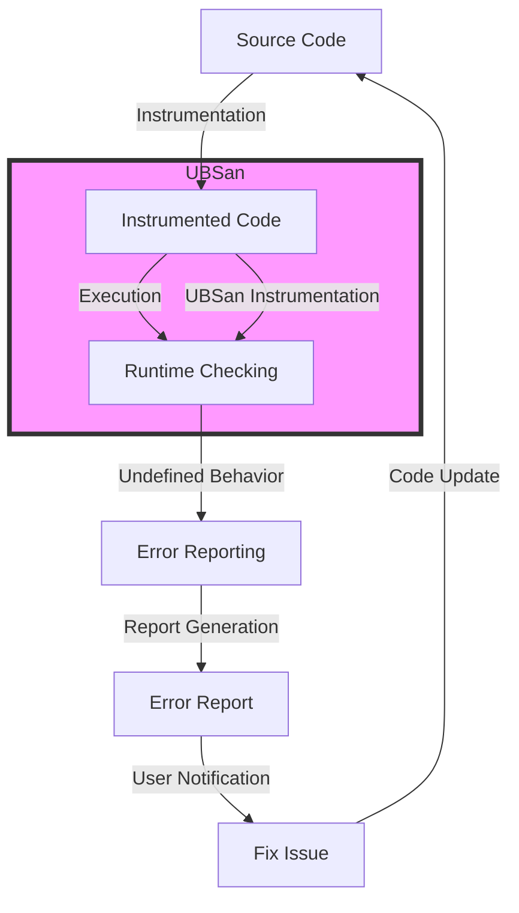

## Introduction
The **UndefinedBehaviorSanitizer (UBSan)** is a tool designed to detect undefined behavior in C and C++ programs. It is a part of the **LLVM** compiler infrastructure and is used to identify and report undefined behavior at runtime. UBSan is an essential tool for ensuring the correctness and reliability of software systems, as undefined behavior can lead to crashes, security vulnerabilities, and other issues. In this section, we will explore the importance of UBSan, its real-world relevance, and why every engineer should know about it.
> **Note:** Undefined behavior can occur when a program violates the rules of the C or C++ language, such as accessing an array out of bounds or using a null pointer.

## Core Concepts
To understand UBSan, it's essential to grasp the concept of undefined behavior. **Undefined behavior** refers to the behavior of a program that is not defined by the C or C++ language standard. This can occur due to various reasons, such as:
* Out-of-bounds array access
* Null pointer dereferences
* Division by zero
* Use of uninitialized variables
> **Warning:** Undefined behavior can lead to severe consequences, including crashes, data corruption, and security vulnerabilities.

The UBSan tool uses a combination of **static analysis** and **runtime checking** to detect undefined behavior. Static analysis involves analyzing the program's source code to identify potential issues, while runtime checking involves monitoring the program's execution to detect undefined behavior.
> **Tip:** UBSan can be used in conjunction with other sanitizers, such as **AddressSanitizer** and **MemorySanitizer**, to provide comprehensive coverage of potential issues.

## How It Works Internally
UBSan works by instrumenting the program's code to detect undefined behavior. This instrumentation involves inserting checks at various points in the code to ensure that the program's behavior is defined. For example, UBSan may insert checks to ensure that array accesses are within bounds or that pointers are not null.
The instrumented code is then executed, and UBSan reports any detected undefined behavior. The reports include information about the location of the issue, the type of undefined behavior, and the values of relevant variables.
> **Interview:** Can you explain how UBSan works internally? How does it detect undefined behavior?

## Code Examples
Here are three examples of using UBSan to detect undefined behavior:
### Example 1: Basic Usage
```cpp
#include <ubsan.h>

int main() {
    int arr[5];
    arr[5] = 10; // out-of-bounds access
    return 0;
}
```
This example demonstrates how UBSan can detect out-of-bounds array access. When run with UBSan enabled, the program will report an error indicating the location of the issue.
### Example 2: Real-world Pattern
```cpp
#include <ubsan.h>

void foo(int* ptr) {
    if (ptr != nullptr) {
        *ptr = 10;
    }
}

int main() {
    int* ptr = nullptr;
    foo(ptr); // null pointer dereference
    return 0;
}
```
This example demonstrates how UBSan can detect null pointer dereferences. When run with UBSan enabled, the program will report an error indicating the location of the issue.
### Example 3: Advanced Usage
```cpp
#include <ubsan.h>

int foo(int x) {
    if (x == 0) {
        return 10 / x; // division by zero
    }
    return x;
}

int main() {
    foo(0);
    return 0;
}
```
This example demonstrates how UBSan can detect division by zero. When run with UBSan enabled, the program will report an error indicating the location of the issue.

## Visual Diagram

This diagram illustrates the workflow of UBSan, from source code instrumentation to error reporting and user notification.

## Comparison
The following table compares UBSan with other sanitizers:
| Sanitizer | Purpose | Detection Method |
| --- | --- | --- |
| UBSan | Detect undefined behavior | Instrumentation and runtime checking |
| AddressSanitizer | Detect memory errors | Instrumentation and runtime checking |
| MemorySanitizer | Detect memory leaks | Instrumentation and runtime checking |
| ThreadSanitizer | Detect data races | Instrumentation and runtime checking |
| Valgrind | Detect memory leaks and errors | Simulation and runtime checking |

## Real-world Use Cases
UBSan is used in various production environments, including:
* **Google**: UBSan is used to detect undefined behavior in Google's C and C++ codebase.
* **Facebook**: UBSan is used to detect undefined behavior in Facebook's C and C++ codebase.
* **Linux**: UBSan is used to detect undefined behavior in the Linux kernel.

## Common Pitfalls
Here are some common mistakes to avoid when using UBSan:
* **Not enabling UBSan**: UBSan must be enabled during compilation to detect undefined behavior.
* **Not handling errors**: UBSan reports errors, but it's up to the developer to handle and fix them.
* **Not testing thoroughly**: UBSan can only detect issues that occur during testing, so thorough testing is essential.
* **Not using other sanitizers**: UBSan is just one tool in the sanitizer toolkit; using other sanitizers can provide comprehensive coverage.

## Interview Tips
Here are some common interview questions related to UBSan:
* **What is UBSan, and how does it work?**: The interviewer wants to assess your understanding of UBSan and its internal mechanics.
* **How do you use UBSan to detect undefined behavior?**: The interviewer wants to evaluate your ability to apply UBSan in a real-world scenario.
* **What are some common pitfalls to avoid when using UBSan?**: The interviewer wants to assess your knowledge of common mistakes and your ability to avoid them.

## Key Takeaways
Here are the key takeaways from this section:
* UBSan is a tool for detecting undefined behavior in C and C++ programs.
* UBSan uses instrumentation and runtime checking to detect undefined behavior.
* UBSan can detect various types of undefined behavior, including out-of-bounds array access, null pointer dereferences, and division by zero.
* UBSan is an essential tool for ensuring the correctness and reliability of software systems.
* UBSan can be used in conjunction with other sanitizers to provide comprehensive coverage of potential issues.
* Thorough testing is essential to detect issues with UBSan.
* Handling errors reported by UBSan is crucial to fixing undefined behavior.