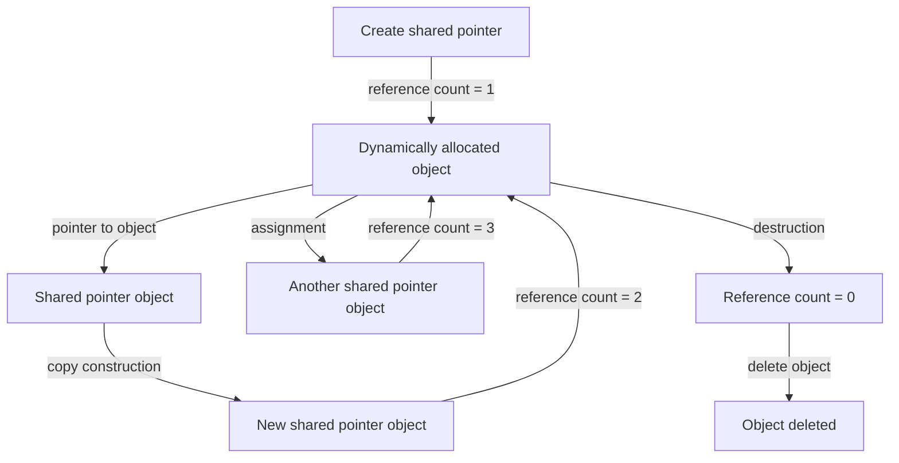

## Introduction
The `std::shared_ptr` class in C++ is a type of smart pointer that allows for shared ownership of a dynamically allocated object. It uses reference counting to manage the lifetime of the object, ensuring that the object is deleted when the last shared pointer to it goes out of scope. This is a crucial concept in C++ programming, as it helps to prevent memory leaks and dangling pointers. In this article, we will delve into the world of `std::shared_ptr`, exploring its core concepts, internal mechanics, and real-world applications.

> **Note:** The `std::shared_ptr` class is part of the C++ Standard Library, which means it is available for use in any C++ program without the need for external dependencies.

## Core Concepts
At its core, `std::shared_ptr` is a class that manages a shared pointer to a dynamically allocated object. The key concepts to understand when working with `std::shared_ptr` are:

* **Reference counting**: Each `std::shared_ptr` object maintains a reference count, which represents the number of shared pointers that point to the same object. When the reference count reaches zero, the object is deleted.
* **Shared ownership**: Multiple `std::shared_ptr` objects can share ownership of the same object, allowing for flexible and efficient management of dynamically allocated memory.
* **Smart pointer**: `std::shared_ptr` is a type of smart pointer, which means it automatically manages the lifetime of the object it points to, eliminating the need for manual memory management using `new` and `delete`.

## How It Works Internally
The internal mechanics of `std::shared_ptr` are based on a combination of reference counting and smart pointer techniques. Here's a step-by-step breakdown of how it works:

1. **Construction**: When a `std::shared_ptr` object is created, it initializes a reference count to 1 and sets the pointer to the dynamically allocated object.
2. **Copy construction**: When a `std::shared_ptr` object is copied, the reference count is incremented, and the pointer is set to the same object.
3. **Assignment**: When a `std::shared_ptr` object is assigned to another `std::shared_ptr` object, the reference count is updated accordingly.
4. **Destruction**: When a `std::shared_ptr` object goes out of scope, the reference count is decremented. If the reference count reaches zero, the object is deleted.

The time complexity of `std::shared_ptr` operations is as follows:

* **Construction**: O(1)
* **Copy construction**: O(1)
* **Assignment**: O(1)
* **Destruction**: O(1)

The space complexity of `std::shared_ptr` is O(1), as it only requires a small amount of memory to store the reference count and pointer.

## Code Examples
Here are three complete and runnable examples of using `std::shared_ptr`:

### Example 1: Basic Usage
```cpp
#include <iostream>
#include <memory>

int main() {
    // Create a shared pointer to an integer
    std::shared_ptr<int> ptr(new int(10));

    // Print the value of the integer
    std::cout << *ptr << std::endl;

    // Create another shared pointer to the same integer
    std::shared_ptr<int> ptr2 = ptr;

    // Print the value of the integer again
    std::cout << *ptr2 << std::endl;

    return 0;
}
```

### Example 2: Real-World Pattern
```cpp
#include <iostream>
#include <memory>
#include <vector>

class Person {
public:
    Person(const std::string& name) : name_(name) {}

    void printName() {
        std::cout << name_ << std::endl;
    }

private:
    std::string name_;
};

int main() {
    // Create a vector of shared pointers to Person objects
    std::vector<std::shared_ptr<Person>> people;

    // Add some Person objects to the vector
    people.push_back(std::make_shared<Person>("John"));
    people.push_back(std::make_shared<Person>("Jane"));
    people.push_back(std::make_shared<Person>("Bob"));

    // Print the names of all the people
    for (const auto& person : people) {
        person->printName();
    }

    return 0;
}
```

### Example 3: Advanced Usage
```cpp
#include <iostream>
#include <memory>
#include <thread>

class Worker {
public:
    Worker(const std::string& name) : name_(name) {}

    void doWork() {
        std::cout << name_ << " is working..." << std::endl;
    }

private:
    std::string name_;
};

int main() {
    // Create a shared pointer to a Worker object
    std::shared_ptr<Worker> worker = std::make_shared<Worker>("John");

    // Create a thread that uses the Worker object
    std::thread thread([&worker]() {
        worker->doWork();
    });

    // Wait for the thread to finish
    thread.join();

    return 0;
}
```

## Visual Diagram

The diagram illustrates the creation, copying, assignment, and destruction of shared pointers, as well as the reference counting mechanism.

## Comparison
The following table compares `std::shared_ptr` with other smart pointer classes in C++:

| Approach | Time Complexity | Space Complexity | Pros | Cons | Best For |
| --- | --- | --- | --- | --- | --- |
| `std::shared_ptr` | O(1) | O(1) | Shared ownership, reference counting | Slower than `std::unique_ptr` | Shared ownership, complex object graphs |
| `std::unique_ptr` | O(1) | O(1) | Exclusive ownership, no reference counting | Not suitable for shared ownership | Exclusive ownership, simple object graphs |
| `std::weak_ptr` | O(1) | O(1) | Observing shared pointers without increasing reference count | Not suitable for ownership | Observing shared pointers, avoiding circular references |
| Raw pointers | O(1) | O(1) | Low-level memory management | Error-prone, no smart pointer benefits | Low-level memory management, performance-critical code |

## Real-world Use Cases
Here are three real-world examples of using `std::shared_ptr`:

1. **Google's Chromium browser**: The Chromium browser uses `std::shared_ptr` to manage the lifetime of browser tabs, allowing for efficient and safe sharing of resources between tabs.
2. **Microsoft's Visual Studio**: Visual Studio uses `std::shared_ptr` to manage the lifetime of project files, allowing for efficient and safe sharing of resources between projects.
3. **Facebook's React framework**: The React framework uses `std::shared_ptr` to manage the lifetime of React components, allowing for efficient and safe sharing of resources between components.

> **Tip:** When working with `std::shared_ptr`, it's essential to use `std::make_shared` to create shared pointers, as it provides better performance and exception safety.

## Common Pitfalls
Here are four common mistakes to avoid when using `std::shared_ptr`:

1. **Circular references**: Creating circular references between shared pointers can lead to memory leaks. To avoid this, use `std::weak_ptr` to observe shared pointers without increasing the reference count.
2. **Double deletion**: Deleting an object twice can lead to undefined behavior. To avoid this, use `std::shared_ptr` to manage the lifetime of objects, ensuring that each object is deleted only once.
3. **Raw pointer usage**: Using raw pointers instead of smart pointers can lead to memory leaks and dangling pointers. To avoid this, use `std::shared_ptr` or other smart pointer classes to manage the lifetime of objects.
4. **Exception safety**: Failing to handle exceptions properly can lead to memory leaks and undefined behavior. To avoid this, use `std::make_shared` and `std::shared_ptr` to ensure exception safety.

## Interview Tips
Here are three common interview questions related to `std::shared_ptr`, along with sample answers:

1. **What is the difference between `std::shared_ptr` and `std::unique_ptr`?**

Weak answer: "They're both smart pointers, but I'm not sure what the difference is."

Strong answer: "`std::shared_ptr` provides shared ownership, while `std::unique_ptr` provides exclusive ownership. `std::shared_ptr` uses reference counting to manage the lifetime of objects, while `std::unique_ptr` uses a single owner to manage the lifetime of objects."

2. **How does `std::shared_ptr` handle circular references?**

Weak answer: "I'm not sure, but I think it just deletes the objects when they go out of scope."

Strong answer: "`std::shared_ptr` uses `std::weak_ptr` to observe shared pointers without increasing the reference count. This helps to prevent circular references and ensures that objects are deleted when they are no longer needed."

3. **What is the time complexity of `std::shared_ptr` operations?**

Weak answer: "I'm not sure, but I think it's O(n) or something."

Strong answer: "The time complexity of `std::shared_ptr` operations is O(1), as it uses a reference count to manage the lifetime of objects. This makes it efficient for shared ownership and complex object graphs."

## Key Takeaways
Here are ten key takeaways to remember when working with `std::shared_ptr`:

* **Use `std::make_shared` to create shared pointers**: This provides better performance and exception safety.
* **Use `std::shared_ptr` for shared ownership**: This provides efficient and safe sharing of resources between objects.
* **Use `std::weak_ptr` to observe shared pointers**: This helps to prevent circular references and ensures that objects are deleted when they are no longer needed.
* **Avoid using raw pointers**: This can lead to memory leaks and dangling pointers.
* **Use `std::shared_ptr` with caution**: While it provides many benefits, it can also lead to performance issues and complexity if not used carefully.
* **Understand the time and space complexity of `std::shared_ptr` operations**: This is essential for optimizing performance and memory usage.
* **Use `std::shared_ptr` with other smart pointer classes**: This can help to provide a comprehensive and efficient memory management strategy.
* **Avoid circular references**: This can lead to memory leaks and undefined behavior.
* **Handle exceptions properly**: This is essential for ensuring exception safety and preventing memory leaks.
* **Use `std::shared_ptr` with modern C++ features**: This can help to provide a more efficient and expressive programming experience.