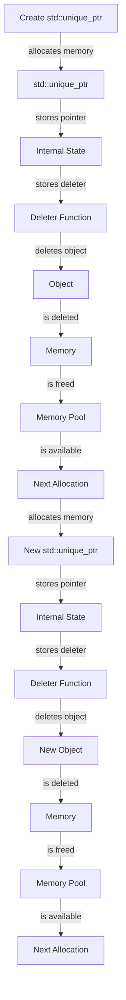

## Introduction
**std::unique_ptr** is a smart pointer in C++ that provides exclusive ownership of a dynamically allocated object. It is a replacement for traditional pointers and helps to prevent memory leaks and dangling pointers. In real-world scenarios, **std::unique_ptr** is used extensively in systems programming, game development, and high-performance applications where memory management is critical. Every C++ engineer needs to understand **std::unique_ptr** to write efficient, safe, and reliable code.

> **Note:** The C++ Standard Library provides several smart pointer classes, including **std::unique_ptr**, **std::shared_ptr**, and **std::weak_ptr**, each with its own use cases and benefits.

## Core Concepts
A **std::unique_ptr** is a wrapper around a raw pointer that provides exclusive ownership of the pointed-to object. The key concepts associated with **std::unique_ptr** are:

* **Exclusive ownership**: A **std::unique_ptr** owns the object it points to, and no other **std::unique_ptr** can own the same object at the same time.
* **Move semantics**: A **std::unique_ptr** can be moved to another **std::unique_ptr**, transferring ownership of the object.
* **Destructor**: When a **std::unique_ptr** goes out of scope, its destructor is called, which deletes the owned object.

> **Warning:** Using **std::unique_ptr** with arrays can lead to undefined behavior, as the destructor will attempt to delete the array using the wrong delete operator.

## How It Works Internally
When a **std::unique_ptr** is created, it allocates memory for the object and stores the pointer to the object in its internal state. The **std::unique_ptr** also stores a deleter function, which is called when the **std::unique_ptr** is destroyed. The deleter function is responsible for deleting the owned object.

Here's a step-by-step breakdown of how **std::unique_ptr** works:

1. **Construction**: A **std::unique_ptr** is constructed, allocating memory for the object and storing the pointer to the object in its internal state.
2. **Move semantics**: When a **std::unique_ptr** is moved to another **std::unique_ptr**, the ownership of the object is transferred, and the original **std::unique_ptr** is reset to a null state.
3. **Destructor**: When a **std::unique_ptr** is destroyed, its destructor is called, which calls the stored deleter function to delete the owned object.

> **Tip:** Use **std::make_unique** to create **std::unique_ptr** objects, as it provides a more efficient and exception-safe way to create objects.

## Code Examples
### Example 1: Basic usage
```cpp
#include <memory>
#include <iostream>

int main() {
    // Create a std::unique_ptr
    std::unique_ptr<int> ptr(new int(5));
    std::cout << *ptr << std::endl; // Output: 5

    // Move the std::unique_ptr
    std::unique_ptr<int> ptr2 = std::move(ptr);
    std::cout << *ptr2 << std::endl; // Output: 5

    return 0;
}
```

### Example 2: Real-world pattern
```cpp
#include <memory>
#include <iostream>
#include <vector>

class Logger {
public:
    Logger(const std::string& filename) : filename_(filename) {
        file_ = std::fopen(filename_.c_str(), "w");
        if (!file_) {
            throw std::runtime_error("Failed to open file");
        }
    }

    ~Logger() {
        if (file_) {
            std::fclose(file_);
        }
    }

    void log(const std::string& message) {
        std::fprintf(file_, "%s\n", message.c_str());
    }

private:
    std::string filename_;
    FILE* file_;
};

int main() {
    std::unique_ptr<Logger> logger = std::make_unique<Logger>("log.txt");
    logger->log("Hello, world!");

    return 0;
}
```

### Example 3: Advanced usage
```cpp
#include <memory>
#include <iostream>
#include <vector>

class Container {
public:
    void add(std::unique_ptr<int> ptr) {
        container_.push_back(std::move(ptr));
    }

    void print() {
        for (const auto& ptr : container_) {
            std::cout << *ptr << std::endl;
        }
    }

private:
    std::vector<std::unique_ptr<int>> container_;
};

int main() {
    Container container;
    container.add(std::make_unique<int>(5));
    container.add(std::make_unique<int>(10));
    container.print();

    return 0;
}
```

## Visual Diagram

The diagram illustrates the creation of a **std::unique_ptr**, the allocation of memory, the storage of the pointer and deleter function, and the deletion of the object when the **std::unique_ptr** is destroyed.

## Comparison
| Smart Pointer | Ownership | Move Semantics | Destructor |
| --- | --- | --- | --- |
| **std::unique_ptr** | Exclusive | Yes | Calls deleter function |
| **std::shared_ptr** | Shared | No | Calls deleter function |
| **std::weak_ptr** | Weak | No | Does not call deleter function |
| Raw Pointer | None | No | Does not call deleter function |

## Real-world Use Cases
* **Google's Chromium browser**: Uses **std::unique_ptr** to manage the lifetime of objects in the browser's rendering engine.
* **Microsoft's Windows**: Uses **std::unique_ptr** to manage the lifetime of objects in the Windows kernel.
* **Facebook's Folly library**: Uses **std::unique_ptr** to manage the lifetime of objects in the Folly library.

## Common Pitfalls
* **Using **std::unique_ptr** with arrays**: Can lead to undefined behavior, as the destructor will attempt to delete the array using the wrong delete operator.
* **Not using **std::make_unique****: Can lead to inefficient and exception-unsafe code.
* **Not checking for null**: Can lead to crashes or undefined behavior when trying to access a null object.
* **Not using move semantics**: Can lead to unnecessary copies and inefficient code.

> **Interview:** What is the difference between **std::unique_ptr** and **std::shared_ptr**? How would you use **std::unique_ptr** to manage the lifetime of an object?

## Interview Tips
* **What is the purpose of **std::unique_ptr****?**: A weak answer would focus on the syntax and basic usage, while a strong answer would discuss the benefits of exclusive ownership and move semantics.
* **How does **std::unique_ptr** manage memory?**: A weak answer would focus on the destructor, while a strong answer would discuss the deleter function and the internal state of the **std::unique_ptr**.
* **What are the advantages of using **std::unique_ptr****?**: A weak answer would focus on the basic benefits, while a strong answer would discuss the performance, safety, and reliability benefits of using **std::unique_ptr**.

## Key Takeaways
* **std::unique_ptr** provides exclusive ownership of a dynamically allocated object.
* **std::unique_ptr** uses move semantics to transfer ownership of the object.
* **std::unique_ptr** stores a deleter function to delete the object when the **std::unique_ptr** is destroyed.
* **std::unique_ptr** is more efficient and safer than using raw pointers.
* **std::unique_ptr** is widely used in systems programming, game development, and high-performance applications.
* **std::make_unique** is the recommended way to create **std::unique_ptr** objects.
* **std::unique_ptr** can be used with containers and algorithms to manage the lifetime of objects.
* **std::unique_ptr** has a time complexity of O(1) for construction and destruction, and a space complexity of O(1) for storing the pointer and deleter function.