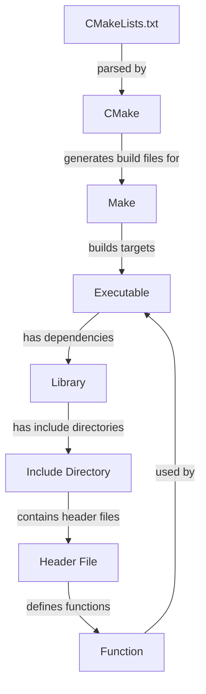

## Introduction
CMake is a **cross-platform build system generator** that creates build files for various platforms, including Unix, Windows, and macOS. It's a crucial tool in the C++ ecosystem, allowing developers to manage complex projects and generate build files for multiple platforms. CMake's primary goal is to provide a **standardized way of building, testing, and packaging** C++ projects, making it easier to collaborate and maintain large codebases. Every C++ engineer should be familiar with CMake, as it's widely used in the industry and essential for building and deploying C++ applications.

> **Note:** CMake is not a build system itself, but rather a generator of build files for other build systems, such as Make, Ninja, or Visual Studio.

## Core Concepts
To understand CMake, you need to grasp the following core concepts:
* **CMakeLists.txt**: The primary configuration file for CMake, which contains commands and directives that define the build process.
* **Targets**: Representations of build artifacts, such as executables or libraries, which are the primary output of the build process.
* **Properties**: Key-value pairs that define the characteristics of targets, such as include directories, compiler flags, or linker libraries.
* **Generators**: The build systems that CMake generates build files for, such as Make, Ninja, or Visual Studio.

## How It Works Internally
Here's a step-by-step breakdown of how CMake works:
1. The user creates a **CMakeLists.txt** file, which contains CMake commands and directives.
2. The user runs CMake, specifying the **source directory** (where the **CMakeLists.txt** file is located) and the **build directory** (where the generated build files will be written).
3. CMake reads the **CMakeLists.txt** file and executes the commands, which define the build process.
4. CMake generates build files for the specified **generator**, such as Make or Visual Studio.
5. The user builds the project using the generated build files, which creates the desired targets (executables or libraries).

## Code Examples
### Example 1: Basic CMakeLists.txt
```cmake
# Set the minimum required CMake version
cmake_minimum_required(VERSION 3.10)

# Set the project name
project(MyProject)

# Add an executable target
add_executable(${PROJECT_NAME} main.cpp)
```
This example demonstrates a basic **CMakeLists.txt** file that sets the minimum required CMake version, defines a project name, and adds an executable target.

### Example 2: Library Target with Dependencies
```cmake
# Set the minimum required CMake version
cmake_minimum_required(VERSION 3.10)

# Set the project name
project(MyProject)

# Add a library target
add_library(${PROJECT_NAME} lib.cpp)

# Add dependencies
target_include_directories(${PROJECT_NAME} PUBLIC include)
target_link_libraries(${PROJECT_NAME} PUBLIC zlib)
```
This example shows how to define a library target with dependencies, including include directories and linker libraries.

### Example 3: Advanced CMakeLists.txt with Custom Commands
```cmake
# Set the minimum required CMake version
cmake_minimum_required(VERSION 3.10)

# Set the project name
project(MyProject)

# Add an executable target
add_executable(${PROJECT_NAME} main.cpp)

# Add a custom command to generate a resource file
add_custom_command(
  OUTPUT resource.txt
  COMMAND ${CMAKE_COMMAND} -E echo "Hello, World!" > resource.txt
  DEPENDS ${PROJECT_NAME}
)

# Add the custom command as a dependency
add_dependencies(${PROJECT_NAME} resource.txt)
```
This example demonstrates how to add custom commands to the build process, including generating a resource file and adding it as a dependency.

## Visual Diagram

This diagram illustrates the relationship between **CMakeLists.txt**, CMake, and the build process, including targets, dependencies, and include directories.

## Comparison
| Build System | Time Complexity | Space Complexity | Pros | Cons | Best For |
| --- | --- | --- | --- | --- | --- |
| Make | O(n) | O(n) | Simple, widely supported | Limited functionality, verbose | Small to medium-sized projects |
| CMake | O(n) | O(n) | Cross-platform, flexible, widely adopted | Steep learning curve, complex | Large, complex projects |
| Ninja | O(n) | O(n) | Fast, efficient, easy to use | Limited functionality, not widely supported | Small to medium-sized projects |
| Meson | O(n) | O(n) | Fast, efficient, easy to use | Limited functionality, not widely supported | Small to medium-sized projects |

## Real-world Use Cases
* **Google**: Uses CMake to build and manage its large codebase, including the Google Chrome browser and the Android operating system.
* **Microsoft**: Uses CMake to build and manage its Windows operating system, as well as other projects, such as the Microsoft Visual Studio IDE.
* **Kitware**: Uses CMake to build and manage its own projects, including the VTK (Visualization Toolkit) and ITK (Insight Segmentation and Registration Toolkit) libraries.

## Common Pitfalls
* **Incorrect use of target properties**: Using the wrong target property, such as `PUBLIC` instead of `PRIVATE`, can lead to incorrect include directories or linker libraries.
* **Missing dependencies**: Failing to add dependencies between targets can result in broken builds or incorrect linker libraries.
* **Incorrect use of custom commands**: Using custom commands incorrectly, such as adding a custom command as a dependency without specifying the correct output file, can lead to broken builds.
* **Not using the correct generator**: Using the wrong generator, such as Make instead of Ninja, can result in slower build times or incorrect build files.

> **Warning:** Avoid using the `add_executable` command without specifying the `EXCLUDE_FROM_ALL` property, as this can lead to incorrect build behavior.

## Interview Tips
* **What is CMake, and how does it work?**: A strong answer should include a brief overview of CMake, its purpose, and how it generates build files for different platforms.
* **How do you add a custom command to a CMakeLists.txt file?**: A strong answer should include an example of how to add a custom command, including the correct syntax and dependencies.
* **What is the difference between a `PUBLIC` and `PRIVATE` target property?**: A strong answer should include an explanation of the difference between `PUBLIC` and `PRIVATE` target properties, including examples of when to use each.

> **Interview:** Be prepared to explain the differences between various build systems, including Make, CMake, Ninja, and Meson, and how to choose the best build system for a given project.

## Key Takeaways
* **CMake is a cross-platform build system generator**: CMake generates build files for different platforms, making it a crucial tool for building and deploying C++ applications.
* **CMakeLists.txt is the primary configuration file**: The **CMakeLists.txt** file contains commands and directives that define the build process.
* **Targets represent build artifacts**: Targets are the primary output of the build process and can be executables, libraries, or other build artifacts.
* **Properties define the characteristics of targets**: Properties, such as include directories, compiler flags, or linker libraries, define the characteristics of targets.
* **CMake has a steep learning curve**: CMake has a complex syntax and many features, making it challenging to learn and master.
* **CMake is widely adopted**: CMake is widely used in the industry, making it an essential tool for C++ engineers to learn and understand.