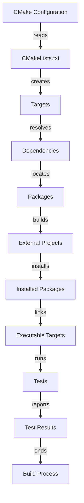

## Introduction
**CMake** is a cross-platform build system generator that creates build files for various platforms and compilers. It's a crucial tool in the C++ ecosystem, allowing developers to manage complex build processes with ease. In this section, we'll explore the importance of CMake and its relevance in real-world projects. CMake provides a flexible and extensible way to build, test, and package software, making it a popular choice among developers.

> **Note:** CMake is not a build system itself, but rather a generator of build files for other systems, such as Make, Ninja, or Visual Studio.

CMake's `find_package`, `FetchContent`, and `ExternalProject` modules are essential components for managing dependencies and building external projects. These modules enable developers to create robust and maintainable build systems, which is critical for large-scale projects.

## Core Concepts
To understand how CMake works, it's essential to grasp the following core concepts:

* **Targets**: A target is a buildable entity, such as an executable or library.
* **Dependencies**: Dependencies are the libraries or executables required by a target.
* **Packages**: A package is a collection of related libraries, executables, or headers.
* **Modules**: Modules are reusable pieces of CMake code that provide specific functionality.

> **Tip:** CMake's modular design allows developers to create custom modules to suit their specific needs.

CMake's `find_package` module is used to locate packages and their dependencies. It searches for packages in various locations, such as system directories or custom paths. The `FetchContent` module is used to download and build external projects, while the `ExternalProject` module is used to build and install external projects.

## How It Works Internally
Here's a step-by-step breakdown of how CMake works internally:

1. **Configuration**: CMake reads the `CMakeLists.txt` file and configures the build system.
2. **Target Creation**: CMake creates targets, which are buildable entities, such as executables or libraries.
3. **Dependency Resolution**: CMake resolves dependencies between targets.
4. **Package Location**: CMake searches for packages and their dependencies using the `find_package` module.
5. **External Project Building**: CMake builds and installs external projects using the `FetchContent` and `ExternalProject` modules.

> **Warning:** CMake's build process can be complex, and incorrect configuration can lead to build errors or unexpected behavior.

## Code Examples
### Example 1: Basic Usage
```cpp
# CMakeLists.txt
cmake_minimum_required(VERSION 3.10)
project(MyProject)

# Find the zlib package
find_package(ZLIB REQUIRED)

# Create an executable target
add_executable(MyExecutable main.cpp)
target_link_libraries(MyExecutable ${ZLIB_LIBRARIES})
```
This example demonstrates how to use the `find_package` module to locate the zlib package and link it to an executable target.

### Example 2: Real-World Pattern
```cpp
# CMakeLists.txt
cmake_minimum_required(VERSION 3.10)
project(MyProject)

# Fetch and build the googletest project
include(FetchContent)
FetchContent_Declare(
  googletest
  GIT_REPOSITORY https://github.com/google/googletest.git
  GIT_TAG        release-1.10.0
)
FetchContent_MakeAvailable(googletest)

# Create a test executable target
add_executable(MyTest test.cpp)
target_link_libraries(MyTest gtest_main)
```
This example demonstrates how to use the `FetchContent` module to download and build the googletest project.

### Example 3: Advanced Usage
```cpp
# CMakeLists.txt
cmake_minimum_required(VERSION 3.10)
project(MyProject)

# Define a custom module
include(CMakeFindDependencyMacro)
macro(find_dependency name)
  find_package(${name} REQUIRED)
  if (${name}_FOUND)
    message(STATUS "Found ${name}")
  else()
    message(FATAL_ERROR "Could not find ${name}")
  endif()
endmacro()

# Find the zlib package using the custom module
find_dependency(ZLIB)
```
This example demonstrates how to define a custom module using the `CMakeFindDependencyMacro` and use it to find the zlib package.

## Visual Diagram

This diagram illustrates the CMake build process, from configuration to test execution.

## Comparison
| Approach | Time Complexity | Space Complexity | Pros | Cons | Best For |
| --- | --- | --- | --- | --- | --- |
| `find_package` | O(n) | O(n) | Simple, easy to use | Limited flexibility | Small projects |
| `FetchContent` | O(1) | O(1) | Flexible, customizable | Complex setup | Large projects |
| `ExternalProject` | O(n) | O(n) | Robust, maintainable | Steep learning curve | Complex projects |

> **Interview:** What is the difference between `find_package` and `FetchContent`? How would you choose between them for a given project?

## Real-world Use Cases
* **Google**: Google uses CMake to build and manage their large-scale projects, such as Chrome and Android.
* **Microsoft**: Microsoft uses CMake to build and manage their C++ projects, such as Visual Studio.
* **Kitware**: Kitware uses CMake to build and manage their open-source projects, such as VTK and ITK.

## Common Pitfalls
* **Incorrect Configuration**: Incorrect configuration can lead to build errors or unexpected behavior.
* **Dependency Conflicts**: Dependency conflicts can occur when multiple packages depend on different versions of the same library.
* **Custom Module Errors**: Custom module errors can occur when the module is not properly defined or used.
* **Build System Complexity**: Build system complexity can lead to maintenance issues and debugging difficulties.

> **Tip:** Use CMake's built-in debugging tools, such as `cmake --debug-trycompile`, to diagnose and fix build issues.

## Interview Tips
* **Question 1:** What is the purpose of the `find_package` module? How does it work?
* **Question 2:** How would you use the `FetchContent` module to download and build an external project?
* **Question 3:** What is the difference between `ExternalProject` and `FetchContent`? How would you choose between them?

> **Warning:** Be prepared to answer questions about CMake's internal workings, such as target creation and dependency resolution.

## Key Takeaways
* CMake is a cross-platform build system generator that creates build files for various platforms and compilers.
* `find_package` is used to locate packages and their dependencies.
* `FetchContent` is used to download and build external projects.
* `ExternalProject` is used to build and install external projects.
* CMake's build process involves configuration, target creation, dependency resolution, package location, and external project building.
* CMake's custom modules can be used to create reusable pieces of code.
* CMake's built-in debugging tools can be used to diagnose and fix build issues.
* CMake is widely used in industry and academia for building and managing large-scale projects.