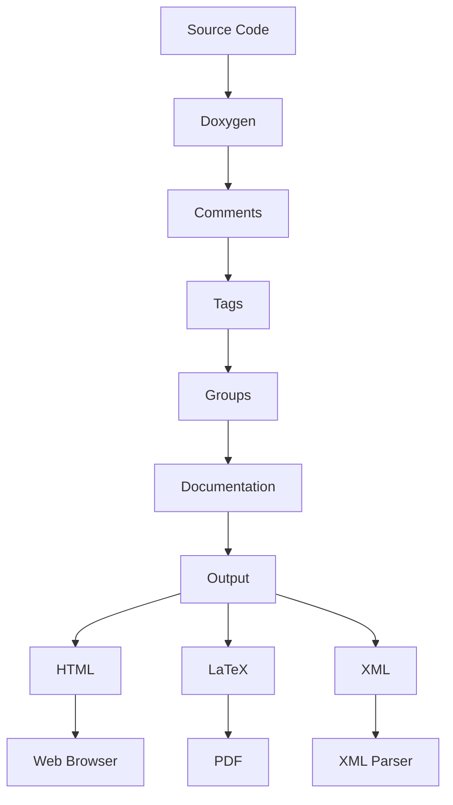

## Introduction
**Doxygen** is a popular tool for generating documentation from source code. It supports a wide range of programming languages, including C++, Java, Python, and many others. Doxygen is widely used in the software industry due to its ability to automatically generate documentation from source code comments, making it easier for developers to maintain and understand complex codebases. In this article, we will delve into the world of Doxygen, exploring its core concepts, internal mechanics, and providing practical examples of how to use it effectively.

> **Note:** Doxygen is often used in conjunction with other development tools, such as version control systems and IDEs, to create a comprehensive development environment.

## Core Concepts
**Doxygen** uses a simple and intuitive syntax to generate documentation from source code comments. The core concepts of Doxygen include:

* **Comments**: Doxygen uses comments in the source code to generate documentation. These comments can be written in a variety of formats, including JavaDoc, Qt, and Doxygen's own syntax.
* **Tags**: Doxygen uses tags to identify specific elements of the documentation, such as functions, classes, and variables.
* **Groups**: Doxygen allows developers to group related documentation elements together, making it easier to navigate and understand complex codebases.

> **Tip:** Doxygen supports a wide range of output formats, including HTML, LaTeX, and XML, making it easy to integrate with existing documentation workflows.

## How It Works Internally
Doxygen works by parsing the source code and extracting comments and other documentation elements. The process can be broken down into the following steps:

1. **Parsing**: Doxygen reads the source code and extracts comments and other documentation elements.
2. **Tagging**: Doxygen identifies specific elements of the documentation, such as functions and classes, using tags.
3. **Grouping**: Doxygen groups related documentation elements together, making it easier to navigate and understand complex codebases.
4. **Generation**: Doxygen generates the documentation in the desired output format.

> **Warning:** Doxygen can be sensitive to the quality and consistency of the source code comments. Poorly written comments can result in incomplete or inaccurate documentation.

## Code Examples
### Example 1: Basic Usage
```cpp
/**
 * @file example.cpp
 * @brief A simple example of Doxygen usage.
 */

/**
 * @brief A simple function that adds two numbers.
 * @param a The first number.
 * @param b The second number.
 * @return The sum of a and b.
 */
int add(int a, int b) {
    return a + b;
}
```
This example demonstrates the basic usage of Doxygen, including the use of comments and tags to generate documentation.

### Example 2: Real-World Pattern
```cpp
/**
 * @class MyClass
 * @brief A simple class that demonstrates Doxygen usage.
 */
class MyClass {
public:
    /**
     * @brief The constructor for MyClass.
     * @param value The initial value of the class.
     */
    MyClass(int value) : value_(value) {}

    /**
     * @brief A method that returns the value of the class.
     * @return The value of the class.
     */
    int getValue() const {
        return value_;
    }

private:
    int value_;
};
```
This example demonstrates a more complex usage of Doxygen, including the use of classes and methods.

### Example 3: Advanced Usage
```cpp
/**
 * @defgroup MyGroup My Group
 * @brief A group of related functions and classes.
 * @{
 */

/**
 * @brief A function that demonstrates advanced Doxygen usage.
 * @param a The first number.
 * @param b The second number.
 * @return The sum of a and b.
 */
int addAdvanced(int a, int b) {
    return a + b;
}

/**
 * @}
 */
```
This example demonstrates the use of groups and advanced Doxygen features, such as the `@defgroup` and `@{` tags.

## Visual Diagram

This diagram illustrates the process of generating documentation using Doxygen, from source code to output.

> **Interview:** Can you explain the difference between Doxygen and other documentation tools, such as JavaDoc? How would you choose the right tool for a given project?

## Comparison
| Tool | Time Complexity | Space Complexity | Pros | Cons | Best For |
| --- | --- | --- | --- | --- | --- |
| Doxygen | O(n) | O(n) | Supports multiple languages, easy to use | Can be sensitive to comment quality | Large-scale projects with complex codebases |
| JavaDoc | O(n) | O(n) | Specifically designed for Java, easy to use | Limited to Java | Java-based projects with simple documentation needs |
| Sphinx | O(n) | O(n) | Supports multiple languages, highly customizable | Steep learning curve | Complex projects with custom documentation needs |
| Read the Docs | O(n) | O(n) | Easy to use, supports multiple languages | Limited customization options | Small to medium-sized projects with simple documentation needs |

## Real-world Use Cases
* **Google**: Google uses Doxygen to generate documentation for many of its open-source projects, including the Google C++ Style Guide.
* **Qt**: Qt, a popular cross-platform application development framework, uses Doxygen to generate documentation for its API.
* **Linux Kernel**: The Linux kernel uses Doxygen to generate documentation for its source code, making it easier for developers to understand and contribute to the kernel.

> **Tip:** Doxygen can be integrated with other development tools, such as version control systems and IDEs, to create a comprehensive development environment.

## Common Pitfalls
* **Poorly written comments**: Doxygen can be sensitive to the quality and consistency of the source code comments. Poorly written comments can result in incomplete or inaccurate documentation.
* **Inconsistent tagging**: Doxygen uses tags to identify specific elements of the documentation. Inconsistent tagging can result in incomplete or inaccurate documentation.
* **Insufficient grouping**: Doxygen allows developers to group related documentation elements together. Insufficient grouping can make it difficult to navigate and understand complex codebases.
* **Incorrect output format**: Doxygen supports a wide range of output formats. Choosing the incorrect output format can result in documentation that is difficult to use or understand.

> **Warning:** Doxygen can be resource-intensive, especially for large projects. It is essential to optimize Doxygen usage to avoid performance issues.

## Interview Tips
* **What is Doxygen, and how does it work?**: A strong answer should include a brief overview of Doxygen, its features, and how it works.
* **How do you optimize Doxygen usage for large projects?**: A strong answer should include tips for optimizing Doxygen usage, such as using incremental builds and optimizing comment quality.
* **What are some common pitfalls when using Doxygen, and how can they be avoided?**: A strong answer should include a discussion of common pitfalls, such as poorly written comments and inconsistent tagging, and how they can be avoided.

## Key Takeaways
* **Doxygen is a powerful tool for generating documentation from source code comments**.
* **Doxygen supports multiple languages and output formats**.
* **Doxygen can be sensitive to comment quality and consistency**.
* **Doxygen allows developers to group related documentation elements together**.
* **Doxygen can be integrated with other development tools to create a comprehensive development environment**.
* **Optimizing Doxygen usage is essential for large projects**.
* **Common pitfalls, such as poorly written comments and inconsistent tagging, can be avoided with careful planning and attention to detail**.
* **Doxygen is widely used in the software industry, including by companies like Google and Qt**.
* **Doxygen has a steep learning curve, but provides a high degree of customization and control**.