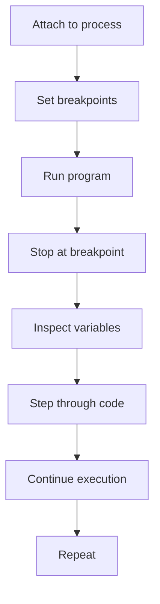

## Introduction
**GDB** (GNU Debugger) and **LLDB** (Low-Level Debugger) are two of the most widely used debugging tools in the software development industry. Debugging is an essential part of the development process, as it allows developers to identify and fix errors in their code. GDB and LLDB provide a wide range of features that make it easier to debug code, including the ability to set breakpoints, inspect variables, and step through code line by line. In this section, we will explore the importance of debugging, the features of GDB and LLDB, and how they are used in real-world applications.

> **Note:** Debugging is a crucial part of the development process, as it helps to ensure that the code is correct, efficient, and reliable.

GDB and LLDB are used in a wide range of applications, from embedded systems to web applications. They are particularly useful for debugging **C** and **C++** code, as they provide a high degree of control over the debugging process. In addition to their use in development, GDB and LLDB are also used in production environments to diagnose and fix issues in deployed systems.

## Core Concepts
The core concepts of GDB and LLDB include:

* **Breakpoints**: Breakpoints are points in the code where the debugger will stop execution and allow the developer to inspect the current state of the program.
* **Variables**: Variables are the data that is stored in memory and can be inspected by the debugger.
* **Stack frames**: Stack frames are the blocks of memory that contain the local variables and function parameters for a given function call.
* **Threads**: Threads are the separate flows of execution that can be debugged independently.

> **Warning:** When using GDB or LLDB, it is essential to be aware of the potential for thread safety issues, as the debugger can interfere with the normal execution of the program.

The key terminology used in GDB and LLDB includes:

* **Target**: The target is the program being debugged.
* **Process**: The process is the running instance of the target program.
* **Thread**: The thread is the separate flow of execution within the process.

## How It Works Internally
GDB and LLDB work by using a combination of operating system APIs and low-level system calls to control the execution of the target program. Here is a step-by-step overview of how they work:

1. **Attach to process**: The debugger attaches to the target process using the operating system's process attachment API.
2. **Set breakpoints**: The debugger sets breakpoints in the target program using the operating system's breakpoint API.
3. **Run program**: The debugger runs the target program using the operating system's process execution API.
4. **Stop at breakpoint**: The debugger stops the target program at the breakpoint using the operating system's process suspension API.
5. **Inspect variables**: The debugger inspects the variables in the target program using the operating system's memory access API.

> **Tip:** When using GDB or LLDB, it is a good idea to use the `info threads` command to inspect the current threads in the program.

## Code Examples
Here are three complete and runnable examples of using GDB and LLDB:

### Example 1: Basic GDB Usage
```cpp
// example1.cpp
#include <iostream>

int main() {
    int x = 5;
    std::cout << "x = " << x << std::endl;
    return 0;
}
```

```bash
# Compile the program
g++ -g example1.cpp -o example1

# Run the program under GDB
gdb example1

# Set a breakpoint at the main function
(gdb) break main

# Run the program
(gdb) run

# Inspect the variable x
(gdb) print x
```

### Example 2: Real-World LLDB Usage
```cpp
// example2.cpp
#include <iostream>
#include <thread>

int main() {
    int x = 5;
    std::thread t([&x] {
        x = 10;
    });
    t.join();
    std::cout << "x = " << x << std::endl;
    return 0;
}
```

```bash
# Compile the program
clang++ -g example2.cpp -o example2 -pthread

# Run the program under LLDB
lldb example2

# Set a breakpoint at the main function
(lldb) break set -n main

# Run the program
(lldb) run

# Inspect the variable x
(lldb) frame variable x
```

### Example 3: Advanced GDB Usage
```cpp
// example3.cpp
#include <iostream>
#include <vector>

int main() {
    std::vector<int> v = {1, 2, 3};
    for (int i = 0; i < v.size(); i++) {
        std::cout << "v[" << i << "] = " << v[i] << std::endl;
    }
    return 0;
}
```

```bash
# Compile the program
g++ -g example3.cpp -o example3

# Run the program under GDB
gdb example3

# Set a breakpoint at the main function
(gdb) break main

# Run the program
(gdb) run

# Inspect the vector v
(gdb) print v
```

## Visual Diagram

This diagram illustrates the basic workflow of using GDB or LLDB to debug a program.

> **Note:** The diagram shows the main steps involved in debugging a program, from attaching to the process to stepping through the code.

## Comparison
| Debugger | Platform | Language Support | Features |
| --- | --- | --- | --- |
| GDB | Linux, macOS, Windows | C, C++, Fortran | Breakpoints, variable inspection, stack frames, threads |
| LLDB | macOS, Linux, Windows | C, C++, Objective-C | Breakpoints, variable inspection, stack frames, threads, expression evaluation |
| Visual Studio Debugger | Windows | C, C++, C# | Breakpoints, variable inspection, stack frames, threads, expression evaluation |
| Eclipse Debugger | Linux, macOS, Windows | Java, C, C++ | Breakpoints, variable inspection, stack frames, threads |

> **Warning:** When choosing a debugger, it is essential to consider the platform, language support, and features required for the project.

## Real-world Use Cases
Here are three real-world examples of using GDB and LLDB:

* **Google**: Google uses GDB and LLDB to debug their C and C++ codebases, including the Google Chrome browser and the Google Search engine.
* **Apple**: Apple uses LLDB to debug their C, C++, and Objective-C codebases, including the macOS and iOS operating systems.
* **Microsoft**: Microsoft uses the Visual Studio Debugger to debug their C, C++, and C# codebases, including the Windows operating system and the Microsoft Office suite.

> **Tip:** When debugging a complex system, it is a good idea to use a combination of GDB and LLDB to get the best of both worlds.

## Common Pitfalls
Here are four common pitfalls to avoid when using GDB and LLDB:

* **Not setting breakpoints**: Failing to set breakpoints can make it difficult to inspect the program's state.
* **Not inspecting variables**: Failing to inspect variables can make it difficult to understand the program's behavior.
* **Not stepping through code**: Failing to step through code can make it difficult to understand the program's flow.
* **Not using expression evaluation**: Failing to use expression evaluation can make it difficult to inspect complex data structures.

> **Interview:** When asked about debugging techniques, a common question is: "How would you debug a complex system?" A strong answer would include a discussion of using GDB and LLDB, setting breakpoints, inspecting variables, and stepping through code.

## Interview Tips
Here are three common interview questions related to GDB and LLDB:

* **What is the difference between GDB and LLDB?**: A weak answer would focus on the surface-level differences, while a strong answer would delve into the underlying architecture and features of each debugger.
* **How would you debug a segmentation fault?**: A weak answer would involve guessing and checking, while a strong answer would involve using GDB or LLDB to inspect the program's state and identify the root cause of the issue.
* **What are some common pitfalls to avoid when using GDB and LLDB?**: A weak answer would involve listing a few obvious pitfalls, while a strong answer would involve discussing the importance of setting breakpoints, inspecting variables, and stepping through code.

> **Note:** When answering interview questions, it is essential to demonstrate a deep understanding of the subject matter and to provide specific examples and anecdotes to illustrate your points.

## Key Takeaways
Here are ten key takeaways to remember:

* **GDB and LLDB are powerful debugging tools**: They provide a wide range of features that make it easier to debug code.
* **Breakpoints are essential**: They allow you to stop the program at specific points and inspect the current state.
* **Variables are important**: They contain the data that is stored in memory and can be inspected by the debugger.
* **Stack frames are crucial**: They contain the local variables and function parameters for a given function call.
* **Threads are complex**: They can interfere with the normal execution of the program and require special care when debugging.
* **Expression evaluation is useful**: It allows you to inspect complex data structures and evaluate expressions.
* **Stepping through code is essential**: It allows you to understand the program's flow and identify issues.
* **Inspecting variables is crucial**: It allows you to understand the program's state and identify issues.
* **GDB and LLDB have different features**: GDB is more mature and widely used, while LLDB is more modern and feature-rich.
* **Debugging is an essential part of the development process**: It helps to ensure that the code is correct, efficient, and reliable.