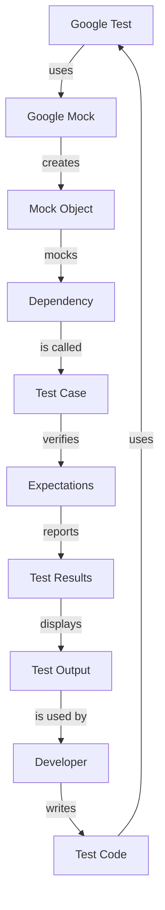

## Introduction
**Google Test (gtest)** and **Google Mock** are two popular C++ testing frameworks developed by Google. Google Test is a testing framework that provides a lot of functionality for writing and running tests, while Google Mock is a mocking framework that allows you to create mock objects for dependencies in your code. These frameworks are widely used in the industry and are considered to be among the best testing tools for C++.

> **Note:** Google Test and Google Mock are designed to work together seamlessly, making it easy to write and run tests for your C++ code.

In real-world scenarios, Google Test and Google Mock are used by many companies, including Google, Microsoft, and Facebook, to ensure the quality and reliability of their software. For example, Google uses Google Test and Google Mock to test its Chrome browser, while Microsoft uses them to test its Windows operating system.

## Core Concepts
**Google Test** provides a lot of functionality for writing and running tests, including:

* **Test cases**: A test case is a collection of related tests.
* **Test fixtures**: A test fixture is a setup and teardown mechanism for test cases.
* **Assertions**: Assertions are used to verify that the code under test behaves as expected.

**Google Mock** provides a lot of functionality for creating mock objects, including:

* **Mock objects**: A mock object is a fake object that mimics the behavior of a real object.
* **Mocking**: Mocking is the process of creating a mock object and setting its behavior.
* **Expectations**: Expectations are used to verify that the mock object is called as expected.

> **Warning:** When using Google Mock, it's easy to over-mock your code, which can make your tests brittle and hard to maintain. It's essential to use mocking judiciously and only mock the dependencies that are necessary for the test.

## How It Works Internally
Google Test and Google Mock use a combination of compile-time and runtime mechanisms to provide their functionality.

* **Compile-time**: Google Test and Google Mock use template metaprogramming to generate code at compile-time. This allows them to provide a lot of functionality without incurring runtime overhead.
* **Runtime**: Google Test and Google Mock use runtime mechanisms to execute tests and verify expectations. This includes creating mock objects, setting up test fixtures, and running test cases.

The time complexity of Google Test and Google Mock is O(1), meaning that the time it takes to run a test is constant and does not depend on the size of the input. The space complexity is O(n), where n is the number of test cases and mock objects.

## Code Examples
### Example 1: Basic Google Test
```cpp
#include <gtest/gtest.h>

int add(int a, int b) {
    return a + b;
}

TEST(AddTest, Basic) {
    int result = add(2, 3);
    EXPECT_EQ(5, result);
}

int main(int argc, char **argv) {
    ::testing::InitGoogleTest(&argc, argv);
    return RUN_ALL_TESTS();
}
```
This example shows how to write a basic test using Google Test. The `add` function is tested by calling it with two inputs and verifying that the result is as expected.

### Example 2: Google Mock Example
```cpp
#include <gmock/gmock.h>
#include <gtest/gtest.h>

class MyClass {
public:
    virtual void doSomething() = 0;
};

class MyClassMock : public MyClass {
public:
    MOCK_METHOD(void, doSomething, (), (override));
};

TEST(MyClassTest, Basic) {
    MyClassMock mock;
    EXPECT_CALL(mock, doSomething());
    mock.doSomething();
}

int main(int argc, char **argv) {
    ::testing::InitGoogleTest(&argc, argv);
    return RUN_ALL_TESTS();
}
```
This example shows how to use Google Mock to create a mock object and set expectations on it. The `MyClass` interface is mocked, and the `doSomething` method is expected to be called.

### Example 3: Advanced Google Test Example
```cpp
#include <gtest/gtest.h>
#include <thread>
#include <future>

int add(int a, int b) {
    return a + b;
}

TEST(AddTest, Advanced) {
    int result = add(2, 3);
    EXPECT_EQ(5, result);
    std::thread t([&result]() {
        EXPECT_EQ(5, result);
    });
    t.join();
}

int main(int argc, char **argv) {
    ::testing::InitGoogleTest(&argc, argv);
    return RUN_ALL_TESTS();
}
```
This example shows how to write an advanced test using Google Test. The `add` function is tested by calling it with two inputs and verifying that the result is as expected. The test also uses a thread to verify that the result is correct.

## Visual Diagram

This diagram shows how Google Test and Google Mock work together to provide a testing framework. The diagram illustrates the flow of control from the test code to the mock object to the dependency and back to the test case.

> **Tip:** When using Google Test and Google Mock, it's essential to understand the flow of control and how the different components work together.

## Comparison
| Framework | Time Complexity | Space Complexity | Pros | Cons |
| --- | --- | --- | --- | --- |
| Google Test | O(1) | O(n) | Easy to use, flexible, and extensible | Steep learning curve |
| Google Mock | O(1) | O(n) | Easy to use, flexible, and extensible | Can be over-used, leading to brittle tests |
| CppUTest | O(1) | O(n) | Easy to use, flexible, and extensible | Not as widely adopted as Google Test and Google Mock |
| Boost.Test | O(1) | O(n) | Easy to use, flexible, and extensible | Not as widely adopted as Google Test and Google Mock |

## Real-world Use Cases
* **Google**: Google uses Google Test and Google Mock to test its Chrome browser.
* **Microsoft**: Microsoft uses Google Test and Google Mock to test its Windows operating system.
* **Facebook**: Facebook uses Google Test and Google Mock to test its social media platform.

## Common Pitfalls
* **Over-mocking**: Over-mocking can make your tests brittle and hard to maintain.
* **Under-mocking**: Under-mocking can make your tests incomplete and ineffective.
* **Not using expectations**: Not using expectations can make your tests incomplete and ineffective.
* **Not using test fixtures**: Not using test fixtures can make your tests harder to write and maintain.

> **Warning:** When using Google Mock, it's easy to fall into the trap of over-mocking or under-mocking. It's essential to use mocking judiciously and only mock the dependencies that are necessary for the test.

## Interview Tips
* **What is Google Test?**: Google Test is a testing framework that provides a lot of functionality for writing and running tests.
* **How does Google Mock work?**: Google Mock creates mock objects and sets expectations on them.
* **What is the difference between Google Test and Google Mock?**: Google Test is a testing framework, while Google Mock is a mocking framework.

> **Interview:** When asked about Google Test and Google Mock, be sure to explain the difference between the two frameworks and how they work together to provide a testing framework.

## Key Takeaways
* **Google Test and Google Mock are widely used**: Google Test and Google Mock are widely used in the industry and are considered to be among the best testing tools for C++.
* **Google Test provides a lot of functionality**: Google Test provides a lot of functionality for writing and running tests, including test cases, test fixtures, and assertions.
* **Google Mock creates mock objects**: Google Mock creates mock objects and sets expectations on them.
* **Mocking should be used judiciously**: Mocking should be used judiciously and only mock the dependencies that are necessary for the test.
* **Test fixtures are essential**: Test fixtures are essential for writing and maintaining tests.
* **Expectations are essential**: Expectations are essential for verifying that the code under test behaves as expected.
* **Google Test and Google Mock have a steep learning curve**: Google Test and Google Mock have a steep learning curve, but are worth the investment.
* **Google Test and Google Mock are extensible**: Google Test and Google Mock are extensible and can be customized to fit your needs.