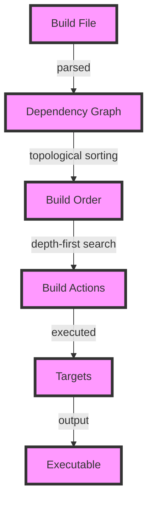

## Introduction
The **Ninja Build System** is a small build system with a focus on speed. It was designed to be used as a backend for other build systems, such as CMake or Meson, but can also be used as a standalone build system. Ninja was created by Evan Martin and is now maintained by the Chromium team. The Ninja Build System is widely used in the industry, particularly in the development of large-scale projects such as the Chromium browser and the Android operating system.

> **Note:** The Ninja Build System is designed to be fast and efficient, making it a popular choice for building large-scale projects.

In real-world scenarios, the Ninja Build System is often used in conjunction with other build tools, such as CMake or Meson, to manage complex build processes. For example, the Chromium browser uses the Ninja Build System to build its source code, which consists of millions of lines of code.

## Core Concepts
The Ninja Build System is based on a few core concepts:

* **Build files**: These are files that contain the build rules and dependencies for a project.
* **Rules**: These are the actions that are taken to build a target, such as compiling a source file or linking an executable.
* **Dependencies**: These are the relationships between targets, such as a target that depends on another target to be built first.
* **Targets**: These are the outputs of the build process, such as executables or libraries.

> **Tip:** Understanding the core concepts of the Ninja Build System is crucial for using it effectively in a project.

The Ninja Build System uses a simple syntax to define build rules and dependencies. For example, a build rule might look like this:
```ninja
rule cc
  command = gcc -c $in -o $out
```
This rule defines a build action that compiles a source file using the `gcc` compiler.

## How It Works Internally
The Ninja Build System works by reading in a build file, which contains the build rules and dependencies for a project. The build file is parsed into a graph of dependencies, which is then used to determine the order in which the build actions should be taken.

> **Warning:** The Ninja Build System assumes that the build file is correct and will not check for errors. If the build file is incorrect, the build process may fail or produce incorrect results.

The Ninja Build System uses a few key algorithms to manage the build process:

* **Topological sorting**: This algorithm is used to determine the order in which the build actions should be taken, based on the dependencies between targets.
* **Depth-first search**: This algorithm is used to traverse the dependency graph and determine which targets need to be built.

The time complexity of the Ninja Build System is O(n + m), where n is the number of targets and m is the number of dependencies. The space complexity is O(n + m), where n is the number of targets and m is the number of dependencies.

## Code Examples
Here are a few examples of how to use the Ninja Build System:

### Example 1: Basic Build Rule
```ninja
# Define a build rule for compiling a source file
rule cc
  command = gcc -c $in -o $out

# Define a target that depends on the build rule
build foo.o: cc foo.c
```
This example defines a build rule for compiling a source file, and then defines a target that depends on the build rule.

### Example 2: Real-World Build Script
```ninja
# Define a build rule for compiling a source file
rule cc
  command = gcc -c $in -o $out

# Define a build rule for linking an executable
rule link
  command = gcc $in -o $out

# Define a target that depends on the build rules
build foo.o: cc foo.c
build foo: link foo.o
```
This example defines two build rules, one for compiling a source file and one for linking an executable. It then defines a target that depends on the build rules.

### Example 3: Advanced Build Script
```ninja
# Define a build rule for compiling a source file
rule cc
  command = gcc -c $in -o $out

# Define a build rule for linking an executable
rule link
  command = gcc $in -o $out

# Define a target that depends on the build rules
build foo.o: cc foo.c
build foo: link foo.o

# Define a target that depends on the previous target
build bar: link bar.o
  dep = foo
```
This example defines two build rules, one for compiling a source file and one for linking an executable. It then defines two targets, one that depends on the build rules and one that depends on the previous target.

## Visual Diagram

This diagram shows the overall flow of the Ninja Build System, from parsing the build file to executing the build actions and producing the final targets.

## Comparison
| Build System | Time Complexity | Space Complexity | Pros | Cons | Best For |
| --- | --- | --- | --- | --- | --- |
| Ninja | O(n + m) | O(n + m) | Fast and efficient, simple syntax | Limited functionality, not suitable for complex projects | Large-scale projects with simple build processes |
| CMake | O(n^2) | O(n^2) | Flexible and powerful, supports complex projects | Steep learning curve, slow performance | Complex projects with multiple dependencies |
| Meson | O(n + m) | O(n + m) | Fast and efficient, simple syntax | Limited functionality, not suitable for complex projects | Large-scale projects with simple build processes |
| Autotools | O(n^2) | O(n^2) | Flexible and powerful, supports complex projects | Steep learning curve, slow performance | Complex projects with multiple dependencies |

## Real-world Use Cases
The Ninja Build System is widely used in the industry, particularly in the development of large-scale projects. Some examples include:

* **Chromium browser**: The Chromium browser uses the Ninja Build System to build its source code, which consists of millions of lines of code.
* **Android operating system**: The Android operating system uses the Ninja Build System to build its source code, which consists of millions of lines of code.
* **Linux kernel**: The Linux kernel uses the Ninja Build System to build its source code, which consists of millions of lines of code.

## Common Pitfalls
Here are a few common pitfalls to watch out for when using the Ninja Build System:

* **Incorrect build file syntax**: The Ninja Build System assumes that the build file is correct and will not check for errors. If the build file is incorrect, the build process may fail or produce incorrect results.
* **Missing dependencies**: The Ninja Build System relies on the build file to specify the dependencies between targets. If a dependency is missing, the build process may fail or produce incorrect results.
* **Incorrect target definitions**: The Ninja Build System relies on the build file to specify the targets and their dependencies. If a target is defined incorrectly, the build process may fail or produce incorrect results.
* **Build file corruption**: The Ninja Build System stores its build state in a file on disk. If this file becomes corrupted, the build process may fail or produce incorrect results.

> **Warning:** The Ninja Build System is sensitive to the build file syntax and dependencies. Incorrect syntax or missing dependencies can cause the build process to fail or produce incorrect results.

## Interview Tips
Here are a few common interview questions related to the Ninja Build System:

* **What is the Ninja Build System?**: The Ninja Build System is a small build system with a focus on speed. It was designed to be used as a backend for other build systems, such as CMake or Meson, but can also be used as a standalone build system.
* **How does the Ninja Build System work?**: The Ninja Build System works by reading in a build file, which contains the build rules and dependencies for a project. The build file is parsed into a graph of dependencies, which is then used to determine the order in which the build actions should be taken.
* **What are the advantages and disadvantages of the Ninja Build System?**: The Ninja Build System is fast and efficient, with a simple syntax. However, it has limited functionality and is not suitable for complex projects.

> **Interview:** The Ninja Build System is a popular choice for building large-scale projects, due to its speed and efficiency. However, it has limited functionality and is not suitable for complex projects.

## Key Takeaways
Here are a few key takeaways to remember when using the Ninja Build System:

* **The Ninja Build System is fast and efficient**: The Ninja Build System is designed to be fast and efficient, making it a popular choice for building large-scale projects.
* **The Ninja Build System has limited functionality**: The Ninja Build System has limited functionality and is not suitable for complex projects.
* **The Ninja Build System relies on the build file**: The Ninja Build System relies on the build file to specify the build rules and dependencies for a project.
* **The Ninja Build System is sensitive to build file syntax and dependencies**: The Ninja Build System is sensitive to the build file syntax and dependencies. Incorrect syntax or missing dependencies can cause the build process to fail or produce incorrect results.
* **The Ninja Build System is widely used in the industry**: The Ninja Build System is widely used in the industry, particularly in the development of large-scale projects.
* **The Ninja Build System has a simple syntax**: The Ninja Build System has a simple syntax, making it easy to learn and use.
* **The Ninja Build System supports multiple build rules**: The Ninja Build System supports multiple build rules, making it flexible and powerful.
* **The Ninja Build System has a small footprint**: The Ninja Build System has a small footprint, making it suitable for use on embedded systems or other resource-constrained environments.