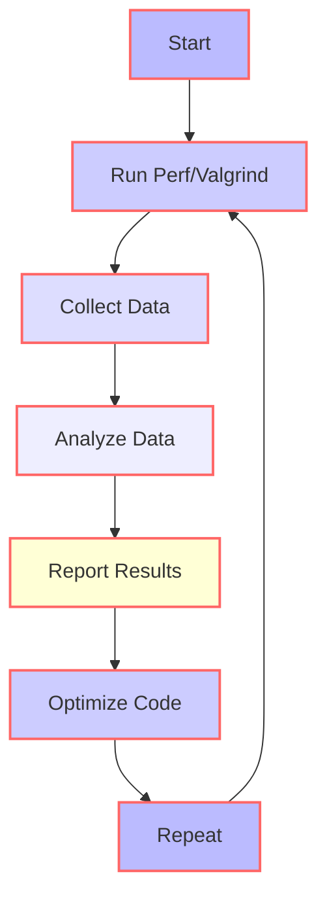

## Introduction
**Profiling** is a crucial step in optimizing the performance of any application. It involves analyzing the execution of a program to identify areas where it can be improved, such as reducing memory usage, decreasing execution time, or minimizing the number of system calls. Two popular tools for profiling C++ applications are **Perf** and **Valgrind**. Perf is a Linux-based profiling tool that provides detailed information about the execution of a program, including CPU cycles, memory accesses, and system calls. Valgrind, on the other hand, is a memory debugging tool that detects memory leaks, invalid memory accesses, and other memory-related issues. In this article, we will explore the basics of Perf and Valgrind, their internal workings, and how to use them to optimize C++ applications.

## Core Concepts
To understand how Perf and Valgrind work, it's essential to grasp some core concepts:
* **Profiling**: The process of analyzing the execution of a program to identify areas for improvement.
* **Sampling**: The process of collecting data about the execution of a program at regular intervals.
* **Tracing**: The process of collecting detailed information about the execution of a program, including system calls, memory accesses, and other events.
* **Memory leak**: A situation where a program allocates memory but fails to release it, causing the memory to become unavailable for other uses.
* **Invalid memory access**: A situation where a program attempts to access memory that is not allocated to it or is outside the bounds of an allocated memory block.

> **Note:** Profiling and debugging are related but distinct concepts. Profiling focuses on optimizing the performance of a program, while debugging focuses on identifying and fixing errors.

## How It Works Internally
Perf and Valgrind use different approaches to profile and debug C++ applications:
* Perf uses a combination of hardware and software counters to collect data about the execution of a program. It can collect data on CPU cycles, memory accesses, and system calls, among other events.
* Valgrind uses a technique called **dynamic binary instrumentation** to instrument the binary code of a program. This involves modifying the binary code to insert additional instructions that collect data about memory accesses and other events.

Here's a step-by-step overview of how Perf works:
1. The user runs the `perf` command with the desired options, such as `perf record` to collect data about the execution of a program.
2. Perf uses the Linux **Performance Monitoring Unit** (PMU) to collect data about the execution of the program.
3. The PMU collects data about various events, such as CPU cycles, memory accesses, and system calls.
4. Perf stores the collected data in a file, which can be analyzed using the `perf report` command.

Valgrind works as follows:
1. The user runs the `valgrind` command with the desired options, such as `valgrind --leak-check=full` to detect memory leaks.
2. Valgrind instruments the binary code of the program using dynamic binary instrumentation.
3. The instrumented code collects data about memory accesses and other events.
4. Valgrind analyzes the collected data to detect memory leaks, invalid memory accesses, and other memory-related issues.

## Code Examples
Here are three complete and runnable examples of using Perf and Valgrind:
### Example 1: Basic Perf Usage
```cpp
#include <iostream>
#include <chrono>
#include <thread>

int main() {
    std::cout << "Starting perf test..." << std::endl;
    std::this_thread::sleep_for(std::chrono::seconds(5));
    std::cout << "Finished perf test." << std::endl;
    return 0;
}
```
To profile this program using Perf, run the following command:
```bash
perf record ./example1
```
This will collect data about the execution of the program and store it in a file called `perf.data`.

### Example 2: Valgrind Memory Leak Detection
```cpp
#include <iostream>
#include <malloc.h>

int main() {
    std::cout << "Starting valgrind test..." << std::endl;
    int* ptr = (int*)malloc(sizeof(int));
    *ptr = 5;
    std::cout << "Finished valgrind test." << std::endl;
    return 0;
}
```
To detect memory leaks in this program using Valgrind, run the following command:
```bash
valgrind --leak-check=full ./example2
```
This will analyze the memory accesses of the program and report any memory leaks.

### Example 3: Advanced Perf Usage
```cpp
#include <iostream>
#include <chrono>
#include <thread>
#include <vector>

int main() {
    std::cout << "Starting perf test..." << std::endl;
    std::vector<int> vec;
    for (int i = 0; i < 1000000; i++) {
        vec.push_back(i);
    }
    std::this_thread::sleep_for(std::chrono::seconds(5));
    std::cout << "Finished perf test." << std::endl;
    return 0;
}
```
To profile this program using Perf and analyze the results, run the following commands:
```bash
perf record ./example3
perf report
```
This will collect data about the execution of the program and display a report showing the most time-consuming functions and lines of code.

## Visual Diagram

This diagram illustrates the process of using Perf and Valgrind to profile and optimize C++ applications.

## Comparison
| Tool | Time Complexity | Space Complexity | Pros | Cons | Best For |
| --- | --- | --- | --- | --- | --- |
| Perf | O(n) | O(n) | High-performance, detailed data | Steep learning curve | CPU-bound applications |
| Valgrind | O(n) | O(n) | Memory leak detection, invalid memory access detection | Slow, high overhead | Memory-bound applications |
| gprof | O(n) | O(n) | Easy to use, low overhead | Limited data, outdated | Simple applications |
| Intel VTune Amplifier | O(n) | O(n) | Detailed data, user-friendly interface | Expensive, limited support | Complex applications |

> **Tip:** When choosing a profiling tool, consider the type of application, the level of detail required, and the available resources.

## Real-world Use Cases
1. **Google**: Google uses Perf to profile and optimize its C++ applications, including the Google Chrome browser.
2. **Facebook**: Facebook uses Valgrind to detect memory leaks and invalid memory accesses in its C++ applications.
3. **Intel**: Intel uses its own VTune Amplifier tool to profile and optimize its C++ applications, including the Intel Compiler.

## Common Pitfalls
1. **Incorrect usage of Perf**: Failing to use the correct options or commands when running Perf can result in incorrect or incomplete data.
2. **Ignoring Valgrind warnings**: Ignoring warnings from Valgrind can lead to memory leaks or invalid memory accesses that cause crashes or other issues.
3. **Over-optimizing**: Over-optimizing code can lead to complex, hard-to-maintain code that is prone to errors.
4. **Failing to test**: Failing to test optimized code can lead to regressions or other issues.

> **Warning:** When optimizing code, always test thoroughly to ensure that the changes do not introduce new issues.

## Interview Tips
1. **What is the difference between Perf and Valgrind?**: Explain the differences in terms of their purposes, usage, and output.
2. **How do you use Perf to profile a C++ application?**: Describe the steps involved in running Perf, including the options and commands used.
3. **What is a memory leak, and how do you detect it using Valgrind?**: Define a memory leak and explain how Valgrind can be used to detect it.

> **Interview:** When answering questions about profiling and optimization, be sure to provide specific examples and details about the tools and techniques used.

## Key Takeaways
* **Profiling is essential for optimizing C++ applications**: Profiling helps identify areas for improvement and ensures that optimizations are effective.
* **Perf and Valgrind are powerful profiling tools**: Both tools provide detailed data and can help detect memory leaks and invalid memory accesses.
* **Correct usage of Perf and Valgrind is crucial**: Incorrect usage can lead to incorrect or incomplete data.
* **Optimizing code requires careful testing**: Over-optimizing code can lead to complex, hard-to-maintain code that is prone to errors.
* **Memory leaks and invalid memory accesses can cause crashes**: Detecting and fixing these issues is essential for ensuring the reliability and stability of C++ applications.
* **Perf has a time complexity of O(n) and a space complexity of O(n)**: This makes it suitable for large-scale applications.
* **Valgrind has a time complexity of O(n) and a space complexity of O(n)**: This makes it suitable for detecting memory leaks and invalid memory accesses in large-scale applications.