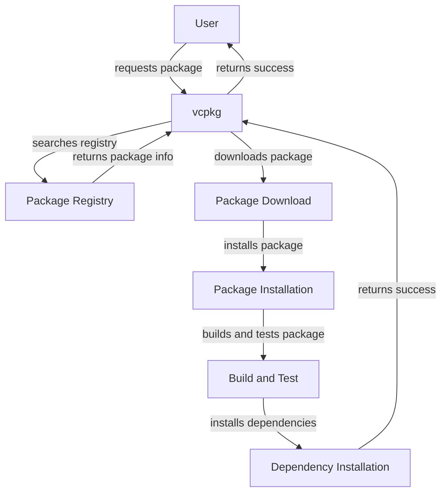

## Introduction
**vcpkg** is a cross-platform package manager developed by Microsoft for C and C++ libraries. It aims to simplify the process of integrating and managing dependencies in C++ projects, making it easier to build and maintain complex software systems. With **vcpkg**, developers can easily discover, acquire, and manage C++ libraries, reducing the time and effort spent on dependency management.

> **Note:** **vcpkg** is designed to work seamlessly with popular build systems like CMake, Meson, and Autotools, making it a versatile tool for a wide range of projects.

In real-world scenarios, **vcpkg** is used by companies like Microsoft, Google, and Facebook to manage dependencies in their C++ projects. For example, Microsoft uses **vcpkg** to manage dependencies in its Windows and Azure projects, while Google uses it to manage dependencies in its Chrome and Android projects.

## Core Concepts
To understand **vcpkg**, it's essential to grasp the following core concepts:

* **Packages**: A package is a self-contained unit of software that contains a library, executable, or other type of software component.
* **Dependencies**: Dependencies are the relationships between packages, where one package requires another package to function correctly.
* **Ports**: Ports are the packages that **vcpkg** manages, which are essentially the C++ libraries that **vcpkg** can install and manage.
* **Triports**: Triports are the packages that **vcpkg** uses to build and test the ports.

> **Warning:** One common mistake when using **vcpkg** is not properly managing dependencies, which can lead to build errors and conflicts between packages.

## How It Works Internally
**vcpkg** works by using a combination of scripts, tools, and configuration files to manage packages and dependencies. Here's a step-by-step breakdown of how **vcpkg** works internally:

1. **Package discovery**: **vcpkg** uses a package registry to discover available packages and their dependencies.
2. **Package installation**: When a package is installed, **vcpkg** downloads the package and its dependencies, and then builds and installs them on the system.
3. **Dependency management**: **vcpkg** manages dependencies by creating a dependency graph, which represents the relationships between packages.
4. **Build and testing**: **vcpkg** uses a build system, such as CMake or Meson, to build and test the packages.

> **Tip:** To optimize **vcpkg** performance, use the `--triplet` option to specify the target platform and architecture.

## Code Examples
Here are three complete and runnable code examples that demonstrate how to use **vcpkg**:

### Example 1: Basic Usage
```bash
# Initialize vcpkg
git clone https://github.com/microsoft/vcpkg.git
cd vcpkg

# Bootstrap vcpkg
bootstrap-vcpkg.bat

# Install a package
vcpkg install zlib
```

### Example 2: Real-World Pattern
```cpp
// CMakeLists.txt
cmake_minimum_required(VERSION 3.10)
project(MyProject)

# Use vcpkg to manage dependencies
find_package(zlib REQUIRED)

# Build the project
add_executable(${PROJECT_NAME} main.cpp)
target_link_libraries(${PROJECT_NAME} zlib::zlib)
```

### Example 3: Advanced Usage
```python
# vcpkg.json
{
    "name": "MyPackage",
    "version": "1.0.0",
    "dependencies": [
        {
            "name": "zlib",
            "version": "1.2.11"
        }
    ]
}

# Install the package
vcpkg install MyPackage
```

## Visual Diagram


> **Note:** This diagram illustrates the high-level workflow of **vcpkg**, from user request to package installation.

## Comparison
| Package Manager | Time Complexity | Space Complexity | Pros | Cons | Best For |
| --- | --- | --- | --- | --- | --- |
| vcpkg | O(n) | O(n) | Easy to use, supports multiple platforms | Limited support for non-C++ libraries | C++ projects |
| Conan | O(n) | O(n) | Supports multiple platforms, flexible configuration | Steep learning curve | C++ projects |
| CMake | O(n) | O(n) | Powerful build system, supports multiple platforms | Complex configuration | C++ projects |
| Autotools | O(n) | O(n) | Mature and widely used, supports multiple platforms | Complex configuration, outdated | C++ projects |

## Real-world Use Cases
Here are three real-world use cases for **vcpkg**:

1. **Microsoft Azure**: Microsoft uses **vcpkg** to manage dependencies in its Azure projects, ensuring that the dependencies are properly installed and configured.
2. **Google Chrome**: Google uses **vcpkg** to manage dependencies in its Chrome browser, ensuring that the dependencies are properly installed and configured.
3. **Facebook**: Facebook uses **vcpkg** to manage dependencies in its C++ projects, ensuring that the dependencies are properly installed and configured.

## Common Pitfalls
Here are four common pitfalls to watch out for when using **vcpkg**:

1. **Not properly managing dependencies**: Failing to manage dependencies can lead to build errors and conflicts between packages.
2. **Not using the correct triplet**: Using the incorrect triplet can lead to build errors and compatibility issues.
3. **Not updating the package registry**: Failing to update the package registry can lead to outdated packages and dependencies.
4. **Not using the correct build system**: Using the incorrect build system can lead to build errors and compatibility issues.

> **Warning:** Not properly managing dependencies can lead to serious consequences, including build errors and security vulnerabilities.

## Interview Tips
Here are three common interview questions related to **vcpkg**, along with weak and strong answers:

1. **What is vcpkg, and how does it work?**
	* Weak answer: "vcpkg is a package manager that installs packages."
	* Strong answer: "vcpkg is a cross-platform package manager that manages dependencies and installs packages. It works by using a combination of scripts, tools, and configuration files to manage packages and dependencies."
2. **How do you manage dependencies with vcpkg?**
	* Weak answer: "I use the `vcpkg install` command to install packages."
	* Strong answer: "I use the `vcpkg install` command to install packages, and I also use the `vcpkg dependency` command to manage dependencies. I make sure to update the package registry regularly to ensure that I have the latest packages and dependencies."
3. **What are some common pitfalls to watch out for when using vcpkg?**
	* Weak answer: "I'm not sure."
	* Strong answer: "Some common pitfalls to watch out for when using vcpkg include not properly managing dependencies, not using the correct triplet, not updating the package registry, and not using the correct build system. I make sure to follow best practices and use the correct tools and commands to avoid these pitfalls."

## Key Takeaways
Here are six key takeaways to remember when using **vcpkg**:

* **vcpkg** is a cross-platform package manager that manages dependencies and installs packages.
* **vcpkg** uses a combination of scripts, tools, and configuration files to manage packages and dependencies.
* **vcpkg** supports multiple platforms and build systems, including CMake, Meson, and Autotools.
* **vcpkg** has a large package registry that contains a wide range of C++ libraries and dependencies.
* **vcpkg** is widely used in industry and academia, and is a popular choice for managing dependencies in C++ projects.
* **vcpkg** has a steep learning curve, but is a powerful tool for managing dependencies and building C++ projects.

> **Tip:** To get the most out of **vcpkg**, make sure to read the documentation and follow best practices for managing dependencies and building packages.