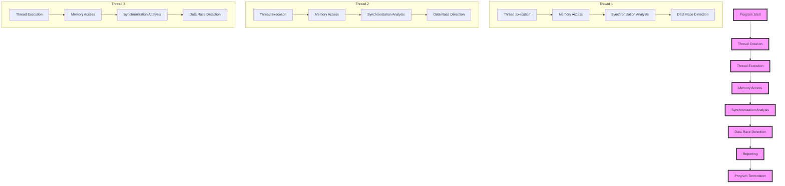

## Introduction
Concurrent Valgrind is a powerful tool for debugging and profiling concurrent programs. It is an extension of the popular Valgrind memory debugging tool, designed to handle the complexities of multithreaded and parallel programs. With Concurrent Valgrind, developers can detect and fix synchronization bugs, data races, and other concurrency-related issues that can be difficult to identify and reproduce. In this guide, we will explore the concepts, mechanics, and usage of Concurrent Valgrind, providing a comprehensive resource for senior engineers working with concurrent systems.

## Core Concepts
To understand Concurrent Valgrind, it's essential to grasp the core concepts of concurrency, synchronization, and memory management. **Concurrency** refers to the ability of a program to execute multiple tasks simultaneously, improving responsiveness, throughput, and overall performance. **Synchronization** mechanisms, such as locks, semaphores, and monitors, ensure that concurrent access to shared resources is coordinated and safe. **Memory management** involves the allocation, deallocation, and manipulation of memory, which can be particularly challenging in concurrent environments.

> **Note:** Concurrency can be achieved through various techniques, including multithreading, multiprocessing, and parallel processing.

## How It Works Internally
Concurrent Valgrind uses a combination of dynamic binary instrumentation and simulation to analyze the behavior of concurrent programs. Here's a step-by-step breakdown of its internal mechanics:

1. **Instrumentation**: Concurrent Valgrind instruments the binary code of the program, inserting additional instructions to track memory accesses, synchronization operations, and other relevant events.
2. **Simulation**: The instrumented code is then executed under a simulated environment, which allows Concurrent Valgrind to control and observe the program's behavior.
3. **Memory Access Tracking**: Concurrent Valgrind tracks all memory accesses, including reads, writes, and allocations, to detect potential data races and synchronization issues.
4. **Synchronization Analysis**: The tool analyzes synchronization operations, such as lock acquisitions and releases, to identify potential deadlocks, livelocks, and other concurrency-related problems.
5. **Reporting**: Concurrent Valgrind generates reports highlighting potential issues, including data races, synchronization errors, and memory leaks.

> **Tip:** To get the most out of Concurrent Valgrind, it's essential to understand the tool's configuration options and how to interpret its output.

## Code Examples
Here are three complete and runnable examples demonstrating the usage of Concurrent Valgrind:

### Example 1: Basic Usage
```cpp
#include <pthread.h>
#include <stdio.h>

int sharedVariable = 0;

void* threadFunction(void* arg) {
    sharedVariable++;
    return NULL;
}

int main() {
    pthread_t thread;
    pthread_create(&thread, NULL, threadFunction, NULL);
    pthread_join(thread, NULL);
    printf("Shared variable: %d\n", sharedVariable);
    return 0;
}
```
This example demonstrates a basic concurrent program with a shared variable. To use Concurrent Valgrind, simply compile the program with the `--tool=drd` option and run it under Valgrind.

### Example 2: Real-World Pattern
```cpp
#include <pthread.h>
#include <stdio.h>
#include <stdlib.h>

#define NUM_THREADS 10

int sharedArray[NUM_THREADS];

void* threadFunction(void* arg) {
    int threadId = *(int*)arg;
    sharedArray[threadId] = threadId;
    return NULL;
}

int main() {
    pthread_t threads[NUM_THREADS];
    int threadIds[NUM_THREADS];
    for (int i = 0; i < NUM_THREADS; i++) {
        threadIds[i] = i;
        pthread_create(&threads[i], NULL, threadFunction, &threadIds[i]);
    }
    for (int i = 0; i < NUM_THREADS; i++) {
        pthread_join(threads[i], NULL);
    }
    for (int i = 0; i < NUM_THREADS; i++) {
        printf("Shared array[%d]: %d\n", i, sharedArray[i]);
    }
    return 0;
}
```
This example demonstrates a more complex concurrent program with multiple threads accessing a shared array. To use Concurrent Valgrind, compile the program with the `--tool=drd` option and run it under Valgrind.

### Example 3: Advanced Usage
```cpp
#include <pthread.h>
#include <stdio.h>
#include <stdlib.h>
#include <semaphore.h>

sem_t semaphore;

void* threadFunction(void* arg) {
    sem_wait(&semaphore);
    // Critical section
    sem_post(&semaphore);
    return NULL;
}

int main() {
    sem_init(&semaphore, 0, 1);
    pthread_t thread;
    pthread_create(&thread, NULL, threadFunction, NULL);
    pthread_join(thread, NULL);
    sem_destroy(&semaphore);
    return 0;
}
```
This example demonstrates the use of a semaphore to synchronize access to a critical section. To use Concurrent Valgrind, compile the program with the `--tool=drd` option and run it under Valgrind.

## Visual Diagram

This diagram illustrates the internal mechanics of Concurrent Valgrind, including thread creation, execution, memory access, synchronization analysis, data race detection, and reporting.

## Comparison
| Tool | Time Complexity | Space Complexity | Pros | Cons | Best For |
| --- | --- | --- | --- | --- | --- |
| Concurrent Valgrind | O(n) | O(n) | Detects data races and synchronization issues | Can be slow and resource-intensive | Debugging and profiling concurrent programs |
| Helgrind | O(n) | O(n) | Detects data races and synchronization issues | Can be slow and resource-intensive | Debugging and profiling concurrent programs |
| DRD | O(n) | O(n) | Detects data races and synchronization issues | Can be slow and resource-intensive | Debugging and profiling concurrent programs |
| Intel Inspector | O(n) | O(n) | Detects data races and synchronization issues | Can be expensive and resource-intensive | Debugging and profiling concurrent programs |

> **Warning:** When using Concurrent Valgrind, be aware of its potential performance overhead and resource requirements.

## Real-world Use Cases
Here are three real-world examples of using Concurrent Valgrind:

1. **Google's Chromium Browser**: The Chromium browser uses Concurrent Valgrind to detect data races and synchronization issues in its multithreaded rendering engine.
2. **Apache HTTP Server**: The Apache HTTP server uses Concurrent Valgrind to detect data races and synchronization issues in its multithreaded request processing engine.
3. **MySQL Database**: The MySQL database uses Concurrent Valgrind to detect data races and synchronization issues in its multithreaded query processing engine.

## Common Pitfalls
Here are four common pitfalls to avoid when using Concurrent Valgrind:

1. **Incorrect Instrumentation**: Failing to instrument the correct code paths can lead to false negatives and missed issues.
2. **Insufficient Synchronization**: Failing to synchronize access to shared resources can lead to data races and other concurrency-related issues.
3. **Inadequate Testing**: Failing to test the program under various concurrency scenarios can lead to missed issues and false negatives.
4. **Ignoring Tool Output**: Failing to carefully review and act on the output of Concurrent Valgrind can lead to missed issues and continued bugs.

> **Tip:** To get the most out of Concurrent Valgrind, carefully review its output and act on the reported issues.

## Interview Tips
Here are three common interview questions related to Concurrent Valgrind, along with sample answers:

1. **What is Concurrent Valgrind, and how does it work?**
	* Weak answer: "Concurrent Valgrind is a tool that detects data races and synchronization issues in concurrent programs."
	* Strong answer: "Concurrent Valgrind is a dynamic binary instrumentation tool that detects data races and synchronization issues in concurrent programs by tracking memory accesses and analyzing synchronization operations. It works by instrumenting the binary code, simulating the program's execution, and reporting potential issues."
2. **How do you use Concurrent Valgrind to debug a concurrent program?**
	* Weak answer: "I use Concurrent Valgrind by compiling the program with the `--tool=drd` option and running it under Valgrind."
	* Strong answer: "I use Concurrent Valgrind by compiling the program with the `--tool=drd` option, running it under Valgrind, and carefully reviewing the output to identify potential data races and synchronization issues. I then use the reported issues to guide my debugging efforts and ensure that the program is correctly synchronized."
3. **What are some common pitfalls to avoid when using Concurrent Valgrind?**
	* Weak answer: "Some common pitfalls include incorrect instrumentation and ignoring tool output."
	* Strong answer: "Some common pitfalls include incorrect instrumentation, insufficient synchronization, inadequate testing, and ignoring tool output. To avoid these pitfalls, I carefully review the tool's output, ensure that the program is correctly instrumented, and thoroughly test the program under various concurrency scenarios."

> **Interview:** Be prepared to discuss your experience with Concurrent Valgrind, including how you use it to debug and profile concurrent programs, and how you avoid common pitfalls.

## Key Takeaways
Here are ten key takeaways to remember when working with Concurrent Valgrind:

* Concurrent Valgrind is a powerful tool for detecting data races and synchronization issues in concurrent programs.
* It works by instrumenting the binary code, simulating the program's execution, and reporting potential issues.
* Carefully review the tool's output to identify potential issues and guide debugging efforts.
* Ensure that the program is correctly instrumented and synchronized to avoid false negatives and missed issues.
* Thoroughly test the program under various concurrency scenarios to ensure correct behavior.
* Use Concurrent Valgrind in conjunction with other debugging tools, such as print statements and debuggers, to ensure comprehensive coverage.
* Be aware of the tool's potential performance overhead and resource requirements.
* Use the `--tool=drd` option to enable Concurrent Valgrind's data race detection capabilities.
* Use the `--tool=helgrind` option to enable Concurrent Valgrind's synchronization analysis capabilities.
* Regularly review and update the program's synchronization mechanisms to ensure correct behavior and avoid concurrency-related issues.