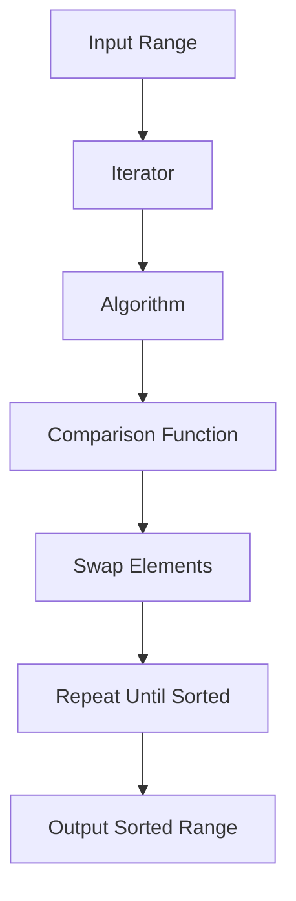

## Introduction
The C++ Standard Template Library (STL) provides a wide range of algorithms that can be used to perform various operations on containers, such as searching, sorting, and manipulating data. **STL algorithms** are a fundamental part of C++ programming and are used extensively in many applications, including game development, scientific computing, and web development. In this section, we will explore the importance of STL algorithms, their real-world relevance, and why every engineer should know how to use them.

> **Note:** STL algorithms are designed to be generic, meaning they can work with any type of container, including vectors, lists, and sets. This makes them extremely versatile and useful in a wide range of applications.

STL algorithms are essential for any C++ programmer because they provide a way to perform complex operations on data without having to write custom code. They are also highly optimized, making them much faster than equivalent custom code. Furthermore, STL algorithms are designed to work with the C++ Standard Library containers, making it easy to integrate them into existing codebases.

## Core Concepts
To use STL algorithms effectively, it's essential to understand the core concepts behind them. Here are some key terms and definitions:

* **Algorithm**: A set of instructions that can be used to perform a specific operation on a container.
* **Iterator**: An object that points to an element in a container and can be used to traverse the container.
* **Range**: A pair of iterators that define a sequence of elements in a container.
* **Predicate**: A function that takes an element as an argument and returns a boolean value indicating whether the element meets a certain condition.

> **Warning:** When using STL algorithms, it's essential to ensure that the iterators used are valid and point to elements within the container. Using invalid iterators can lead to undefined behavior and crashes.

## How It Works Internally
STL algorithms work by using iterators to traverse the elements of a container and perform the desired operation. The algorithm takes a range of iterators as input and applies the operation to each element in the range. The algorithm may also take additional arguments, such as a predicate or a comparison function.

Here's a step-by-step breakdown of how the `std::sort` algorithm works:

1. The algorithm takes a range of iterators as input, defining the sequence of elements to be sorted.
2. The algorithm uses a comparison function to compare each pair of elements in the range.
3. The algorithm swaps elements in the range to put them in sorted order.
4. The algorithm repeats steps 2-3 until the entire range is sorted.

> **Tip:** When using STL algorithms, it's often more efficient to use `const` iterators instead of non-`const` iterators. This can help prevent unnecessary copies of the data and improve performance.

## Code Examples
Here are three complete and runnable code examples that demonstrate the use of STL algorithms:

### Example 1: Basic Usage
```cpp
#include <algorithm>
#include <vector>
#include <iostream>

int main() {
    std::vector<int> numbers = {4, 2, 7, 1, 3};
    std::sort(numbers.begin(), numbers.end());
    for (int num : numbers) {
        std::cout << num << " ";
    }
    return 0;
}
```
This example demonstrates the use of the `std::sort` algorithm to sort a vector of integers.

### Example 2: Real-World Pattern
```cpp
#include <algorithm>
#include <vector>
#include <string>
#include <iostream>

struct Person {
    std::string name;
    int age;
};

bool comparePeople(const Person& a, const Person& b) {
    return a.age < b.age;
}

int main() {
    std::vector<Person> people = {
        {"John", 30},
        {"Jane", 25},
        {"Bob", 40},
        {"Alice", 35}
    };
    std::sort(people.begin(), people.end(), comparePeople);
    for (const Person& person : people) {
        std::cout << person.name << ": " << person.age << std::endl;
    }
    return 0;
}
```
This example demonstrates the use of the `std::sort` algorithm to sort a vector of `Person` objects based on their age.

### Example 3: Advanced Usage
```cpp
#include <algorithm>
#include <vector>
#include <string>
#include <iostream>

struct Person {
    std::string name;
    int age;
};

bool comparePeople(const Person& a, const Person& b) {
    return a.age < b.age;
}

int main() {
    std::vector<Person> people = {
        {"John", 30},
        {"Jane", 25},
        {"Bob", 40},
        {"Alice", 35}
    };
    std::stable_sort(people.begin(), people.end(), comparePeople);
    for (const Person& person : people) {
        std::cout << person.name << ": " << person.age << std::endl;
    }
    return 0;
}
```
This example demonstrates the use of the `std::stable_sort` algorithm to sort a vector of `Person` objects based on their age, while maintaining the relative order of equal elements.

## Visual Diagram

This diagram illustrates the internal workings of the `std::sort` algorithm.

## Comparison
Here's a comparison of different sorting algorithms:

| Algorithm | Time Complexity | Space Complexity | Pros | Cons | Best For |
| --- | --- | --- | --- | --- | --- |
| `std::sort` | O(n log n) | O(log n) | Fast, efficient | Not stable | General-purpose sorting |
| `std::stable_sort` | O(n log n) | O(log n) | Fast, stable | More memory-intensive | Sorting large datasets |
| `std::partial_sort` | O(n log k) | O(log k) | Fast, efficient | Not stable | Partial sorting |
| `std::heap_sort` | O(n log n) | O(1) | Fast, efficient | Not stable | Sorting large datasets |

> **Interview:** What is the time complexity of the `std::sort` algorithm? Answer: O(n log n).

## Real-world Use Cases
Here are three real-world examples of using STL algorithms:

* **Google**: Google uses STL algorithms extensively in their C++ codebase, including in their search engine and advertising platforms.
* **Facebook**: Facebook uses STL algorithms in their C++ codebase, including in their news feed and messaging platforms.
* **Microsoft**: Microsoft uses STL algorithms in their C++ codebase, including in their Windows operating system and Office software suite.

## Common Pitfalls
Here are four common mistakes to watch out for when using STL algorithms:

* **Invalid iterators**: Using invalid iterators can lead to undefined behavior and crashes.
* **Incorrect comparison functions**: Using an incorrect comparison function can lead to incorrect sorting results.
* **Not checking for exceptions**: Not checking for exceptions can lead to crashes and unexpected behavior.
* **Not using `const` iterators**: Not using `const` iterators can lead to unnecessary copies of the data and improve performance.

> **Warning:** Always check the documentation for the specific STL algorithm you are using to ensure you are using it correctly.

## Interview Tips
Here are three common interview questions related to STL algorithms:

* **What is the time complexity of the `std::sort` algorithm?**: Answer: O(n log n).
* **How does the `std::stable_sort` algorithm work?**: Answer: The `std::stable_sort` algorithm works by using a comparison function to compare each pair of elements in the range, and swapping elements to put them in sorted order while maintaining the relative order of equal elements.
* **What is the difference between `std::sort` and `std::stable_sort`?**: Answer: The main difference between `std::sort` and `std::stable_sort` is that `std::stable_sort` maintains the relative order of equal elements, while `std::sort` does not.

## Key Takeaways
Here are ten key takeaways to remember when using STL algorithms:

* **STL algorithms are designed to be generic**: They can work with any type of container, including vectors, lists, and sets.
* **STL algorithms are highly optimized**: They are much faster than equivalent custom code.
* **Use `const` iterators**: This can help prevent unnecessary copies of the data and improve performance.
* **Check for exceptions**: Always check for exceptions when using STL algorithms.
* **Use the correct comparison function**: Using an incorrect comparison function can lead to incorrect sorting results.
* **The `std::sort` algorithm has a time complexity of O(n log n)**: This makes it suitable for sorting large datasets.
* **The `std::stable_sort` algorithm maintains the relative order of equal elements**: This makes it suitable for sorting large datasets where the relative order of equal elements is important.
* **The `std::partial_sort` algorithm is suitable for partial sorting**: This makes it suitable for sorting large datasets where only a portion of the data needs to be sorted.
* **The `std::heap_sort` algorithm is suitable for sorting large datasets**: This makes it suitable for sorting large datasets where the data needs to be sorted in a specific order.
* **Always check the documentation**: Always check the documentation for the specific STL algorithm you are using to ensure you are using it correctly.