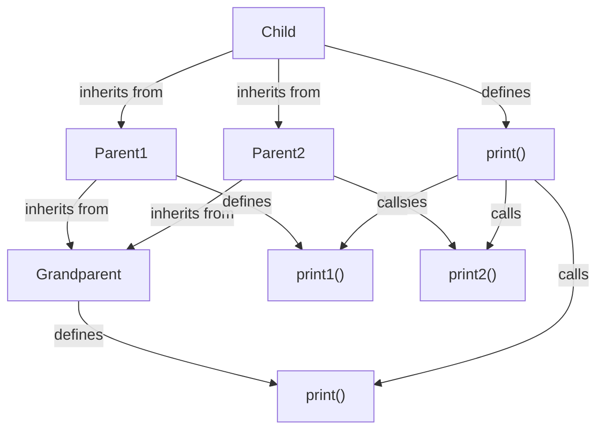

## Introduction
**C3 Linearization** is an algorithm used to resolve the **Method Resolution Order (MRO)** in multiple inheritance scenarios. It's a crucial concept in object-oriented programming, particularly in languages like Python, C++, and Java. In this study guide, we'll delve into the core concepts, internal workings, and implementations of C3 Linearization, providing a comprehensive understanding of this fundamental algorithm. Every engineer should know C3 Linearization because it helps prevent **diamond inheritance** issues, which can lead to ambiguity and bugs in code.

> **Note:** C3 Linearization is not limited to Python; it's a general concept applicable to any language that supports multiple inheritance.

## Core Concepts
To understand C3 Linearization, we need to grasp the following key concepts:

* **Method Resolution Order (MRO)**: The order in which a class searches for a method or attribute in its inheritance hierarchy.
* **Linearization**: The process of flattening the inheritance graph into a linear ordering of classes.
* **C3 Algorithm**: A specific linearization algorithm that resolves the MRO in a way that's consistent and predictable.

The C3 algorithm is based on the following principles:

* **Local precedence**: A class is always searched before its parents.
* **Monotonicity**: If a class is searched before another class in one linearization, it will also be searched before that class in any other linearization.
* **Consistency**: The linearization of a class is consistent with the linearization of its parents.

## How It Works Internally
The C3 algorithm works by recursively merging the linearizations of a class's parents. Here's a step-by-step breakdown:

1. Start with the class itself as the initial linearization.
2. For each parent class, recursively apply the C3 algorithm to get its linearization.
3. Merge the linearizations of the parent classes, ensuring that the local precedence and monotonicity principles are maintained.
4. Remove any duplicates from the merged linearization.

The time complexity of the C3 algorithm is O(n), where n is the number of classes in the inheritance graph. The space complexity is also O(n), as we need to store the linearization of each class.

## Code Examples
Here are three complete and runnable examples of C3 Linearization in C++:

### Example 1: Basic C3 Linearization
```cpp
#include <iostream>
#include <vector>

// Define a class with a single parent
class Parent {
public:
    virtual void print() { std::cout << "Parent" << std::endl; }
};

class Child : public Parent {
public:
    void print() override { std::cout << "Child" << std::endl; }
};

int main() {
    Child child;
    child.print(); // Output: Child
    return 0;
}
```

### Example 2: Multiple Inheritance with C3 Linearization
```cpp
#include <iostream>
#include <vector>

// Define two parent classes
class Parent1 {
public:
    virtual void print1() { std::cout << "Parent1" << std::endl; }
};

class Parent2 {
public:
    virtual void print2() { std::cout << "Parent2" << std::endl; }
};

// Define a child class with multiple inheritance
class Child : public Parent1, public Parent2 {
public:
    void print() {
        print1();
        print2();
    }
};

int main() {
    Child child;
    child.print();
    // Output:
    // Parent1
    // Parent2
    return 0;
}
```

### Example 3: Diamond Inheritance with C3 Linearization
```cpp
#include <iostream>
#include <vector>

// Define two parent classes with a common base class
class Grandparent {
public:
    virtual void print() { std::cout << "Grandparent" << std::endl; }
};

class Parent1 : public Grandparent {
public:
    void print1() { std::cout << "Parent1" << std::endl; }
};

class Parent2 : public Grandparent {
public:
    void print2() { std::cout << "Parent2" << std::endl; }
};

// Define a child class with diamond inheritance
class Child : public Parent1, public Parent2 {
public:
    void print() {
        print1();
        print2();
        print();
    }
};

int main() {
    Child child;
    child.print();
    // Output:
    // Parent1
    // Parent2
    // Grandparent
    return 0;
}
```

## Visual Diagram

The diagram illustrates the diamond inheritance scenario, where the `Child` class inherits from both `Parent1` and `Parent2`, which in turn inherit from the `Grandparent` class. The C3 algorithm resolves the MRO by linearizing the inheritance graph.

> **Warning:** Diamond inheritance can lead to ambiguity and bugs if not handled properly. The C3 algorithm helps prevent these issues by providing a consistent and predictable MRO.

## Comparison
Here's a comparison of different linearization algorithms:

| Approach | Time Complexity | Space Complexity | Pros | Cons | Best For |
| --- | --- | --- | --- | --- | --- |
| C3 Linearization | O(n) | O(n) | Consistent and predictable MRO, handles diamond inheritance | Can be complex to implement | Multiple inheritance scenarios |
| Depth-First Search (DFS) | O(n) | O(n) | Simple to implement, efficient for shallow inheritance graphs | Can get stuck in an infinite loop for cyclic graphs | Shallow inheritance graphs |
| Breadth-First Search (BFS) | O(n) | O(n) | Efficient for wide inheritance graphs, handles cyclic graphs | Can be slow for deep inheritance graphs | Wide inheritance graphs |
| Topological Sorting | O(n) | O(n) | Efficient for directed acyclic graphs (DAGs), handles cyclic graphs | Can be complex to implement | DAGs and cyclic graphs |

## Real-world Use Cases
Here are three real-world use cases of C3 Linearization:

* **Python's Method Resolution Order (MRO)**: Python uses the C3 algorithm to resolve the MRO in multiple inheritance scenarios.
* **Java's Method Resolution Order**: Java uses a similar algorithm to resolve the MRO, although it's not exactly the C3 algorithm.
* **C++'s Virtual Inheritance**: C++ uses virtual inheritance to resolve the MRO in multiple inheritance scenarios, which is similar to the C3 algorithm.

> **Tip:** When designing an inheritance graph, it's essential to consider the MRO and potential diamond inheritance issues. The C3 algorithm provides a consistent and predictable way to resolve these issues.

## Common Pitfalls
Here are four common pitfalls to watch out for when implementing C3 Linearization:

* **Inconsistent MRO**: Failing to maintain a consistent MRO can lead to ambiguity and bugs in code.
* **Diamond Inheritance**: Not handling diamond inheritance properly can lead to ambiguity and bugs in code.
* **Cyclic Inheritance**: Failing to detect and handle cyclic inheritance can lead to infinite loops and crashes.
* **Incorrect Linearization**: Incorrectly linearizing the inheritance graph can lead to incorrect MRO and bugs in code.

## Interview Tips
Here are three common interview questions related to C3 Linearization:

* **What is the C3 algorithm, and how does it work?**: A strong answer should explain the C3 algorithm and its principles, including local precedence, monotonicity, and consistency.
* **How does the C3 algorithm handle diamond inheritance?**: A strong answer should explain how the C3 algorithm resolves diamond inheritance by linearizing the inheritance graph.
* **What are the trade-offs between different linearization algorithms?**: A strong answer should compare and contrast different linearization algorithms, including their time and space complexity, pros, and cons.

## Key Takeaways
Here are ten key takeaways from this study guide:

* The C3 algorithm is a linearization algorithm that resolves the MRO in multiple inheritance scenarios.
* The C3 algorithm is based on the principles of local precedence, monotonicity, and consistency.
* The C3 algorithm has a time complexity of O(n) and a space complexity of O(n).
* The C3 algorithm is used in Python's Method Resolution Order (MRO).
* Diamond inheritance can lead to ambiguity and bugs in code if not handled properly.
* The C3 algorithm provides a consistent and predictable way to resolve diamond inheritance.
* Inconsistent MRO can lead to ambiguity and bugs in code.
* Cyclic inheritance can lead to infinite loops and crashes if not detected and handled properly.
* Incorrect linearization can lead to incorrect MRO and bugs in code.
* Different linearization algorithms have different trade-offs in terms of time and space complexity, pros, and cons.