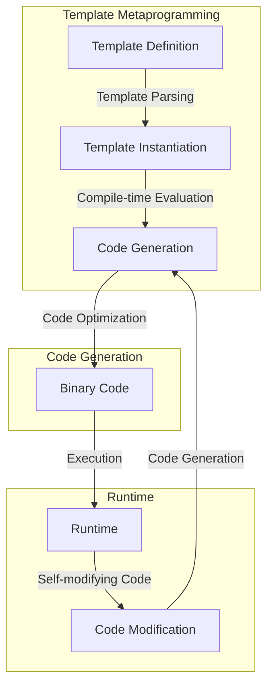

## Introduction
**Metaprogramming** is a programming technique where a program generates, modifies, or manipulates other programs or its own code at runtime. This technique is essential in software development, as it allows for greater flexibility, automation, and customization. Metaprogramming is used in various areas, such as **compiler construction**, **code generation**, and **reflection**. In C++, metaprogramming is achieved through **template metaprogramming**, which involves using templates to perform computations at compile-time.

> **Note:** Metaprogramming is a powerful tool that can simplify complex tasks, but it can also lead to **code bloat**, **performance issues**, and **debugging difficulties** if not used carefully.

## Core Concepts
The core concepts of metaprogramming include:

* **Self-modifying code**: code that generates, modifies, or manipulates its own code at runtime.
* **Code generation**: the process of generating code at runtime or compile-time.
* **Reflection**: the ability of a program to examine and modify its own structure and behavior at runtime.
* **Template metaprogramming**: a technique in C++ that involves using templates to perform computations at compile-time.

> **Tip:** When using metaprogramming, it's essential to consider the **trade-offs** between **code complexity**, **performance**, and **maintainability**.

## How It Works Internally
Template metaprogramming in C++ works by using **template instantiation** to perform computations at compile-time. The compiler generates a separate instantiation of the template for each set of template arguments, which allows for **compile-time evaluation** of expressions. This process involves the following steps:

1. **Template parsing**: the compiler parses the template definition and identifies the template parameters.
2. **Template instantiation**: the compiler generates a separate instantiation of the template for each set of template arguments.
3. **Compile-time evaluation**: the compiler evaluates the expressions in the template instantiation at compile-time.

> **Warning:** Template metaprogramming can lead to **code bloat** if not used carefully, as the compiler generates a separate instantiation of the template for each set of template arguments.

## Code Examples
### Example 1: Basic Template Metaprogramming
```cpp
template <int N>
struct Factorial {
    enum { value = N * Factorial<N-1>::value };
};

template <>
struct Factorial<0> {
    enum { value = 1 };
};

int main() {
    std::cout << Factorial<5>::value << std::endl; // Output: 120
    return 0;
}
```
This example demonstrates a basic template metaprogramming technique for calculating the factorial of a number at compile-time.

### Example 2: Advanced Template Metaprogramming
```cpp
template <typename T, typename U>
struct IsSame {
    static const bool value = false;
};

template <typename T>
struct IsSame<T, T> {
    static const bool value = true;
};

int main() {
    std::cout << std::boolalpha << IsSame<int, int>::value << std::endl; // Output: true
    std::cout << std::boolalpha << IsSame<int, double>::value << std::endl; // Output: false
    return 0;
}
```
This example demonstrates an advanced template metaprogramming technique for checking if two types are the same at compile-time.

### Example 3: Metaprogramming with SFINAE
```cpp
template <typename T>
auto foo(T t) -> decltype(t.foo()) {
    return t.foo();
}

template <typename T>
void foo(T t) {
    std::cout << "No foo() member function" << std::endl;
}

struct A {
    void foo() {
        std::cout << "A::foo()" << std::endl;
    }
};

struct B {};

int main() {
    A a;
    B b;
    foo(a); // Output: A::foo()
    foo(b); // Output: No foo() member function
    return 0;
}
```
This example demonstrates a metaprogramming technique using **SFINAE (Substitution Failure Is Not An Error)** to overload a function based on the presence of a member function.

## Visual Diagram

This diagram illustrates the lifecycle of metaprogramming, from template definition to code generation and execution.

## Comparison
| Approach | Time Complexity | Space Complexity | Pros | Cons | Best For |
| --- | --- | --- | --- | --- | --- |
| Template Metaprogramming | O(1) | O(1) | Compile-time evaluation, code generation | Code bloat, complexity | C++ template metaprogramming |
| Reflection | O(n) | O(n) | Runtime introspection, dynamic code modification | Performance overhead, security risks | Java, C# reflection |
| Code Generation | O(n) | O(n) | Dynamic code generation, customization | Complexity, maintainability | Python, Ruby code generation |
| SFINAE | O(1) | O(1) | Compile-time function overloading, metaprogramming | Complexity, readability | C++ SFINAE |

## Real-world Use Cases
1. **Compiler construction**: metaprogramming is used in compiler construction to generate code for different platforms and architectures.
2. **Code generation**: metaprogramming is used in code generation tools to generate boilerplate code, such as getter and setter methods.
3. **Reflection**: metaprogramming is used in reflection-based frameworks, such as Java and C#, to provide runtime introspection and dynamic code modification.
4. **Game development**: metaprogramming is used in game development to generate code for different game levels, characters, and objects.

> **Interview:** What is the difference between template metaprogramming and reflection? How would you use SFINAE to overload a function?

## Common Pitfalls
1. **Code bloat**: metaprogramming can lead to code bloat if not used carefully, as the compiler generates a separate instantiation of the template for each set of template arguments.
2. **Performance overhead**: metaprogramming can lead to performance overhead if not used carefully, as the compiler generates code at compile-time or runtime.
3. **Complexity**: metaprogramming can lead to complexity if not used carefully, as the code can become difficult to read and maintain.
4. **Debugging difficulties**: metaprogramming can lead to debugging difficulties if not used carefully, as the code can become difficult to debug and understand.

> **Warning:** Metaprogramming can lead to **security risks** if not used carefully, as the code can be vulnerable to attacks.

## Interview Tips
1. **What is metaprogramming?**: be prepared to explain the concept of metaprogramming, including template metaprogramming, reflection, and code generation.
2. **How does template metaprogramming work?**: be prepared to explain the process of template metaprogramming, including template instantiation and compile-time evaluation.
3. **What is SFINAE?**: be prepared to explain the concept of SFINAE, including how it is used to overload functions and enable metaprogramming.

> **Tip:** When answering interview questions, be sure to provide **concrete examples** and **code snippets** to demonstrate your understanding of metaprogramming concepts.

## Key Takeaways
* Metaprogramming is a powerful technique for generating, modifying, or manipulating code at runtime or compile-time.
* Template metaprogramming is a technique in C++ that involves using templates to perform computations at compile-time.
* Reflection is a technique that involves examining and modifying the structure and behavior of a program at runtime.
* Code generation is a technique that involves generating code at runtime or compile-time.
* SFINAE is a technique that involves using function overloading to enable metaprogramming.
* Metaprogramming can lead to code bloat, performance overhead, complexity, and debugging difficulties if not used carefully.
* Metaprogramming is used in various areas, including compiler construction, code generation, and game development.
* When using metaprogramming, it's essential to consider the trade-offs between code complexity, performance, and maintainability.