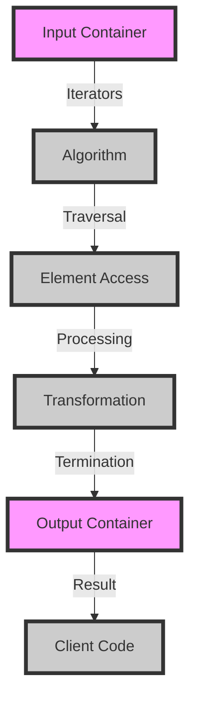

## Introduction
The Standard Template Library (STL) is a fundamental component of the C++ Standard Library, providing a wide range of algorithms for various tasks such as sorting, searching, and manipulating containers. Understanding the lifecycle and mechanics of STL algorithms is crucial for any C++ developer, as it enables them to write efficient, effective, and scalable code. In this article, we will delve into the world of STL algorithms, exploring their core concepts, internal mechanics, and practical applications.

## Core Concepts
STL algorithms are based on a set of core concepts that provide a foundation for understanding their behavior and usage. These concepts include:

* **Iterators**: objects that point to elements in a container, allowing algorithms to traverse and manipulate the data.
* **Container**: a data structure that holds a collection of elements, such as vectors, lists, or sets.
* **Algorithm**: a function that takes iterators and/or containers as input, performing a specific operation on the data.
* **Functor**: a function object that can be used as a callback or a predicate in algorithms.

> **Note:** STL algorithms are designed to be generic, meaning they can work with different types of containers and iterators, making them highly reusable and flexible.

## How It Works Internally
When an STL algorithm is executed, it follows a specific lifecycle:

1. **Initialization**: the algorithm is called with the required input parameters, such as iterators and/or containers.
2. **Traversal**: the algorithm traverses the container using iterators, accessing the elements and performing the desired operation.
3. **Processing**: the algorithm processes the elements, applying the specified logic and/or transformations.
4. **Termination**: the algorithm completes its execution, returning any relevant results or updating the container as needed.

Under the hood, STL algorithms use a combination of template metaprogramming and compiler optimizations to achieve high performance and efficiency. For example, the `std::sort` algorithm uses a **introsort** algorithm, which is a hybrid of quicksort and heapsort, to achieve an average time complexity of O(n log n).

## Code Examples
Here are three complete and runnable code examples demonstrating the use of STL algorithms:

### Example 1: Basic Sorting
```cpp
#include <algorithm>
#include <vector>
#include <iostream>

int main() {
    std::vector<int> numbers = {4, 2, 7, 1, 3};
    std::sort(numbers.begin(), numbers.end());
    for (const auto& num : numbers) {
        std::cout << num << " ";
    }
    return 0;
}
```
This example uses the `std::sort` algorithm to sort a vector of integers in ascending order.

### Example 2: Searching for an Element
```cpp
#include <algorithm>
#include <vector>
#include <iostream>

int main() {
    std::vector<int> numbers = {4, 2, 7, 1, 3};
    int target = 2;
    auto it = std::find(numbers.begin(), numbers.end(), target);
    if (it != numbers.end()) {
        std::cout << "Found " << target << " at index " << std::distance(numbers.begin(), it) << std::endl;
    } else {
        std::cout << "Not found" << std::endl;
    }
    return 0;
}
```
This example uses the `std::find` algorithm to search for a specific element in a vector.

### Example 3: Transforming a Container
```cpp
#include <algorithm>
#include <vector>
#include <iostream>

int main() {
    std::vector<int> numbers = {1, 2, 3, 4, 5};
    std::vector<int> squaredNumbers;
    squaredNumbers.reserve(numbers.size());
    std::transform(numbers.begin(), numbers.end(), std::back_inserter(squaredNumbers), [](int x) { return x * x; });
    for (const auto& num : squaredNumbers) {
        std::cout << num << " ";
    }
    return 0;
}
```
This example uses the `std::transform` algorithm to transform a vector of integers by squaring each element.

## Visual Diagram

This diagram illustrates the lifecycle of an STL algorithm, from input container to output container.

## Comparison
| Algorithm | Time Complexity | Space Complexity | Pros | Cons | Best For |
| --- | --- | --- | --- | --- | --- |
| `std::sort` | O(n log n) | O(1) | Efficient, stable | Slow for small datasets | Large datasets |
| `std::find` | O(n) | O(1) | Simple, efficient | Slow for large datasets | Small to medium datasets |
| `std::transform` | O(n) | O(1) | Flexible, efficient | Limited to single-pass transformations | Data processing pipelines |

> **Warning:** Choosing the wrong algorithm can lead to performance issues or incorrect results. Always consider the time and space complexity of an algorithm before using it.

## Real-world Use Cases
Here are three real-world use cases for STL algorithms:

* **Google's Search Engine**: uses STL algorithms to efficiently search and rank web pages.
* **Facebook's News Feed**: uses STL algorithms to sort and filter news feed items.
* **Amazon's Recommendation System**: uses STL algorithms to transform and analyze customer data.

## Common Pitfalls
Here are four common pitfalls to avoid when using STL algorithms:

* **Incorrect iterator usage**: using iterators incorrectly can lead to undefined behavior or crashes.
* **Inefficient algorithm choice**: choosing an algorithm with high time or space complexity can lead to performance issues.
* **Data corruption**: modifying data while iterating over it can lead to data corruption or crashes.
* **Lack of error handling**: failing to handle errors or exceptions can lead to crashes or unexpected behavior.

> **Tip:** Always use `const` correctness and iterator safety to prevent data corruption and crashes.

## Interview Tips
Here are three common interview questions related to STL algorithms:

* **What is the time complexity of `std::sort`?**: a strong answer would explain the introsort algorithm and its average time complexity of O(n log n).
* **How do you use `std::find` to search for an element in a container?**: a strong answer would demonstrate the use of `std::find` with iterators and a container.
* **What is the difference between `std::transform` and `std::for_each`?**: a strong answer would explain the difference in functionality and usage between the two algorithms.

> **Interview:** Be prepared to explain the trade-offs between different algorithms and demonstrate their usage in code.

## Key Takeaways
Here are ten key takeaways to remember:

* **STL algorithms are generic**: they can work with different types of containers and iterators.
* **Choose the right algorithm**: consider time and space complexity, as well as the specific use case.
* **Use `const` correctness**: to prevent data corruption and ensure iterator safety.
* **Handle errors and exceptions**: to prevent crashes or unexpected behavior.
* **Understand iterator usage**: to avoid undefined behavior or crashes.
* **Use `std::sort` for large datasets**: for efficient and stable sorting.
* **Use `std::find` for small to medium datasets**: for simple and efficient searching.
* **Use `std::transform` for data processing pipelines**: for flexible and efficient data transformation.
* **Avoid incorrect iterator usage**: to prevent data corruption or crashes.
* **Optimize for performance**: by choosing the right algorithm and using efficient data structures.